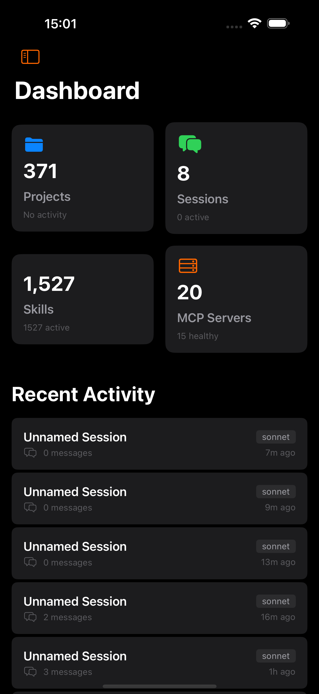
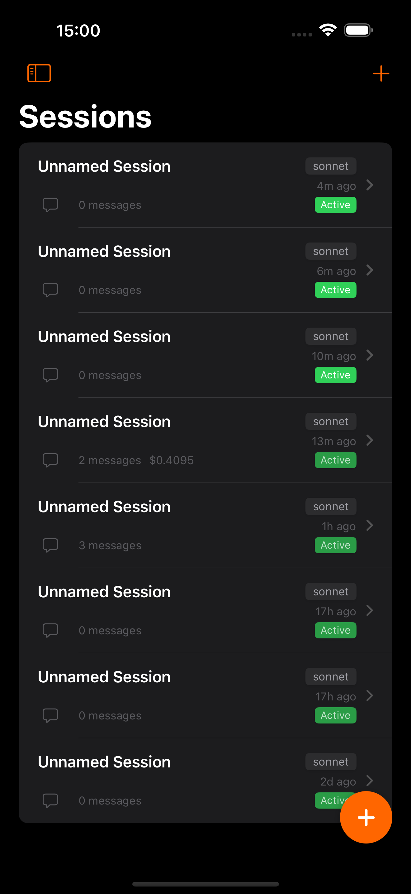
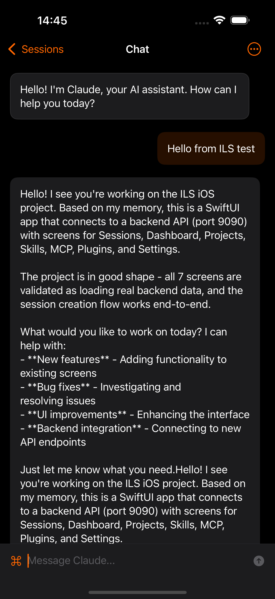

# ILS - Intelligent Language System

> A native iOS & macOS client for [Claude Code](https://claude.ai/claude-code) with a Swift backend

[](https://github.com/krzemienski/ils-ios/actions/workflows/build.yml)
[](https://swift.org)
[](https://developer.apple.com/ios/)
[](https://developer.apple.com/macos/)
[](https://vapor.codes)
[](LICENSE)

ILS provides a mobile interface for interacting with Claude Code sessions, managing projects, viewing skills, and configuring MCP servers - all from your iPhone, iPad, or Mac.

## Features

- **Chat with Claude** - Real-time streaming responses via SSE with markdown rendering
- **Session Management** - Create, view, fork, rename, and export chat sessions
- **Project Browser** - Browse and manage Claude Code projects
- **Skills Explorer** - View and search 1,500+ available Claude Code skills
- **Plugin Management** - Browse marketplace, install, enable/disable Claude Code plugins
- **MCP Server Status** - Monitor Model Context Protocol servers
- **System Monitoring** - View CPU, memory, disk, network metrics and running processes
- **Team Coordination** - Manage multi-agent teams with tasks and messaging
- **Custom Themes** - Create and customize your own themes or choose from 12 built-in themes
- **Cloudflare Tunnel** - Expose your local backend via secure tunnel
- **macOS Native** - Full macOS app with 3-column NavigationSplitView, multi-window support, keyboard shortcuts, and Touch Bar
- **Dark Mode** - Native iOS dark theme throughout

## Screenshots

| Dashboard | Sessions | Chat |
|-----------|----------|------|
|  |  |  |

## Architecture

This monorepo contains both the Vapor-based REST API backend and the SwiftUI iOS application, sharing common models through the `ILSShared` library. See [ARCHITECTURE.md](ARCHITECTURE.md) for detailed system design, data flow diagrams, and technical decisions.

```
ils-ios/
├── Sources/                    # Swift Package (Backend + Shared)
│   ├── ILSShared/             # Shared models (used by both)
│   │   ├── Models/            # Session, Project, Message, etc.
│   │   └── DTOs/              # Request/Response types
│   └── ILSBackend/            # Vapor REST API server
│       ├── App/               # Server configuration & routes
│       ├── Controllers/       # API endpoint handlers
│       ├── Models/            # Fluent ORM database models
│       ├── Migrations/        # Database schema migrations
│       └── Services/          # Business logic (streaming, filesystem)
├── ILSApp/                    # iOS & macOS Application (Xcode project)
│   ├── ILSApp/                # iOS app target
│   │   ├── Views/             # SwiftUI views by feature
│   │   ├── ViewModels/        # MVVM view models
│   │   ├── Services/          # API client, SSE client
│   │   └── Theme/             # Design system
│   └── ILSMacApp/             # macOS app target
│       ├── Views/             # macOS-specific views
│       ├── Managers/          # macOS managers
│       └── TouchBar/          # Touch Bar support
├── Tests/                     # Backend tests
├── Package.swift              # Swift Package manifest
└── ils.sqlite                 # SQLite database (auto-created)
```

## Prerequisites

- **macOS** 15.0+ (Sequoia or later)
- **Xcode** 16.0+ with iOS 18 SDK
- **Swift** 6.0+
- **Claude Code CLI** installed and configured (optional, for full functionality)

## Quick Start

### 1. Clone the Repository

```bash
git clone https://github.com/krzemienski/ils-ios.git
cd ils-ios
```

### 2. Start the Backend

```bash
# Build and run the backend server
PORT=9999 swift run ILSBackend

# You should see:
# [ NOTICE ] Server started on http://0.0.0.0:9999
```

The backend will:
- Create `ils.sqlite` database on first run
- Run database migrations automatically
- Start listening on port 9999 (Note: avoid 8080, used by ralph-mobile)

**Verify it's running:**
```bash
curl http://localhost:9999/health
# Returns: OK

# Check sessions endpoint
curl http://localhost:9999/api/v1/sessions
```

### 3. Run the iOS App

**Option A: Xcode (Recommended)**
```bash
open ILSApp/ILSApp.xcodeproj
```
Select the **ILSApp** scheme and press `Cmd+R` to build and run on Simulator.

**Option B: Command Line**
```bash
xcodebuild -project ILSApp/ILSApp.xcodeproj \
  -scheme ILSApp \
  -destination 'platform=iOS Simulator,name=iPhone 16 Pro Max' \
  -quiet build
```

### 4. Run the macOS App

```bash
open ILSApp/ILSApp.xcodeproj
```
Select the **ILSMacApp** scheme and press `Cmd+R`.

### 5. Configure Connection

The iOS app connects to `http://localhost:9999` by default.

- **Simulator**: Works automatically (shares localhost with Mac)
- **Physical Device**: Go to Settings in the app and update the host to your Mac's IP address

## iOS App Structure

The iOS app follows MVVM architecture with feature-based organization:

```
ILSApp/
├── ILSAppApp.swift           # App entry point & global state
├── ContentView.swift         # Root navigation container
├── Views/
│   ├── Root/                 # Root container views
│   ├── Home/                 # Home dashboard screen
│   ├── Chat/                 # Chat interface with streaming
│   ├── Sessions/             # Session list & creation
│   ├── Projects/             # Project browser
│   ├── Skills/               # Skills explorer
│   ├── Browser/              # Plugin browser & marketplace
│   ├── Plugins/              # Plugin management
│   ├── MCP/                  # MCP server status
│   ├── System/               # System monitoring (CPU, memory, processes)
│   ├── Teams/                # Team coordination
│   ├── Fleet/                # Fleet management
│   ├── Dashboard/            # Dashboard stats
│   ├── Settings/             # App configuration
│   ├── Themes/               # Custom theme management
│   ├── Onboarding/           # First-run setup flow
│   ├── Sidebar/              # Navigation sidebar
│   └── Shared/               # Reusable components
├── ViewModels/               # Business logic per feature
├── Services/
│   ├── APIClient.swift       # REST API communication
│   └── SSEClient.swift       # Server-Sent Events for streaming
└── Theme/
    └── ILSTheme.swift        # Colors, fonts, spacing
```

## API Endpoints

Base URL: `http://localhost:9999/api/v1`

| Method | Endpoint | Description |
|--------|----------|-------------|
| `GET` | `/health` | Health check |
| `GET` | `/api/v1/sessions` | List all sessions (DB + external) |
| `POST` | `/api/v1/sessions` | Create a new session |
| `GET` | `/api/v1/sessions/:id` | Get a specific session |
| `PUT` | `/api/v1/sessions/:id` | Rename a session |
| `DELETE` | `/api/v1/sessions/:id` | Delete a session |
| `POST` | `/api/v1/sessions/:id/fork` | Fork a session |
| `GET` | `/api/v1/sessions/:id/messages` | Get session messages |
| `GET` | `/api/v1/sessions/scan` | Scan for external sessions |
| `POST` | `/api/v1/chat/stream` | Send message (SSE streaming) |
| `POST` | `/api/v1/chat/cancel` | Cancel running chat |
| `GET` | `/api/v1/projects` | List all projects |
| `GET` | `/api/v1/skills` | List available skills |
| `GET` | `/api/v1/skills/search` | Search skills by name/tags |
| `GET` | `/api/v1/mcp` | List MCP servers |
| `GET` | `/api/v1/plugins` | List installed plugins |
| `GET` | `/api/v1/plugins/search` | Search plugins |
| `GET` | `/api/v1/plugins/marketplace` | Browse plugin marketplace |
| `POST` | `/api/v1/plugins/install` | Install a plugin |
| `GET` | `/api/v1/config` | Get Claude configuration |
| `GET` | `/api/v1/stats` | Dashboard statistics |
| `GET` | `/api/v1/stats/recent` | Recent sessions for timeline |
| `GET` | `/api/v1/settings` | Get user settings |
| `GET` | `/api/v1/server/status` | Server connection status |
| `GET` | `/api/v1/themes` | List custom themes |
| `POST` | `/api/v1/themes` | Create a custom theme |
| `PUT` | `/api/v1/themes/:id` | Update a custom theme |
| `DELETE` | `/api/v1/themes/:id` | Delete a custom theme |
| `GET` | `/api/v1/teams` | List all teams |
| `POST` | `/api/v1/teams` | Create a new team |
| `GET` | `/api/v1/teams/:name` | Get team details |
| `DELETE` | `/api/v1/teams/:name` | Delete a team |
| `POST` | `/api/v1/teams/:name/spawn` | Spawn a teammate |
| `GET` | `/api/v1/teams/:name/tasks` | List team tasks |
| `POST` | `/api/v1/teams/:name/tasks` | Create a team task |
| `GET` | `/api/v1/system/metrics` | Current system metrics |
| `GET` | `/api/v1/system/processes` | Running processes |
| `GET` | `/api/v1/system/files` | Directory listing |
| `WS` | `/api/v1/system/metrics/live` | Live metrics stream |
| `GET` | `/api/v1/tunnel/status` | Cloudflare tunnel status |
| `POST` | `/api/v1/tunnel/start` | Start tunnel |
| `POST` | `/api/v1/tunnel/stop` | Stop tunnel |

## Shared Models

Both the iOS app and backend use the same model definitions from `ILSShared`:

| Model | Purpose |
|-------|---------|
| `ChatSession` | Chat session with metadata |
| `Message` | Individual chat message |
| `Project` | Claude Code project with path |
| `Skill` | Skill definition and metadata |
| `MCPServer` | MCP server configuration |
| `Plugin` | Installed plugin information |
| `ClaudeConfig` | Claude Code settings |
| `StreamMessage` | Real-time streaming events |
| `CustomTheme` | Custom theme definition |
| `FleetHost` | Remote host configuration |
| `CLIMessage` | Claude CLI message structure |
| `ContentBlocks` | Message content blocks |
| `ServerConnection` | Server connection state |
| `SetupProgress` | Setup workflow progress |

## Development

### Running Tests

**Backend Tests:**
```bash
swift test
```

**iOS App (Xcode):**
```bash
xcodebuild test \
  -project ILSApp/ILSApp.xcodeproj \
  -scheme ILSApp \
  -destination 'platform=iOS Simulator,name=iPhone 16 Pro'
```

### Database Management

The backend uses SQLite stored at `ils.sqlite` in the project root.

**Reset database:**
```bash
rm ils.sqlite
swift run ILSBackend  # Recreates with fresh migrations
```

**Inspect database:**
```bash
sqlite3 ils.sqlite ".tables"
sqlite3 ils.sqlite ".schema sessions"
```

### Adding New Features

1. **Add shared model** in `Sources/ILSShared/Models/`
2. **Add backend controller** in `Sources/ILSBackend/Controllers/`
3. **Add iOS view model** in `ILSApp/ViewModels/`
4. **Add iOS view** in `ILSApp/Views/`

## URL Schemes

The app supports deep linking via the `ils://` URL scheme:

| URL | Action |
|-----|--------|
| `ils://home` | Open Home tab |
| `ils://sessions` | Open Sessions tab |
| `ils://projects` | Open Projects tab |
| `ils://plugins` | Open Plugins/Browser tab |
| `ils://mcp` | Open MCP Servers tab |
| `ils://skills` | Open Skills tab |
| `ils://system` | Open System monitoring tab |
| `ils://fleet` | Open Fleet management tab |
| `ils://teams` | Open Teams tab |
| `ils://settings` | Open Settings tab |

## Troubleshooting

### Backend won't start

```bash
# Check if port 9999 is in use
lsof -i :9999

# Kill existing process if needed
kill -9 <PID>
```

### iOS can't connect to backend

1. Verify backend is running: `curl http://localhost:9999/health`
2. For physical device, use your Mac's IP address in Settings
3. Ensure both devices are on the same network

### Build errors

```bash
# Clean Swift Package cache
rm -rf .build
swift package resolve

# Clean Xcode build
rm -rf ~/Library/Developer/Xcode/DerivedData/ILSApp-*
```

## Scripts

The `scripts/` directory contains automation tools:

| Script | Purpose |
|--------|---------|
| `setup.sh` | Initial project setup and dependencies |
| `install-backend-service.sh` | Install backend as system service |
| `run_regression_tests.sh` | Run full regression test suite |
| `reinstall-plugins.sh` | Reinstall all plugins |
| `bootstrap-remote.sh` | Bootstrap remote host setup |
| `remote-access` | Remote access configuration |

## Tech Stack

| Component | Technology |
|-----------|------------|
| Backend Framework | [Vapor 4](https://vapor.codes) |
| Database | SQLite via [Fluent](https://docs.vapor.codes/fluent/overview/) |
| iOS UI | SwiftUI (iOS 17+) |
| macOS UI | SwiftUI (macOS 14+) |
| Architecture | MVVM |
| Networking | URLSession + SSE |
| Streaming | Server-Sent Events |
| Code Highlighting | [Splash](https://github.com/JohnSundell/Splash) |
| YAML Parsing | [Yams](https://github.com/jpsim/Yams) |

## Contributing

Contributions are welcome! Please read [CONTRIBUTING.md](CONTRIBUTING.md) for guidelines.

## Changelog

See [CHANGELOG.md](CHANGELOG.md) for release history.

## License

MIT License - see [LICENSE](LICENSE) for details.

## Acknowledgments

- [Claude Code](https://claude.ai/claude-code) by Anthropic
- [Vapor](https://vapor.codes) Swift web framework
- [SwiftUI](https://developer.apple.com/xcode/swiftui/) by Apple
