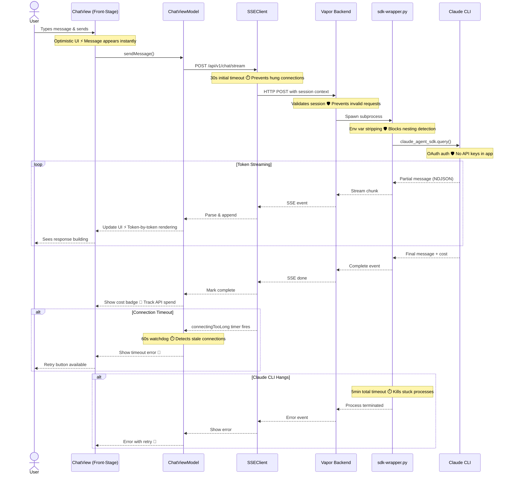

# Chat Streaming Pipeline

**Type:** Architecture Diagram
**Last Updated:** 2026-03-10
**Related Files:**
- `ILSApp/ILSApp/Views/Chat/ChatView.swift`
- `ILSApp/ILSApp/ViewModels/ChatViewModel.swift`
- `ILSApp/ILSApp/Services/SSEClient.swift`
- `Sources/ILSBackend/Controllers/ChatController.swift`
- `scripts/sdk-wrapper.py`

## Purpose

Shows how a user's chat message flows from SwiftUI input through the Vapor backend to Claude and back as a real-time streaming response, including timeout handling and error recovery.

## Diagram

## Key Insights

- **Instant Feedback**: Optimistic UI shows user message before backend confirms
- **Token Streaming**: Response renders word-by-word via SSE, not waiting for full completion
- **Two-Tier Timeouts**: 30s initial connect + 5min total prevents both slow starts and infinite hangs
- **Env Var Stripping**: Removes `CLAUDECODE=1` vars so Claude CLI doesn't detect nesting and refuse to run
- **Cost Tracking**: Final event includes API cost so users can monitor spend

## Change History

- **2026-03-10:** Initial creation
