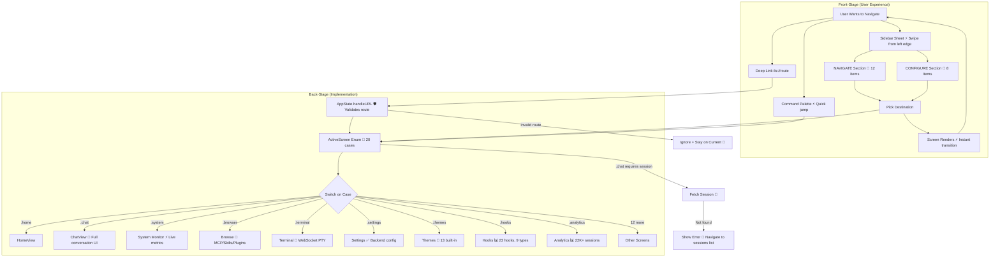

# Navigation & Deep Link Routing

**Type:** Architecture Diagram
**Last Updated:** 2026-03-18
**Related Files:**
- `ILSApp/ILSApp/Views/Root/SidebarRootView.swift`
- `ILSApp/ILSApp/Views/Root/SidebarView.swift`
- `ILSApp/ILSApp/ILSAppApp.swift`
- `ILSApp/ILSApp/AppState.swift`

## Purpose

Shows how users navigate ILS via sidebar (20 items in 2 sections), deep links (`ils://`), and programmatic routing — all converging on a single `ActiveScreen` enum with 20 cases.

## Diagram

## Sidebar Structure (Verified via Audit)

**NAVIGATE (12):** Home, System Monitor, Browse, Terminal, All Sessions, Activity Feed, Documentation, Split View, Search, Permissions, Agent Teams, Agent Queue

**CONFIGURE (8):** Usage, Host Profiles, Backends, Hooks, Themes, Settings, Analytics, Workflows

## Deep Links (Verified Working)

| Route | Screen | Status |
|-------|--------|--------|
| `ils://home` | Home | ✅ Works from foreground |
| `ils://settings` | Settings | ✅ Works from foreground |
| `ils://themes` | Themes | ✅ Works from foreground |
| `ils://fleet` | Host Profiles | ✅ Works from foreground |
| `ils://sessions/{uuid}` | ChatView | ✅ UUID must be lowercase |
| `ils://browser` | Browse | ✅ NOT `ils://browse` |
| `ils://system` | System Monitor | ✅ |

## Key Insights

- **Single State Machine**: All navigation converges to `ActiveScreen` enum — no scattered routing logic
- **20 Sidebar Items**: 12 NAVIGATE + 8 CONFIGURE, requiring scroll for items below Agent Queue
- **Deep Links Work in Foreground**: No system confirmation dialog when app is already open
- **Sidebar as Sheet**: SwiftUI `.sheet` triggered by toolbar — swipe-from-left-edge gesture opens it
- **FIXED: Sidebar from ChatView**: Previously blocked by ChatView's keyboard-dismiss DragGesture claiming the edge swipe. Fixed by replacing with `.scrollDismissesKeyboard(.interactively)`

## Change History

- **2026-03-18:** Updated with complete 20-item sidebar structure, NAVIGATE/CONFIGURE sections, verified deep links, and ChatView sidebar bug from full functional audit
- **2026-03-18:** Initial creation
