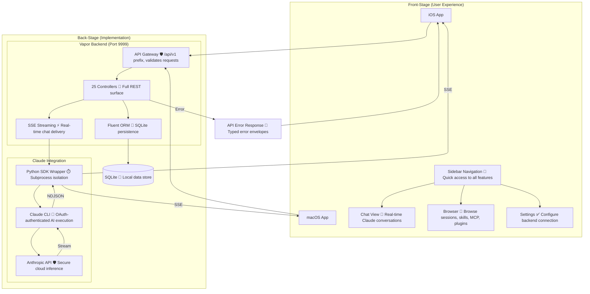

# ILS System Architecture Overview

**Type:** Architecture Diagram
**Last Updated:** 2026-03-10
**Related Files:**
- `ILSApp/ILSApp/` — iOS SwiftUI app
- `ILSApp/ILSMacApp/` — macOS SwiftUI app
- `Sources/ILSBackend/` — Vapor 4 backend
- `Sources/ILSShared/` — Shared DTOs
- `scripts/sdk-wrapper.py` — Python Claude Agent SDK wrapper

## Purpose

Shows how ILS delivers a native Claude Code experience across iOS and macOS by connecting SwiftUI clients to a local Vapor backend that orchestrates Claude CLI execution.

## Diagram

## Key Insights

- **Native Performance**: SwiftUI on both platforms — no web views, no Electron
- **Local-First**: Vapor backend + SQLite runs on user's machine, data never leaves device
- **Real-Time Chat**: SSE streaming delivers Claude responses token-by-token
- **OAuth Auth**: Claude CLI handles auth — no API keys stored in app
- **Error Isolation**: Python subprocess prevents Claude CLI hangs from crashing backend

## Change History

- **2026-03-10:** Initial creation
