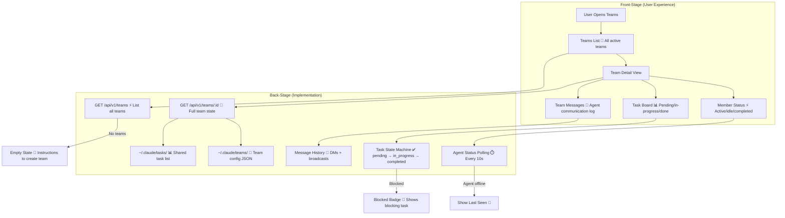

# Agent Teams

**Type:** Feature Diagram
**Last Updated:** 2026-03-18
**Related Files:**
- `ILSApp/ILSApp/Views/Teams/`
- `ILSApp/ILSApp/ViewModels/TeamsViewModel.swift`
- `Sources/ILSBackend/Controllers/TeamsController.swift`

## Purpose

Lets users view and manage Claude Code agent teams — coordinated groups of AI agents working on shared task lists — with real-time status, task progress, and member activity monitoring.

## Diagram

## Key Insights

- **Live Status**: Agent member status polled regularly — active, idle, or completed
- **Task Visualization**: Kanban-style board showing task flow through states
- **Communication Log**: View agent-to-agent messages for debugging team coordination
- **Blocked Detection**: Tasks with unresolved dependencies show blocking task reference
- **File-Based State**: Teams and tasks stored in `~/.claude/` directories — portable and inspectable

## Change History

- **2026-03-18:** Initial creation
