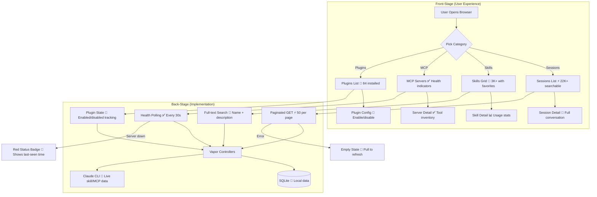

# Browser & Data Explorer

**Type:** Feature Diagram
**Last Updated:** 2026-03-18
**Related Files:**
- `ILSApp/ILSApp/Views/Browser/`
- `ILSApp/ILSApp/ViewModels/SkillsViewModel.swift`
- `ILSApp/ILSApp/ViewModels/MCPViewModel.swift`
- `ILSApp/ILSApp/ViewModels/PluginsViewModel.swift`
- `Sources/ILSBackend/Controllers/SkillsController.swift`
- `Sources/ILSBackend/Controllers/MCPController.swift`
- `Sources/ILSBackend/Controllers/PluginsController.swift`

## Purpose

Lets users browse, search, and inspect their entire Claude Code ecosystem — 22K+ sessions, 3K+ skills, 15 MCP servers, and 84 plugins — with paginated lists, detail views, and health status indicators.

## Diagram

## Key Insights

- **Massive Scale**: Handles 22K+ sessions with paginated loading — no memory blowup
- **Live Health**: MCP servers show green/red health badges with auto-polling
- **Skill Favorites**: Users can pin frequently-used skills for quick access
- **Plugin Toggle**: Enable/disable plugins without leaving the browser
- **Unified Search**: Search across sessions, skills, and plugins from one interface

## Change History

- **2026-03-18:** Initial creation
