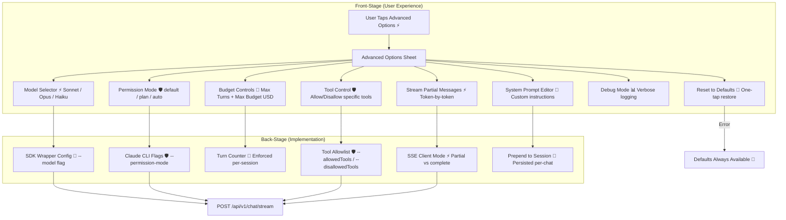

# Chat Advanced Options

**Type:** Feature Diagram
**Last Updated:** 2026-03-18
**Related Files:**
- `ILSApp/ILSApp/Views/Chat/ChatView.swift`
- `ILSApp/ILSApp/Views/Chat/AdvancedOptionsSheet.swift`
- `ILSApp/ILSApp/ViewModels/ChatViewModel.swift`

## Purpose

Gives users granular control over every aspect of their Claude conversation — model selection, system prompts, permission modes, token budgets, tool allowlists, and streaming behavior — accessible from a single sheet in the chat input bar.

## Diagram

## Key Insights

- **Model Switching**: Users can switch between Sonnet (fast), Opus (deep reasoning), and Haiku (cheap) mid-conversation
- **System Prompt**: Custom instructions prepended to every message — persists per chat session
- **Token-by-Token Streaming**: "Stream Partial Messages" toggle controls whether responses render word-by-word or all at once
- **Tool Safety**: Allow/disallow specific tools (Bash, Write, Edit) for safety-conscious users
- **Budget Guardrails**: Max Turns and Max Budget USD prevent runaway sessions
- **One-Tap Reset**: Restore all defaults if configuration gets confusing

## Change History

- **2026-03-18:** Initial creation from full functional audit
