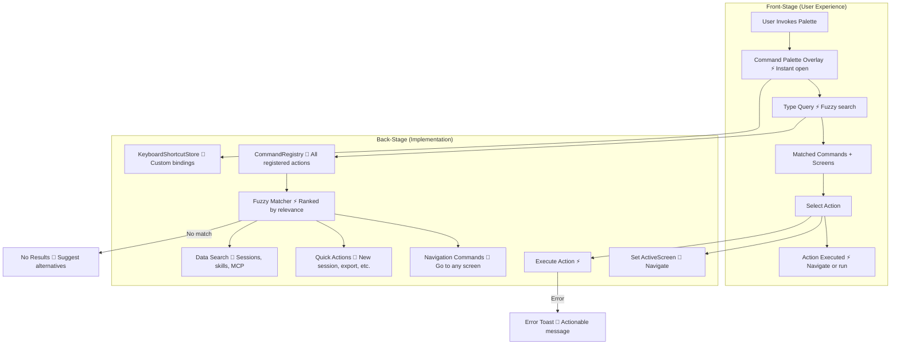

# Command Palette

**Type:** Feature Diagram
**Last Updated:** 2026-03-18
**Related Files:**
- `ILSApp/ILSApp/Views/CommandPalette/`
- `ILSApp/ILSApp/Services/CommandRegistry.swift`
- `ILSApp/ILSApp/Services/KeyboardShortcutStore.swift`

## Purpose

Provides a keyboard-driven quick-action overlay (Cmd+K style) that lets power users jump to any screen, search across data, and execute common actions without touching the sidebar.

## Diagram

## Key Insights

- **Keyboard-First**: Power users navigate entire app without touching sidebar
- **Fuzzy Search**: Typo-tolerant matching across commands, screens, and data
- **Extensible Registry**: New commands registered declaratively via `CommandRegistry`
- **Custom Shortcuts**: Users can rebind keyboard shortcuts via `KeyboardShortcutStore`
- **Cross-Concern**: Searches sessions, skills, and MCP servers from one input

## Change History

- **2026-03-18:** Initial creation
