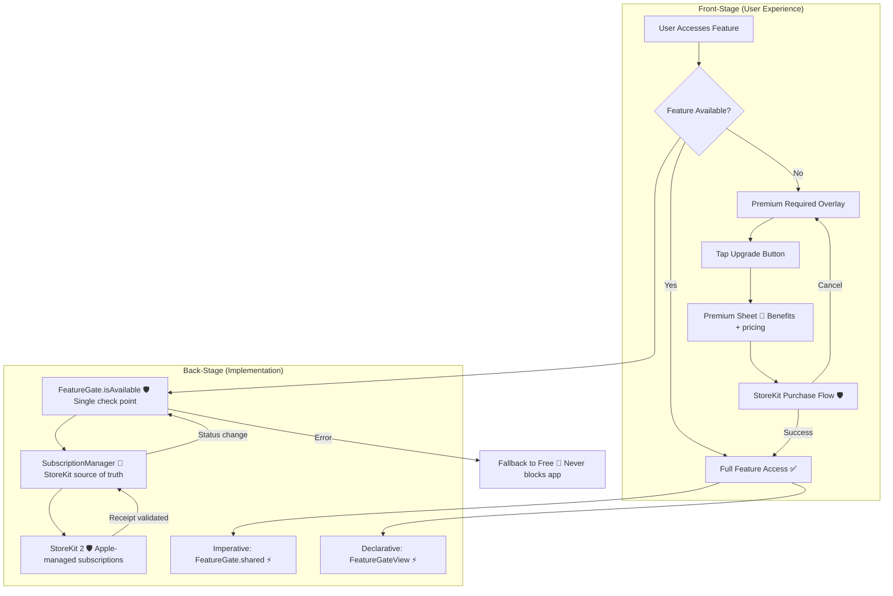

# Premium Feature Gating

**Type:** Feature Diagram
**Last Updated:** 2026-03-10
**Related Files:**
- `ILSApp/ILSApp/Services/FeatureGate.swift`
- `ILSApp/ILSApp/Services/SubscriptionManager.swift`
- `ILSApp/ILSApp/Views/Premium/FeatureGateView.swift`
- `ILSApp/ILSApp/Views/Premium/PremiumView.swift`

## Purpose

Controls access to premium features (chat export, custom themes, advanced monitoring, unlimited sessions) with a non-intrusive upgrade experience that lets free users see what they're missing.

## Diagram

## Key Insights

- **Non-Intrusive**: Free users see a tasteful overlay, never a hard block or nag screen
- **Two Usage Patterns**: `FeatureGateView` for SwiftUI views, `FeatureGate.shared.isAvailable()` for imperative logic
- **Single Source of Truth**: `SubscriptionManager` owns premium status via StoreKit 2
- **Graceful Fallback**: If StoreKit fails, app defaults to free tier — never crashes or locks out
- **4 Gated Features**: Chat export, custom themes (10/13), advanced monitoring, unlimited sessions (free: 5 max)

## Change History

- **2026-03-10:** Initial creation
