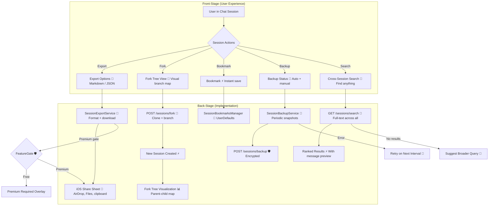

# Session Management

**Type:** Feature Diagram
**Last Updated:** 2026-03-18
**Related Files:**
- `ILSApp/ILSApp/Services/SessionExportService.swift`
- `ILSApp/ILSApp/Services/SessionBackupService.swift`
- `ILSApp/ILSApp/Services/SessionBookmarksManager.swift`
- `ILSApp/ILSApp/ViewModels/SessionForkTreeViewModel.swift`
- `ILSApp/ILSApp/ViewModels/CrossSessionSearchViewModel.swift`
- `Sources/ILSBackend/Controllers/SessionBackupController.swift`

## Purpose

Empowers users to manage their Claude Code conversations beyond basic chat — exporting for sharing, forking to branch ideas, bookmarking for quick access, backing up for safety, and searching across all sessions.

## Diagram

## Key Insights

- **Export Gated**: Chat export is a premium feature — clear upgrade path for free users
- **Fork Trees**: Visual graph shows conversation branch history — great for exploring alternatives
- **Cross-Session Search**: Search message content across all 22K+ sessions with previews
- **Auto-Backup**: Periodic session snapshots protect against data loss
- **Bookmarks**: One-tap bookmark for quick access to important conversations

## Change History

- **2026-03-18:** Initial creation
