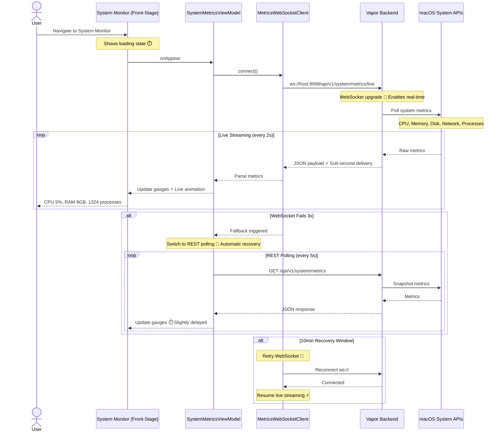

# System Monitoring

**Type:** Feature Diagram
**Last Updated:** 2026-03-18
**Related Files:**
- `ILSApp/ILSApp/Views/System/SystemMetricsView.swift`
- `ILSApp/ILSApp/ViewModels/SystemMetricsViewModel.swift`
- `ILSApp/ILSApp/Services/MetricsWebSocketClient.swift`
- `Sources/ILSBackend/Controllers/SystemController.swift`

## Purpose

Gives users a live dashboard of their machine's health (CPU, memory, disk, network, process count) with real-time WebSocket streaming and automatic fallback to REST polling when WebSocket fails.

## Diagram

## Key Insights

- **Real-Time by Default**: WebSocket streams metrics every 2s for live gauges and graphs
- **Automatic Fallback**: After 3 WebSocket failures, transparently switches to REST polling at 5s intervals
- **Self-Healing**: After 10 minutes in fallback mode, retries WebSocket to restore real-time
- **Native Gauges**: CPU/memory/disk rendered as SwiftUI gauge animations, not static text
- **Process Count**: Shows total running processes as a health indicator

## Change History

- **2026-03-18:** Initial creation
