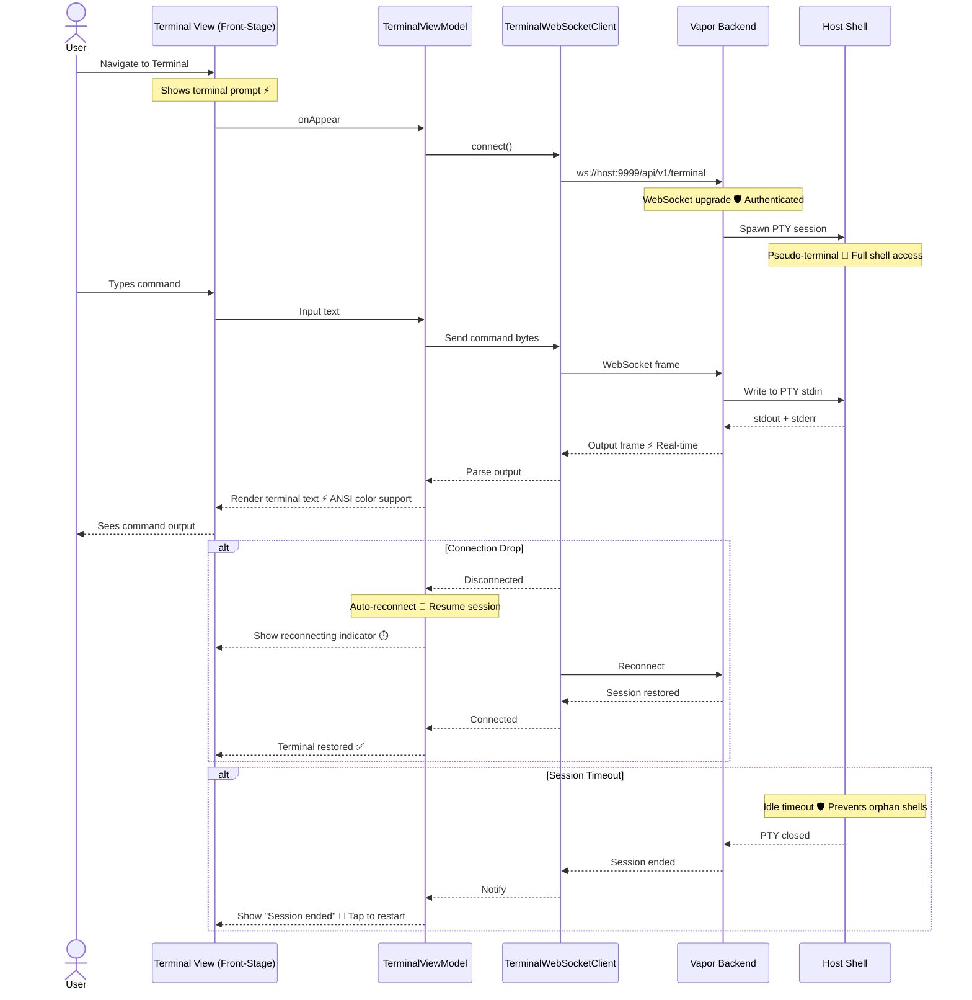

# Terminal Integration

**Type:** Feature Diagram
**Last Updated:** 2026-03-18
**Related Files:**
- `ILSApp/ILSApp/Views/Terminal/`
- `ILSApp/ILSApp/ViewModels/TerminalViewModel.swift`
- `ILSApp/ILSApp/Services/TerminalWebSocketClient.swift`
- `Sources/ILSBackend/Controllers/TerminalController.swift`

## Purpose

Gives users a native terminal interface within ILS to execute commands on the backend machine via WebSocket, enabling server management without switching to a separate terminal app.

## Diagram

## Key Insights

- **Native Terminal**: Full PTY session via WebSocket — not a command runner, a real shell
- **ANSI Support**: Terminal renders colors, cursor movement, and formatting natively
- **Session Persistence**: Reconnect restores the same shell session after network blips
- **Idle Timeout**: Orphan shells automatically cleaned up to prevent resource leaks
- **Authenticated**: WebSocket connection requires valid backend auth

## Change History

- **2026-03-18:** Initial creation
