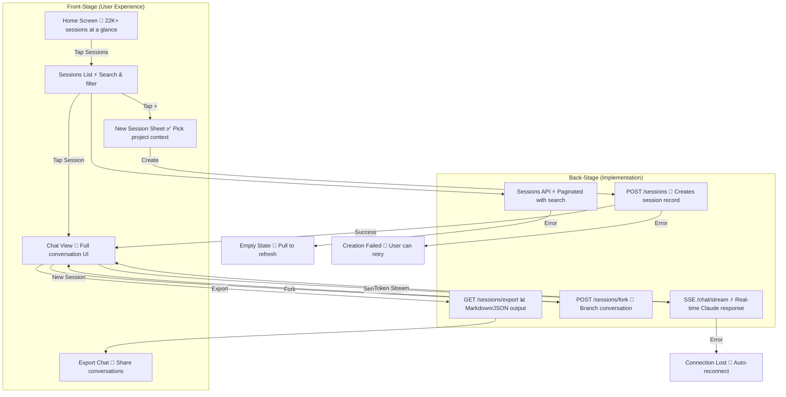

# Chat Session Lifecycle

**Type:** Sequence Diagram
**Last Updated:** 2026-03-10
**Related Files:**
- `ILSApp/ILSApp/Views/Sessions/SessionsView.swift`
- `ILSApp/ILSApp/Views/Chat/ChatView.swift`
- `ILSApp/ILSApp/ViewModels/ChatViewModel.swift`
- `Sources/ILSBackend/Controllers/SessionsController.swift`

## Purpose

Maps the complete user journey from browsing sessions to having a conversation with Claude, including session creation, message exchange, and session management actions like export and fork.

## Diagram

## Key Insights

- **Massive Scale**: Home screen aggregates 22K+ sessions with instant search
- **Context Preservation**: Forking lets users branch conversations without losing history
- **Export Freedom**: Users own their data — export as Markdown or JSON anytime
- **Error Recovery**: Every failure point has a user-actionable recovery path

## Change History

- **2026-03-10:** Initial creation
