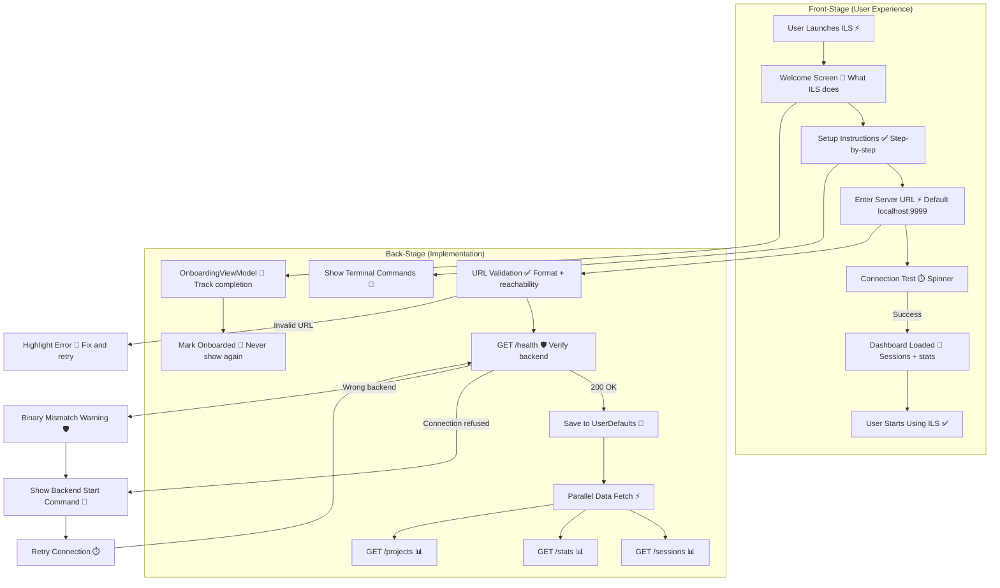

# Onboarding & First Launch

**Type:** Sequence Diagram
**Last Updated:** 2026-03-18
**Related Files:**
- `ILSApp/ILSApp/Views/Onboarding/`
- `ILSApp/ILSApp/ViewModels/OnboardingViewModel.swift`
- `ILSApp/ILSApp/ViewModels/SetupViewModel.swift`
- `ILSApp/ILSApp/Views/Settings/ServerSetupSheet.swift`
- `ILSApp/ILSApp/AppState.swift`

## Purpose

Guides a first-time user from app launch to a connected, functional ILS experience — including backend setup instructions, server connection, and initial data load so they see value within 60 seconds.

## Diagram

## Key Insights

- **60-Second Goal**: User should see their data within a minute of first launch
- **Zero-Config Default**: `localhost:9999` pre-filled — local users just tap Connect
- **Clear Instructions**: Shows exact terminal commands to start the backend
- **Binary Mismatch Detection**: Warns if old backend (wrong path) is running
- **Parallel Loading**: Sessions, stats, and projects fetched simultaneously after connection
- **One-Time Only**: Onboarding marked complete in UserDefaults — never shown again

## Change History

- **2026-03-18:** Initial creation
