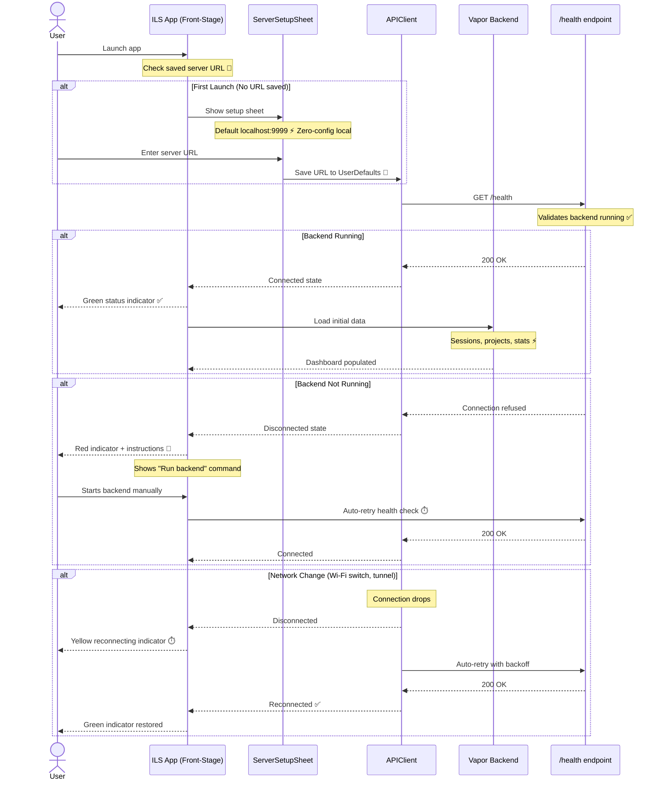

# Server Connection Journey

**Type:** Sequence Diagram
**Last Updated:** 2026-03-10
**Related Files:**
- `ILSApp/ILSApp/Services/APIClient.swift`
- `ILSApp/ILSApp/Views/Settings/ServerSetupSheet.swift`
- `ILSApp/ILSApp/ViewModels/AppState.swift`
- `Sources/ILSBackend/Controllers/SystemController.swift`

## Purpose

Shows how users connect the iOS/macOS app to their local or remote ILS backend, including first-launch setup, health checks, and reconnection after network changes.

## Diagram

## Key Insights

- **Zero-Config Local**: Default `localhost:9999` works out of the box for local dev
- **Visual Status**: Color-coded connection indicator — green/yellow/red
- **Auto-Recovery**: Network changes trigger automatic reconnection with backoff
- **Clear Instructions**: Disconnected state shows exact command to start backend

## Change History

- **2026-03-10:** Initial creation
