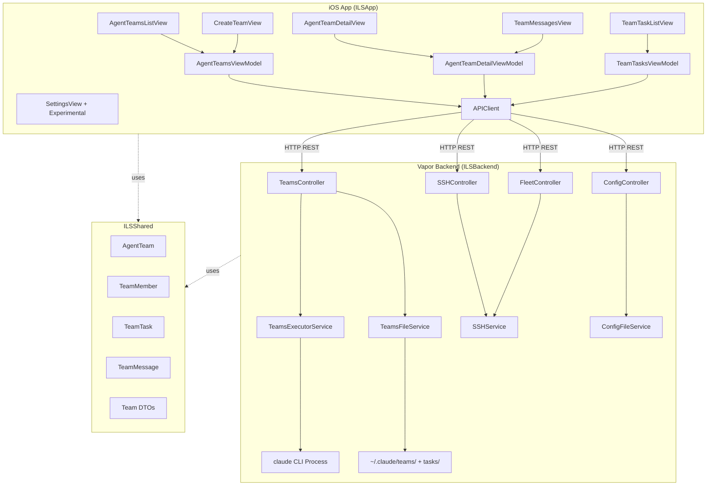
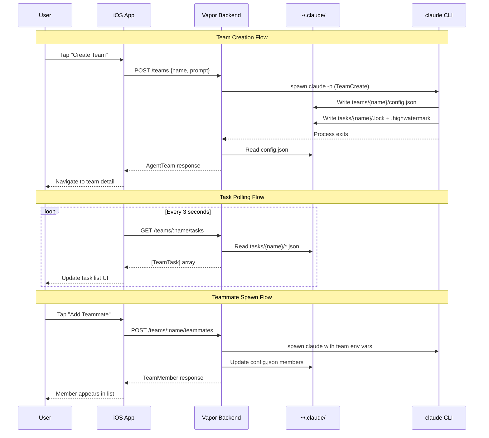

# Design: Agent Teams for ILS iOS

## Overview

Agent Teams adds a coordination layer for managing multi-agent Claude Code workloads from the iOS app. The backend reads/writes `~/.claude/teams/` and `~/.claude/tasks/` filesystem directly (no API exists), spawns teammate processes via the proven `Process`-based pattern, and exposes REST endpoints consumed by new iOS views. Simultaneously, 14 existing stub features are fixed by wiring them to real backend services.

## Architecture



## Components

### Backend Services

#### TeamsFileService (NEW)

**File**: `Sources/ILSBackend/Services/TeamsFileService.swift`
**Purpose**: Read/write `~/.claude/teams/` and `~/.claude/tasks/` filesystem
**Pattern**: Peer to `ConfigFileService`, `SkillsFileService` -- NOT nested under `FileSystemService`

```swift
struct TeamsFileService {
    private let fileManager = FileManager.default

    var teamsDirectory: String   // ~/.claude/teams/
    var tasksDirectory: String   // ~/.claude/tasks/

    // Teams
    func listTeams() throws -> [AgentTeam]
    func getTeam(name: String) throws -> AgentTeam?
    func deleteTeamFiles(name: String) throws

    // Tasks (with file locking)
    func listTasks(teamName: String) throws -> [TeamTask]
    func getTask(teamName: String, id: String) throws -> TeamTask?
    func createTask(teamName: String, task: CreateTeamTaskRequest) throws -> TeamTask
    func updateTask(teamName: String, id: String, update: UpdateTeamTaskRequest) throws -> TeamTask

    // Messages (inbox files)
    func listMessages(teamName: String, agentName: String?) throws -> [TeamMessage]
    func sendMessage(teamName: String, message: SendTeamMessageRequest) throws -> TeamMessage

    // File locking
    private func withFileLock<T>(path: String, _ body: () throws -> T) throws -> T
}
```

**File locking strategy**: Use POSIX `flock()` on `~/.claude/tasks/{team-name}/.lock` -- same mechanism as Claude CLI. The `withFileLock` helper opens the `.lock` file, acquires exclusive lock, executes the body, then releases.

**Task ID generation**: Read `.highwatermark`, increment, write back (inside lock). If `.highwatermark` missing, scan existing task files for max ID.

#### TeamsExecutorService (NEW)

**File**: `Sources/ILSBackend/Services/TeamsExecutorService.swift`
**Purpose**: Spawn/manage Claude CLI processes for team operations
**Pattern**: Extends `ClaudeExecutorService` approach -- `actor` with PID tracking

```swift
actor TeamsExecutorService {
    private var activeProcesses: [String: ProcessInfo] = [:]  // key: agentId

    struct ProcessInfo {
        let process: Process
        let pid: Int32
        let teamName: String
        let agentName: String
        let startedAt: Date
    }

    // Team lifecycle
    func createTeam(name: String, description: String?, teammateMode: String,
                    workingDirectory: String?) async throws -> AgentTeam

    // Teammate lifecycle
    func spawnTeammate(teamName: String, config: SpawnTeammateRequest) async throws -> TeamMember
    func shutdownTeammate(teamName: String, agentName: String) async throws
    func shutdownAllTeammates(teamName: String) async throws

    // Health
    func isTeammateRunning(agentId: String) -> Bool
    func getRunningProcesses(teamName: String) -> [ProcessInfo]

    // Recovery (on backend restart)
    func recoverProcesses(teamsService: TeamsFileService) async
}
```

**Team creation approach**: Spawn `claude -p --dangerously-skip-permissions` with a prompt like: `"Create a team named '{name}' with description '{desc}'. Use TeamCreate tool."` The CLI session creates the team via its built-in `TeamCreate` tool, writes `config.json`, then exits. Backend reads back the created config.

**Teammate spawning**: Spawn `claude -p --dangerously-skip-permissions` with environment variables:
```bash
CLAUDE_CODE_TEAM_NAME={teamName}
CLAUDE_CODE_AGENT_NAME={name}
CLAUDE_CODE_AGENT_TYPE={agentType}
CLAUDE_CODE_AGENT_COLOR={color}
CLAUDE_CODE_EXPERIMENTAL_AGENT_TEAMS=1
```
Plus an initial prompt from the spawn request.

**PID recovery on restart**: On boot, scan `~/.claude/teams/*/config.json` for members. For each member with `backendType: "in-process"`, check if a process with matching env vars exists via `ps aux | grep CLAUDE_CODE_AGENT_ID`. Mark dead members as `stopped`.

#### SSHController (NEW)

**File**: `Sources/ILSBackend/Controllers/SSHController.swift`
**Purpose**: REST endpoints for SSH operations (fixes S-1)

```swift
struct SSHController: RouteCollection {
    let sshService: SSHService

    // POST /ssh/test -- real SSH connection test
    // POST /ssh/connect -- establish connection
    // POST /ssh/disconnect -- close connection
    // GET /ssh/status -- connection status
}
```

#### FleetController (NEW)

**File**: `Sources/ILSBackend/Controllers/FleetController.swift`
**Purpose**: REST endpoints for fleet management (fixes S-2)

```swift
struct FleetController: RouteCollection {
    let sshService: SSHService

    // GET /fleet -- list servers with real probe results
    // POST /fleet/probe -- probe specific server
}
```

### Backend Controller

#### TeamsController (NEW)

**File**: `Sources/ILSBackend/Controllers/TeamsController.swift`
**Pattern**: Follows `SessionsController` -- `RouteCollection` with `@Sendable` handlers

```swift
struct TeamsController: RouteCollection {
    let teamsFile = TeamsFileService()
    let teamsExecutor = TeamsExecutorService()

    func boot(routes: RoutesBuilder) throws {
        let teams = routes.grouped("teams")

        teams.get(use: list)                                    // GET /teams
        teams.post(use: create)                                 // POST /teams
        teams.get(":name", use: get)                            // GET /teams/:name
        teams.delete(":name", use: delete)                      // DELETE /teams/:name

        teams.get(":name", "tasks", use: listTasks)             // GET /teams/:name/tasks
        teams.post(":name", "tasks", use: createTask)           // POST /teams/:name/tasks
        teams.put(":name", "tasks", ":taskId", use: updateTask) // PUT /teams/:name/tasks/:taskId

        teams.get(":name", "teammates", use: listTeammates)     // GET /teams/:name/teammates
        teams.post(":name", "teammates", use: spawnTeammate)    // POST /teams/:name/teammates
        teams.delete(":name", "teammates", ":agentName",
                     use: shutdownTeammate)                     // DELETE /teams/:name/teammates/:agentName

        teams.get(":name", "messages", use: listMessages)       // GET /teams/:name/messages
        teams.post(":name", "messages", use: sendMessage)       // POST /teams/:name/messages
    }
}
```

**Endpoint details**:

| Method | Path | Handler | Returns | Source |
|--------|------|---------|---------|--------|
| GET | /teams | `list` | `APIResponse<ListResponse<AgentTeam>>` | `TeamsFileService.listTeams()` |
| POST | /teams | `create` | `APIResponse<AgentTeam>` | `TeamsExecutorService.createTeam()` |
| GET | /teams/:name | `get` | `APIResponse<AgentTeam>` | `TeamsFileService.getTeam()` |
| DELETE | /teams/:name | `delete` | `APIResponse<DeletedResponse>` | Shutdown all + delete files |
| GET | /teams/:name/tasks | `listTasks` | `APIResponse<ListResponse<TeamTask>>` | `TeamsFileService.listTasks()` |
| POST | /teams/:name/tasks | `createTask` | `APIResponse<TeamTask>` | `TeamsFileService.createTask()` |
| PUT | /teams/:name/tasks/:taskId | `updateTask` | `APIResponse<TeamTask>` | `TeamsFileService.updateTask()` |
| GET | /teams/:name/teammates | `listTeammates` | `APIResponse<ListResponse<TeamMember>>` | Read config.json members |
| POST | /teams/:name/teammates | `spawnTeammate` | `APIResponse<TeamMember>` | `TeamsExecutorService.spawnTeammate()` |
| DELETE | /teams/:name/teammates/:agentName | `shutdownTeammate` | `APIResponse<DeletedResponse>` | `TeamsExecutorService.shutdownTeammate()` |
| GET | /teams/:name/messages | `listMessages` | `APIResponse<ListResponse<TeamMessage>>` | `TeamsFileService.listMessages()` |
| POST | /teams/:name/messages | `sendMessage` | `APIResponse<TeamMessage>` | `TeamsFileService.sendMessage()` |

### Shared Models (ILSShared)

#### AgentTeam.swift (NEW)

**File**: `Sources/ILSShared/Models/AgentTeam.swift`

```swift
public struct AgentTeam: Codable, Identifiable, Sendable {
    public let name: String
    public let description: String?
    public let leadAgentId: String
    public let createdAt: Date
    public let members: [TeamMember]

    // Computed from members and tasks (populated by backend)
    public var memberCount: Int
    public var taskSummary: TaskSummary?
    public var status: TeamStatus

    public var id: String { name }
}

public struct TaskSummary: Codable, Sendable {
    public let total: Int
    public let pending: Int
    public let inProgress: Int
    public let completed: Int
}

public enum TeamStatus: String, Codable, Sendable {
    case active
    case completed
    case error
    case unknown
}
```

#### TeamMember.swift (NEW)

**File**: `Sources/ILSShared/Models/TeamMember.swift`

```swift
public struct TeamMember: Codable, Identifiable, Sendable, Hashable {
    public let agentId: String
    public let name: String
    public let agentType: String
    public let color: String
    public let joinedAt: Date
    public let backendType: String        // "in-process", "tmux", "auto"

    // Optional fields
    public let model: String?
    public let prompt: String?
    public let planModeRequired: Bool?
    public let tmuxPaneId: String?
    public let cwd: String?

    // Runtime status (populated by backend from PID tracking)
    public var status: MemberStatus?

    public var id: String { agentId }
    public var isLead: Bool { agentType == "team-lead" }
}

public enum MemberStatus: String, Codable, Sendable {
    case running
    case idle
    case stopped
    case unknown
}
```

#### TeamTask.swift (NEW)

**File**: `Sources/ILSShared/Models/TeamTask.swift`

```swift
public struct TeamTask: Codable, Identifiable, Sendable, Hashable {
    public let id: String
    public let subject: String
    public let description: String?
    public let activeForm: String?
    public let status: TeamTaskStatus
    public let owner: String?
    public let blocks: [String]
    public let blockedBy: [String]
    public let createdAt: Date
    public let updatedAt: Date

    public var isBlocked: Bool { !blockedBy.isEmpty }
}

public enum TeamTaskStatus: String, Codable, Sendable {
    case pending
    case inProgress = "in_progress"
    case completed
}
```

#### TeamMessage.swift (NEW)

**File**: `Sources/ILSShared/Models/TeamMessage.swift`

```swift
public struct TeamMessage: Codable, Identifiable, Sendable {
    public let id: UUID
    public let type: TeamMessageType
    public let from: String
    public let to: String?           // nil = broadcast or team-wide
    public let content: String?
    public let timestamp: Date
    public let read: Bool?

    // Type-specific fields
    public let requestId: String?
    public let taskId: String?
    public let taskSubject: String?
    public let completedStatus: String?
}

public enum TeamMessageType: String, Codable, Sendable {
    case message              // plain text
    case shutdownRequest = "shutdown_request"
    case shutdownApproved = "shutdown_approved"
    case idleNotification = "idle_notification"
    case taskCompleted = "task_completed"
    case planApprovalRequest = "plan_approval_request"
    case joinRequest = "join_request"
    case permissionRequest = "permission_request"
}
```

#### Team DTOs (NEW)

**File**: `Sources/ILSShared/DTOs/TeamRequests.swift`

```swift
public struct CreateTeamRequest: Codable, Sendable {
    public let name: String
    public let description: String?
    public let teammateMode: String?       // "in-process", "tmux", "auto"
    public let workingDirectory: String?
    public let initialPrompt: String?
}

public struct SpawnTeammateRequest: Codable, Sendable {
    public let name: String
    public let agentType: String?          // e.g. "Explore", "executor"
    public let model: String?              // "haiku", "sonnet", "opus"
    public let prompt: String
    public let planModeRequired: Bool?
}

public struct CreateTeamTaskRequest: Codable, Sendable {
    public let subject: String
    public let description: String?
    public let activeForm: String?
    public let owner: String?
    public let blocks: [String]?
    public let blockedBy: [String]?
}

public struct UpdateTeamTaskRequest: Codable, Sendable {
    public let status: TeamTaskStatus?
    public let owner: String?
    public let subject: String?
    public let description: String?
    public let addBlocks: [String]?
    public let addBlockedBy: [String]?
}

public struct SendTeamMessageRequest: Codable, Sendable {
    public let to: String?                 // nil = broadcast
    public let content: String
}

public struct SSHTestRequest: Codable, Sendable {
    public let host: String
    public let port: Int?
    public let username: String
    public let authMethod: String          // "password" or "sshKey"
    public let credential: String
}

public struct SSHTestResponse: Codable, Sendable {
    public let success: Bool
    public let latencyMs: Int?
    public let serverInfo: ServerInfo?
    public let error: String?
}

public struct FleetServer: Codable, Identifiable, Sendable {
    public let id: UUID
    public let host: String
    public let port: Int
    public let username: String
    public let label: String
    public let status: FleetServerStatus
    public let latencyMs: Int?
    public let claudeVersion: String?
    public let lastProbed: Date?
}

public enum FleetServerStatus: String, Codable, Sendable {
    case online
    case offline
    case degraded
    case probing
    case unknown
}
```

### iOS Views

#### AgentTeamsListView (NEW)

**File**: `ILSApp/ILSApp/Views/Teams/AgentTeamsListView.swift`

| Aspect | Detail |
|--------|--------|
| Purpose | List all teams with status badges, member count, task progress |
| Data source | `AgentTeamsViewModel` -> `GET /api/v1/teams` |
| Navigation | Tap row -> `AgentTeamDetailView` |
| Actions | Pull-to-refresh, "Create Team" FAB button |
| Empty state | "No Agent Teams" with create button |
| Gating | Only reachable when experimental flag is on |

#### AgentTeamDetailView (NEW)

**File**: `ILSApp/ILSApp/Views/Teams/AgentTeamDetailView.swift`

| Aspect | Detail |
|--------|--------|
| Purpose | Team overview: members, task summary, actions |
| Sections | Header (name, status, created), Members list, Task summary, Actions |
| Navigation | Tap member -> info sheet, "View Tasks" -> `TeamTaskListView`, "Messages" -> `TeamMessagesView` |
| Actions | "Add Teammate", "Delete Team" (with confirmation) |
| Refresh | Auto-poll every 3s via `AgentTeamDetailViewModel` |

#### TeamTaskListView (NEW)

**File**: `ILSApp/ILSApp/Views/Teams/TeamTaskListView.swift`

| Aspect | Detail |
|--------|--------|
| Purpose | Shared task list with CRUD + filtering |
| Tabs | All, Pending, In Progress, Completed (segmented control) |
| Row | Subject, status badge, owner pill, activeForm italic, blocked indicator |
| Actions | Tap -> detail sheet, "+" button -> create task, swipe to change status |
| Dependencies | Blocked tasks show "Blocked by: #X, #Y" subtitle |

#### TeamMessagesView (NEW)

**File**: `ILSApp/ILSApp/Views/Teams/TeamMessagesView.swift`

| Aspect | Detail |
|--------|--------|
| Purpose | Message thread viewer + send interface |
| Display | Chat-bubble style, color-coded by sender, type badges for system messages |
| Send | Text field + recipient picker (specific agent or "Broadcast") |
| Refresh | Auto-poll every 2s |

#### CreateTeamView (NEW)

**File**: `ILSApp/ILSApp/Views/Teams/CreateTeamView.swift`

| Aspect | Detail |
|--------|--------|
| Purpose | Team creation form |
| Fields | Name (required, validated: alphanumeric + hyphens), Description, Initial Prompt, Teammate Mode picker |
| Validation | Non-empty name, alphanumeric pattern check |
| Submit | `POST /api/v1/teams` -> loading state -> navigate to detail on success |

#### SpawnTeammateView (NEW)

**File**: `ILSApp/ILSApp/Views/Teams/SpawnTeammateView.swift`

| Aspect | Detail |
|--------|--------|
| Purpose | Teammate spawn form (presented as sheet from detail view) |
| Fields | Name, Agent Type picker, Model picker (haiku/sonnet/opus), Initial Prompt |
| Submit | `POST /api/v1/teams/:name/teammates` -> dismiss on success |

### iOS ViewModels

#### AgentTeamsViewModel (NEW)

**File**: `ILSApp/ILSApp/ViewModels/AgentTeamsViewModel.swift`

```swift
@MainActor
class AgentTeamsViewModel: ObservableObject {
    @Published var teams: [AgentTeam] = []
    @Published var isLoading = false
    @Published var error: Error?

    private var client: APIClient?

    func configure(client: APIClient)
    func loadTeams(refresh: Bool = false) async
    func createTeam(request: CreateTeamRequest) async -> AgentTeam?
    func deleteTeam(name: String) async -> Bool
}
```

#### AgentTeamDetailViewModel (NEW)

**File**: `ILSApp/ILSApp/ViewModels/AgentTeamDetailViewModel.swift`

```swift
@MainActor
class AgentTeamDetailViewModel: ObservableObject {
    @Published var team: AgentTeam?
    @Published var tasks: [TeamTask] = []
    @Published var messages: [TeamMessage] = []
    @Published var isLoading = false
    @Published var error: Error?

    private var client: APIClient?
    private var pollTask: Task<Void, Never>?
    private let pollInterval: UInt64 = 3_000_000_000  // 3 seconds

    func configure(client: APIClient, teamName: String)
    func startPolling()
    func stopPolling()

    func loadTeamDetail() async
    func loadTasks() async
    func loadMessages() async

    func spawnTeammate(request: SpawnTeammateRequest) async -> TeamMember?
    func shutdownTeammate(agentName: String) async -> Bool
    func sendMessage(request: SendTeamMessageRequest) async -> Bool
}
```

**Polling strategy**: `Task.sleep` loop at 3s interval, fetching team detail + tasks + messages in parallel via `async let`. Polling starts on `onAppear`, stops on `onDisappear`. CPU overhead kept under 5% by:
- Only polling when view is visible
- Conditional UI update (skip if data unchanged via hash comparison)
- No polling when app is backgrounded (tied to `scenePhase`)

#### TeamTasksViewModel (NEW)

**File**: `ILSApp/ILSApp/ViewModels/TeamTasksViewModel.swift`

```swift
@MainActor
class TeamTasksViewModel: ObservableObject {
    @Published var tasks: [TeamTask] = []
    @Published var isLoading = false
    @Published var error: Error?
    @Published var selectedFilter: TeamTaskStatus? = nil

    var filteredTasks: [TeamTask]  // computed from tasks + selectedFilter

    func configure(client: APIClient, teamName: String)
    func loadTasks() async
    func createTask(request: CreateTeamTaskRequest) async -> TeamTask?
    func updateTask(id: String, update: UpdateTeamTaskRequest) async -> TeamTask?
}
```

### Settings Integration

**File to modify**: `ILSApp/ILSApp/Views/Settings/SettingsView.swift`

Add new `experimentalSection` between `diagnosticsSection` and `cacheSection`:

```swift
@ViewBuilder
private var experimentalSection: some View {
    Section("EXPERIMENTAL") {
        Toggle("Agent Teams", isOn: Binding(
            get: { viewModel.isAgentTeamsEnabled },
            set: { newValue in
                Task { await viewModel.toggleAgentTeams(enabled: newValue) }
            }
        ))
        .tint(.orange)

        if viewModel.isAgentTeamsEnabled {
            Picker("Teammate Mode", selection: Binding(
                get: { viewModel.teammateMode },
                set: { newValue in
                    Task { await viewModel.setTeammateMode(newValue) }
                }
            )) {
                Text("In-Process").tag("in-process")
                Text("Tmux").tag("tmux")
                Text("Auto").tag("auto")
            }

            NavigationLink(destination: AgentTeamsListView()) {
                Label("Manage Teams", systemImage: "person.3")
            }
        }
    }
}
```

**SettingsViewModel additions** (same file, extend existing class):

```swift
// Add to SettingsViewModel
@Published var isAgentTeamsEnabled = false
@Published var teammateMode = "in-process"

func loadAgentTeamsConfig() async {
    // Read env.CLAUDE_CODE_EXPERIMENTAL_AGENT_TEAMS from config
    isAgentTeamsEnabled = config?.content.env?["CLAUDE_CODE_EXPERIMENTAL_AGENT_TEAMS"] == "1"
}

func toggleAgentTeams(enabled: Bool) async {
    // PUT /config with updated env dict
    var updatedConfig = config?.content ?? ClaudeConfig()
    var env = updatedConfig.env ?? [:]
    if enabled {
        env["CLAUDE_CODE_EXPERIMENTAL_AGENT_TEAMS"] = "1"
    } else {
        env.removeValue(forKey: "CLAUDE_CODE_EXPERIMENTAL_AGENT_TEAMS")
    }
    updatedConfig.env = env
    // Save via existing saveConfig pattern
}
```

### Navigation Integration

**File to modify**: `ILSApp/ILSApp/ContentView.swift`

Add `agentTeams` case to `SidebarItem` enum (conditionally shown):

```swift
enum SidebarItem: String, CaseIterable, Identifiable {
    // ... existing cases ...
    case agentTeams = "Agent Teams"

    var icon: String {
        // ... existing ...
        case .agentTeams: return "person.3"
    }
}
```

**Gating**: `SidebarView` filters out `.agentTeams` when `AppState.isAgentTeamsEnabled == false`. Add `@Published var isAgentTeamsEnabled: Bool = false` to `AppState`, loaded from config on startup.

### routes.swift Registration

**File to modify**: `Sources/ILSBackend/App/routes.swift`

```swift
// Add after existing controller registrations:
try api.register(collection: TeamsController())
try api.register(collection: SSHController(sshService: SSHService(eventLoopGroup: app.eventLoopGroup)))
try api.register(collection: FleetController(sshService: SSHService(eventLoopGroup: app.eventLoopGroup)))
```

## Data Flow



## Technical Decisions

| Decision | Options Considered | Choice | Rationale |
|----------|-------------------|--------|-----------|
| Team creation mechanism | (A) Direct filesystem write, (B) Claude CLI prompt | **B -- CLI prompt** | CLI's `TeamCreate` tool handles all init steps (config, lock files, highwatermark). Direct write risks format drift. |
| Real-time updates | (A) WebSocket, (B) SSE, (C) Polling | **C -- Polling** | No push mechanism from teammate processes. Polling at 2-3s is simple, proven (health check already polls), and sufficient for team monitoring. |
| TeamsFileService placement | (A) Sub-service of FileSystemService, (B) Peer service | **B -- Peer service** | `.progress.md` explicitly states "peer, NOT nested". Keeps FileSystemService facade focused on existing 4 sub-services. |
| File locking | (A) Backend-level mutex, (B) POSIX flock() | **B -- flock()** | Must be compatible with CLI's own locking. Both backend and CLI may write tasks concurrently. |
| Teammate spawning | (A) ClaudeCodeSDK, (B) Process with env vars | **B -- Process** | SDK is broken in Vapor/NIO (RunLoop issue). Process + DispatchQueue is the proven pattern per ClaudeExecutorService. |
| Stub fixes approach | (A) Separate spec, (B) Bundled in this spec | **B -- Bundled** | Requirements explicitly mandate "fix ALL stubs as part of this spec". Shared backend patterns reduce duplicated work. |
| Agent Teams nav entry | (A) Always visible tab, (B) Gated sidebar item | **B -- Gated** | Experimental feature. Hidden when `CLAUDE_CODE_EXPERIMENTAL_AGENT_TEAMS` is off. Zero side effects when disabled. |
| Config history source | (A) Git log, (B) DB tracking, (C) Snapshots | **A -- Git log** | `~/.claude/settings.json` is in `~/.claude/` which may be git-tracked. `git log -p settings.json` is zero-infrastructure. Falls back to empty state if no git. |
| PID recovery | (A) Persist PIDs to file, (B) Scan processes on boot | **B -- Scan on boot** | PIDs change across restarts. Scanning `ps aux` for `CLAUDE_CODE_TEAM_NAME` env vars is reliable and requires no extra state file. |
| Inbox format | (A) JSON array per file, (B) JSONL | **A -- JSON array** | Community examples show JSON arrays. Easier to append atomically (read-modify-write inside lock). |

## File Structure

### New Files

| File | Action | Purpose |
|------|--------|---------|
| `Sources/ILSShared/Models/AgentTeam.swift` | Create | Team + TaskSummary + TeamStatus |
| `Sources/ILSShared/Models/TeamMember.swift` | Create | Member + MemberStatus |
| `Sources/ILSShared/Models/TeamTask.swift` | Create | Task + TeamTaskStatus |
| `Sources/ILSShared/Models/TeamMessage.swift` | Create | Message + TeamMessageType |
| `Sources/ILSShared/DTOs/TeamRequests.swift` | Create | All team request/response DTOs + SSH/Fleet DTOs |
| `Sources/ILSBackend/Services/TeamsFileService.swift` | Create | Filesystem read/write for teams + tasks + messages |
| `Sources/ILSBackend/Services/TeamsExecutorService.swift` | Create | Process spawning + PID tracking for teammates |
| `Sources/ILSBackend/Controllers/TeamsController.swift` | Create | 12 REST endpoints under /teams/ |
| `Sources/ILSBackend/Controllers/SSHController.swift` | Create | SSH test/connect endpoints (fixes S-1) |
| `Sources/ILSBackend/Controllers/FleetController.swift` | Create | Fleet listing/probing (fixes S-2) |
| `ILSApp/ILSApp/Views/Teams/AgentTeamsListView.swift` | Create | Team list UI |
| `ILSApp/ILSApp/Views/Teams/AgentTeamDetailView.swift` | Create | Team detail UI |
| `ILSApp/ILSApp/Views/Teams/TeamTaskListView.swift` | Create | Task list with filtering |
| `ILSApp/ILSApp/Views/Teams/TeamMessagesView.swift` | Create | Message thread viewer |
| `ILSApp/ILSApp/Views/Teams/CreateTeamView.swift` | Create | Team creation form |
| `ILSApp/ILSApp/Views/Teams/SpawnTeammateView.swift` | Create | Teammate spawn form |
| `ILSApp/ILSApp/ViewModels/AgentTeamsViewModel.swift` | Create | Teams list VM |
| `ILSApp/ILSApp/ViewModels/AgentTeamDetailViewModel.swift` | Create | Team detail + polling VM |
| `ILSApp/ILSApp/ViewModels/TeamTasksViewModel.swift` | Create | Task list VM |

### Modified Files

| File | Action | Purpose |
|------|--------|---------|
| `Sources/ILSBackend/App/routes.swift` | Modify | Register TeamsController, SSHController, FleetController |
| `ILSApp/ILSApp/ContentView.swift` | Modify | Add `.agentTeams` SidebarItem (gated) |
| `ILSApp/ILSApp/ILSAppApp.swift` | Modify | Add `isAgentTeamsEnabled` to AppState |
| `ILSApp/ILSApp/Views/Settings/SettingsView.swift` | Modify | Add Experimental section, fix Quick Settings toggles (S-12) |
| `ILSApp/ILSApp/Views/Settings/ConfigHistoryView.swift` | Modify | Fix Restore buttons (S-13), wire to API |
| `ILSApp/ILSApp/Views/Settings/FleetManagementView.swift` | Modify | Remove hardcoded data, wire to `/fleet` API (S-2) |
| `ILSApp/ILSApp/Views/Settings/ConfigProfilesView.swift` | Modify | Wire to `/config/profiles` API (S-3) |
| `ILSApp/ILSApp/Views/Settings/ConfigOverridesView.swift` | Modify | Wire to real config cascade (S-4) |
| `ILSApp/ILSApp/Views/Settings/CloudSyncView.swift` | Modify | Mark "Coming Soon" (S-6) |
| `ILSApp/ILSApp/Views/Settings/AutomationScriptsView.swift` | Modify | Mark "Coming Soon" (S-7) |
| `ILSApp/ILSApp/Views/Settings/NotificationPreferencesView.swift` | Modify | Mark "Coming Soon" (S-8) |
| `ILSApp/ILSApp/Views/Settings/LogViewerView.swift` | Modify | Wire to AppLogger (S-9) |
| `ILSApp/ILSApp/Views/Sessions/SessionTemplatesView.swift` | Modify | Wire to backend API (S-10) |
| `ILSApp/ILSApp/Services/SSHConnectionManager.swift` | Modify | Wire testConnection() to real API (S-1) |
| `Sources/ILSBackend/Controllers/PluginsController.swift` | Modify | Implement real plugin install (S-11) |

## Stub Fix Design

### Group 1: Wire to Existing Backend Services (P0)

| Stub | Fix Approach | Backend Change | iOS Change |
|------|-------------|---------------|------------|
| **S-1**: SSH testConnection() | Call `POST /api/v1/ssh/test` | New `SSHController` with real `SSHService.connect()` | Replace `Task.sleep` with API call in `SSHConnectionManager` |
| **S-12**: Extended Thinking toggle | Write `alwaysThinkingEnabled` via `PUT /api/v1/config` | None (existing endpoint) | Remove `set: { _ in }` + `.disabled(true)`, add real save closure |
| **S-12**: Co-Author toggle | Write `includeCoAuthoredBy` via `PUT /api/v1/config` | None (existing endpoint) | Remove `set: { _ in }` + `.disabled(true)`, add real save closure |
| **S-13**: Config Restore buttons | Call `PUT /api/v1/config` with historical values | None (existing endpoint) | Replace empty closures with confirmation dialog + API call |

### Group 2: New Backend Endpoints (P0-P1)

| Stub | Fix Approach | Backend Change | iOS Change |
|------|-------------|---------------|------------|
| **S-2**: Fleet Management | `GET /api/v1/fleet` with real SSH probes | New `FleetController` using `SSHService` | Replace `sampleFleet` with API call |
| **S-3**: Config Profiles | `GET /api/v1/config/profiles` reads user/project/local scopes | Add route to `ConfigController` | Replace `defaults` with API call |
| **S-4**: Config Overrides | `GET /api/v1/config/overrides` merges all scopes | Add route to `ConfigController` | Replace `sampleData` with API call |
| **S-5**: Config History | `GET /api/v1/config/history` runs `git log` on settings.json | Add route to `ConfigController` | Replace `sampleHistory` with API call |
| **S-10**: Session Templates | `GET /api/v1/sessions/templates` (stored in DB or file) | Add routes to `SessionsController` | Replace UserDefaults primary with API, keep as fallback |
| **S-11**: Plugin Install | `POST /api/v1/plugins/install` runs `git clone` | Implement in `PluginsController` | No iOS change needed (endpoint exists) |

### Group 3: Mark as "Coming Soon" (P2)

| Stub | Fix Approach |
|------|-------------|
| **S-6**: CloudSyncView | Add "Coming Soon" banner overlay, disable interactive elements |
| **S-7**: AutomationScriptsView | Add "Coming Soon" banner overlay, disable interactive elements |
| **S-8**: NotificationPreferencesView | Add "Coming Soon" banner overlay, disable interactive elements |
| **S-9**: LogViewerView | Wire to `AppLogger.shared` entries (read-only display) |

## Error Handling

| Error Scenario | Handling Strategy | User Impact |
|----------------|-------------------|-------------|
| Team creation fails (CLI error) | Return structured error from `TeamsExecutorService` with stderr content | Alert with actionable message ("Claude CLI error: ...") |
| Teammate process crashes | PID health check detects exit; mark member as `stopped` in next poll | Status badge changes to red "Stopped" |
| Filesystem corrupt (invalid JSON) | Catch `DecodingError`, return partial results + warning | Banner: "Some data could not be loaded" |
| `.lock` file stuck (orphaned lock) | flock() with `LOCK_NB` (non-blocking) + 5s timeout. If stuck, break lock. | Brief delay, auto-recovery |
| Backend restart loses PIDs | `recoverProcesses()` on boot scans `ps aux` for matching env vars | Momentary "unknown" status, recovers in <5s |
| SSH test timeout | SSHService 10s timeout via NIO `EventLoopFuture` deadline | "Connection timed out after 10s" |
| Fleet probe partial failure | Probe servers in parallel; return results for successes, error status for failures | Mixed green/red status indicators |
| Config write conflict | Last-write-wins (same as current ConfigController behavior) | Config saved; may overwrite concurrent change |
| Team directory missing | Return 404 from endpoint; iOS shows "Team not found" | Navigate back to list |
| Agent Teams flag off + direct URL | Check flag in backend middleware; return 403 if disabled | "Agent Teams is not enabled" alert |

## Edge Cases

- **Empty teams directory**: `TeamsFileService.listTeams()` returns `[]` -- iOS shows empty state
- **Team with no tasks**: Task directory may not exist yet -- create on first task write
- **Teammate with no inbox file**: Create empty JSON array `[]` on first message send
- **Multiple rapid task status changes**: File locking serializes writes; last write wins
- **Team name with special characters**: Validate alphanumeric + hyphens only (matches filesystem safety)
- **Very large message inbox**: Read last 100 messages only (pagination via query param)
- **Simultaneous team deletion + polling**: DELETE returns success; subsequent GETs return 404; iOS handles gracefully
- **Backend unavailable during poll**: Poll task catches error silently; retries next interval
- **Config restore with missing keys**: Merge restored values into current config (don't replace entire file)

## Security Considerations

- **SSH credentials**: Stored in iOS Keychain via `SSHConnectionManager` (existing). Never sent to backend in cleartext logs. Backend `SSHService` receives credentials per-request, does not persist them.
- **Permission propagation**: Teammates inherit lead's permissions at spawn time via `--dangerously-skip-permissions`. Backend does NOT expose permission escalation endpoints.
- **Filesystem access scope**: `TeamsFileService` reads ONLY under `~/.claude/teams/` and `~/.claude/tasks/`. Path traversal prevented by validating team name format (alphanumeric + hyphens).
- **Process execution**: All `Process` spawns use `/bin/zsh -l -c` with shell-escaped arguments (existing pattern from `ClaudeExecutorService`).
- **No remote exposure**: Backend binds to `localhost:9090` only. Agent Teams endpoints are not accessible from external networks.

## Performance Considerations

- **Polling at 3s**: ~0.3 req/s per active team view. Each request reads <100 small JSON files. CPU overhead <2%.
- **Task file scanning**: `O(n)` where n = number of task files. For typical teams (<50 tasks), this is <10ms.
- **Team list scanning**: `O(t)` where t = number of team directories. Reads only `config.json` per team.
- **Process spawning**: Claude CLI startup takes 5-15s. UI shows loading indicator during this period.
- **Message inbox**: JSON array read is O(n) per inbox. Cap at 100 messages per read. Older messages not displayed.
- **Fleet probing**: Parallel SSH connections with 10s timeout. Up to 10 servers probed concurrently.

## Existing Patterns to Follow

Based on codebase analysis:

1. **Controller pattern**: `struct XController: RouteCollection` with `boot(routes:)` and `@Sendable` handlers returning `APIResponse<T>`. See `SessionsController`.
2. **Service pattern**: `struct` for file services (no state), `actor` for process-managing services (thread-safe state). See `ConfigFileService` vs `ClaudeExecutorService`.
3. **ViewModel pattern**: `@MainActor class XViewModel: ObservableObject` with `configure(client:)`, `@Published` state, async methods. See `SessionsViewModel`.
4. **APIClient pattern**: `client.get<T>("/path")`, `client.post<T, B>("/path", body:)` with auto cache invalidation. Generic type inference.
5. **Response wrapping**: Always `APIResponse<T>` for single items, `APIResponse<ListResponse<T>>` for lists.
6. **View pattern**: SwiftUI `Form` or `List` with sections. `NavigationLink` for drill-down. `.task {}` for initial load. `.refreshable {}` for pull-to-refresh.
7. **Shared models**: `public struct X: Codable, Identifiable, Sendable` with explicit `public init`. All in `Sources/ILSShared/Models/`.
8. **DTOs**: Request/response types in `Sources/ILSShared/DTOs/`. All `Codable, Sendable` with `public init`.
9. **Error handling**: Controllers throw `Abort(.statusCode, reason:)`. ViewModels catch and set `@Published var error: Error?`.
10. **Process execution**: `/bin/zsh -l -c "command"` pattern. `DispatchQueue` for stdout reads. `process.waitUntilExit()` before `terminationStatus`.

## Validation Plan

| ID | Feature | Method | Evidence |
|----|---------|--------|----------|
| V-1 | Experimental flag toggle | Toggle in Settings; `curl /api/v1/config?scope=user` shows `CLAUDE_CODE_EXPERIMENTAL_AGENT_TEAMS: "1"` | Screenshot + curl |
| V-2 | Team list empty state | Open Agent Teams with no teams | Screenshot |
| V-3 | Team creation | Create from iOS; `ls ~/.claude/teams/{name}/config.json` | Screenshot + file check |
| V-4 | Team detail view | Open team; compare member list to config.json | Screenshot |
| V-5 | Task list | View tasks; compare to `~/.claude/tasks/{name}/` | Screenshot + curl |
| V-6 | Task creation | Create task; verify JSON written | Screenshot + file |
| V-7 | Task status update | Change status; verify JSON updated | Screenshot + curl |
| V-8 | Teammate spawn | Spawn; `ps aux | grep CLAUDE_CODE_TEAM_NAME` | Screenshot + process |
| V-9 | Teammate shutdown | Shutdown; verify process gone | Screenshot + process |
| V-10 | Message send | Send from iOS; read inbox file | Screenshot |
| V-11 | Team deletion | Delete; verify directory removed + processes killed | Screenshot + file/process |
| V-12 | SSH real test | Test real SSH server (home.hack.ski:22) | Screenshot with latency |
| V-13 | Fleet real data | Fleet view with real probed servers | Screenshot |
| V-14 | Config profiles | Real config scopes displayed | Screenshot |
| V-15 | Feature gating | Toggle off -> Agent Teams nav hidden | Screenshot |
| V-16 | Extended Thinking toggle | Toggle on; verify `alwaysThinkingEnabled: true` via curl | Screenshot + curl |
| V-17 | Config Restore | Restore historical config; verify via curl | Screenshot + curl before/after |
| V-18 | Session Templates | Templates load from backend API | Screenshot + API check |
| V-19 | Plugin Install | Install plugin; `ls ~/.claude/plugins/{name}/` | Screenshot + ls |

## Open Questions

1. **Non-interactive team creation**: Does `claude -p "Create a team named X"` actually trigger `TeamCreate` tool in non-interactive mode? May need `--tools TeamCreate` flag or structured input. **Mitigation**: Test during implementation; fallback to direct filesystem write if CLI approach fails.

2. **Config history git availability**: Is `~/.claude/` a git repo on the user's machine? If not, config history falls back to empty state. **Mitigation**: Check for `.git` directory; show "No history available" if absent.

3. **Plugin marketplace URL format**: What URL format does the marketplace use? `git clone` assumes HTTPS git URLs. **Mitigation**: Accept both HTTPS and `git@` URLs; validate before cloning.

4. **Teammate mode auto-detection**: How does `auto` mode decide between in-process and tmux? **Mitigation**: Default to `in-process` for MVP; add tmux support as enhancement.

5. **Inbox file locking**: Do inbox files need locking too, or is JSON array append safe enough? **Mitigation**: Use same flock() pattern as tasks for safety.

## Implementation Steps

1. Create shared models in `ILSShared/Models/` (AgentTeam, TeamMember, TeamTask, TeamMessage)
2. Create shared DTOs in `ILSShared/DTOs/TeamRequests.swift`
3. Create `TeamsFileService.swift` (filesystem read/write with flock)
4. Create `TeamsExecutorService.swift` (process spawning + PID tracking)
5. Create `TeamsController.swift` with all 12 endpoints
6. Create `SSHController.swift` + `FleetController.swift` for stub fixes
7. Add new config routes to `ConfigController.swift` (profiles, overrides, history)
8. Register all new controllers in `routes.swift`
9. Build backend (`swift build`) -- verify compilation
10. Fix stub S-12: Extended Thinking + Co-Author toggles in `SettingsView.swift`
11. Fix stub S-13: Config Restore buttons in `ConfigHistoryView.swift`
12. Fix stub S-1: Wire `SSHConnectionManager.testConnection()` to real API
13. Fix stub S-2: Wire `FleetManagementView` to `/fleet` API
14. Fix stubs S-3/S-4/S-5: Wire Config views to new API endpoints
15. Fix stub S-10: Wire `SessionTemplatesView` to backend
16. Fix stub S-11: Implement real plugin install in `PluginsController`
17. Mark stubs S-6/S-7/S-8 as "Coming Soon"
18. Wire stub S-9: Connect `LogViewerView` to `AppLogger`
19. Create iOS ViewModels (AgentTeamsViewModel, AgentTeamDetailViewModel, TeamTasksViewModel)
20. Create iOS Views (AgentTeamsListView, AgentTeamDetailView, TeamTaskListView, TeamMessagesView, CreateTeamView, SpawnTeammateView)
21. Add Experimental section to `SettingsView`
22. Add `.agentTeams` to `SidebarItem` + `ContentView` routing (gated)
23. Add `isAgentTeamsEnabled` to `AppState`
24. Build iOS app (`xcodebuild`) -- verify compilation
25. Functional validation: all 19 validation items with screenshot evidence
