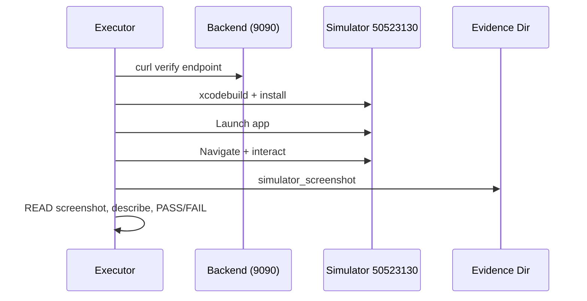
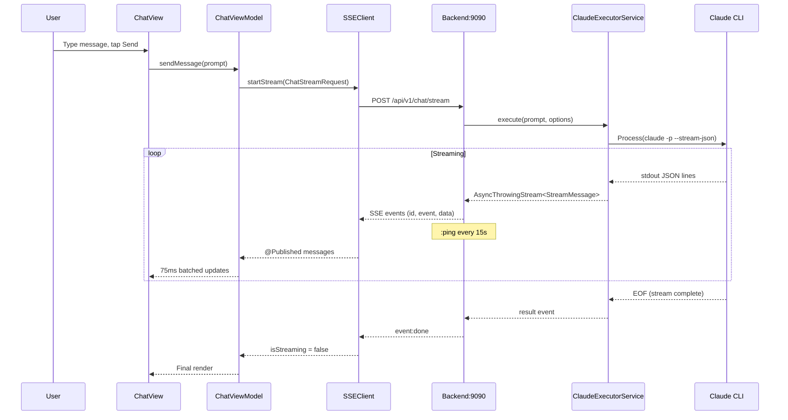
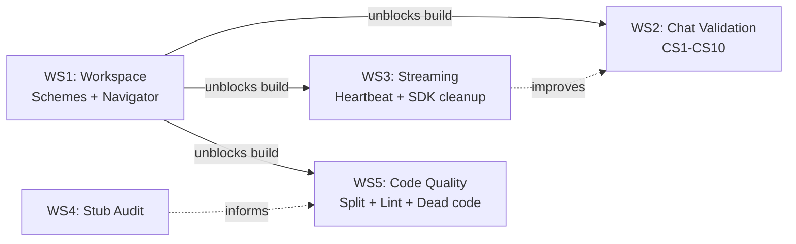

# Design: ILS iOS Alpha Release

## Overview

Five workstreams converge to produce a verified, unified ILS iOS app: (1) workspace unification via shared xcschemes, (2) E2E validation of 10 chat scenarios with screenshot evidence, (3) SSE heartbeat hardening, (4) stub audit, and (5) code quality cleanup. The architecture is sound -- this design is about completing, verifying, and polishing what exists.

## Architecture

```mermaid
graph TB
    subgraph Workspace["ILSFullStack.xcworkspace"]
        direction TB
        ILSApp["ILSApp.xcodeproj<br/>(iOS, Simulator)"]
        Backend["Package.swift<br/>(ILSBackend, macOS)"]
        Shared["ILSShared<br/>(SPM Library)"]
        ILSApp --> Shared
        Backend --> Shared
    end

    subgraph Streaming["Chat Streaming Pipeline"]
        CLI["Claude CLI<br/>-p --stream-json"] -->|stdout| Executor["ClaudeExecutorService<br/>Process + DispatchQueue"]
        Executor -->|AsyncThrowingStream| StreamSvc["StreamingService<br/>SSE + heartbeat"]
        StreamSvc -->|HTTP SSE| SSEClient["SSEClient<br/>URLSession.bytes"]
        SSEClient -->|@Published| ChatVM["ChatViewModel<br/>75ms batching"]
        ChatVM -->|SwiftUI| ChatView["ChatView"]
    end

    subgraph Validation["E2E Validation"]
        Curl["curl localhost:9090"] --> Evidence["specs/alpha/evidence/"]
        Simulator["Simulator 50523130"] --> Evidence
        Build["xcodebuild"] --> Simulator
    end
```

## Components

### 1. Workspace Schemes

**Purpose**: Enable building both backend and iOS app from `ILSFullStack.xcworkspace`.

**Interfaces**: Three shared xcscheme files at workspace level.

| Scheme | Target | Destination | Working Dir | Env Vars |
|--------|--------|-------------|-------------|----------|
| ILSApp | ILSApp.app | Simulator 50523130 | N/A | N/A |
| ILSBackend | ILSBackend (SPM exec) | My Mac | `/Users/nick/Desktop/ils-ios` | `PORT=9090` |

### 2. SSE Heartbeat (Enhancement)

**Purpose**: Detect stale SSE connections client-side when heartbeat stops.

**Current state**: Backend already sends `: ping` every 15s via `StreamingService.heartbeatTask`. Client already ignores lines starting with `:` (heartbeat comment). **Missing**: client-side timeout detection when heartbeats stop arriving.

### 3. Chat Validation Harness

**Purpose**: Systematic E2E verification of 10 chat scenarios.

**Evidence directory**: `specs/alpha/evidence/`

---

## Workstream 1: Workspace Unification

### 1.1 Workspace Shared Schemes Directory

```bash
mkdir -p ILSFullStack.xcworkspace/xcshareddata/xcschemes
```

### 1.2 ILSApp Workspace Scheme

File: `ILSFullStack.xcworkspace/xcshareddata/xcschemes/ILSApp.xcscheme`

Key values extracted from existing `ILSApp/ILSApp.xcodeproj/xcshareddata/xcschemes/ILSApp.xcscheme`:
- `BlueprintIdentifier`: `00000000000000000000000E`
- `BuildableName`: `ILSApp.app`
- `BlueprintName`: `ILSApp`
- `ReferencedContainer`: `container:ILSApp/ILSApp.xcodeproj` (relative to workspace)

```xml
<?xml version="1.0" encoding="UTF-8"?>
<Scheme
   LastUpgradeVersion = "1600"
   version = "1.7">
   <BuildAction
      parallelizeBuildables = "YES"
      buildImplicitDependencies = "YES">
      <BuildActionEntries>
         <BuildActionEntry
            buildForTesting = "YES"
            buildForRunning = "YES"
            buildForProfiling = "YES"
            buildForArchiving = "YES"
            buildForAnalyzing = "YES">
            <BuildableReference
               BuildableIdentifier = "primary"
               BlueprintIdentifier = "00000000000000000000000E"
               BuildableName = "ILSApp.app"
               BlueprintName = "ILSApp"
               ReferencedContainer = "container:ILSApp/ILSApp.xcodeproj">
            </BuildableReference>
         </BuildActionEntry>
      </BuildActionEntries>
   </BuildAction>
   <TestAction
      buildConfiguration = "Debug"
      selectedDebuggerIdentifier = "Xcode.DebuggerFoundation.Debugger.LLDB"
      selectedLauncherIdentifier = "Xcode.DebuggerFoundation.Launcher.LLDB"
      shouldUseLaunchSchemeArgsEnv = "YES"
      shouldAutocreateTestPlan = "YES">
   </TestAction>
   <LaunchAction
      buildConfiguration = "Debug"
      selectedDebuggerIdentifier = "Xcode.DebuggerFoundation.Debugger.LLDB"
      selectedLauncherIdentifier = "Xcode.DebuggerFoundation.Launcher.LLDB"
      launchStyle = "0"
      useCustomWorkingDirectory = "NO"
      ignoresPersistentStateOnLaunch = "NO"
      debugDocumentVersioning = "YES"
      debugServiceExtension = "internal"
      allowLocationSimulation = "YES">
      <BuildableProductRunnable
         runnableDebuggingMode = "0">
         <BuildableReference
            BuildableIdentifier = "primary"
            BlueprintIdentifier = "00000000000000000000000E"
            BuildableName = "ILSApp.app"
            BlueprintName = "ILSApp"
            ReferencedContainer = "container:ILSApp/ILSApp.xcodeproj">
         </BuildableReference>
      </BuildableProductRunnable>
   </LaunchAction>
   <ProfileAction
      buildConfiguration = "Release"
      shouldUseLaunchSchemeArgsEnv = "YES"
      savedToolIdentifier = ""
      useCustomWorkingDirectory = "NO"
      debugDocumentVersioning = "YES">
      <BuildableProductRunnable
         runnableDebuggingMode = "0">
         <BuildableReference
            BuildableIdentifier = "primary"
            BlueprintIdentifier = "00000000000000000000000E"
            BuildableName = "ILSApp.app"
            BlueprintName = "ILSApp"
            ReferencedContainer = "container:ILSApp/ILSApp.xcodeproj">
         </BuildableReference>
      </BuildableProductRunnable>
   </ProfileAction>
   <AnalyzeAction
      buildConfiguration = "Debug">
   </AnalyzeAction>
   <ArchiveAction
      buildConfiguration = "Release"
      revealArchiveInOrganizer = "YES">
   </ArchiveAction>
</Scheme>
```

### 1.3 ILSBackend Workspace Scheme

File: `ILSFullStack.xcworkspace/xcshareddata/xcschemes/ILSBackend.xcscheme`

The backend is an SPM executable target from `Package.swift`. When the workspace includes a reference to the SPM package (via the "Backend" group pointing at `Sources` and `Package.swift`), Xcode auto-generates a scheme for `ILSBackend`. However, auto-generated schemes lack:
- Custom working directory (needed so Vapor finds `ils.sqlite`, `.env`)
- Environment variables (`PORT=9090`)

We create an explicit shared scheme. The `BlueprintIdentifier` for SPM package targets uses the target name directly -- Xcode resolves SPM targets by name, not by UUID.

```xml
<?xml version="1.0" encoding="UTF-8"?>
<Scheme
   LastUpgradeVersion = "1600"
   version = "1.7">
   <BuildAction
      parallelizeBuildables = "YES"
      buildImplicitDependencies = "YES">
      <BuildActionEntries>
         <BuildActionEntry
            buildForTesting = "NO"
            buildForRunning = "YES"
            buildForProfiling = "YES"
            buildForArchiving = "YES"
            buildForAnalyzing = "YES">
            <BuildableReference
               BuildableIdentifier = "primary"
               BlueprintIdentifier = "ILSBackend"
               BuildableName = "ILSBackend"
               BlueprintName = "ILSBackend"
               ReferencedContainer = "container:">
            </BuildableReference>
         </BuildActionEntry>
      </BuildActionEntries>
   </BuildAction>
   <TestAction
      buildConfiguration = "Debug"
      selectedDebuggerIdentifier = "Xcode.DebuggerFoundation.Debugger.LLDB"
      selectedLauncherIdentifier = "Xcode.DebuggerFoundation.Launcher.LLDB"
      shouldUseLaunchSchemeArgsEnv = "YES">
   </TestAction>
   <LaunchAction
      buildConfiguration = "Debug"
      selectedDebuggerIdentifier = "Xcode.DebuggerFoundation.Debugger.LLDB"
      selectedLauncherIdentifier = "Xcode.DebuggerFoundation.Launcher.LLDB"
      launchStyle = "0"
      useCustomWorkingDirectory = "YES"
      customWorkingDirectory = "/Users/nick/Desktop/ils-ios"
      ignoresPersistentStateOnLaunch = "NO"
      debugDocumentVersioning = "YES"
      debugServiceExtension = "internal"
      allowLocationSimulation = "NO">
      <BuildableProductRunnable
         runnableDebuggingMode = "0">
         <BuildableReference
            BuildableIdentifier = "primary"
            BlueprintIdentifier = "ILSBackend"
            BuildableName = "ILSBackend"
            BlueprintName = "ILSBackend"
            ReferencedContainer = "container:">
         </BuildableReference>
      </BuildableProductRunnable>
      <EnvironmentVariables>
         <EnvironmentVariable
            key = "PORT"
            value = "9090"
            isEnabled = "YES">
         </EnvironmentVariable>
      </EnvironmentVariables>
   </LaunchAction>
   <ProfileAction
      buildConfiguration = "Release"
      shouldUseLaunchSchemeArgsEnv = "YES"
      savedToolIdentifier = ""
      useCustomWorkingDirectory = "YES"
      customWorkingDirectory = "/Users/nick/Desktop/ils-ios"
      debugDocumentVersioning = "YES">
      <BuildableProductRunnable
         runnableDebuggingMode = "0">
         <BuildableReference
            BuildableIdentifier = "primary"
            BlueprintIdentifier = "ILSBackend"
            BuildableName = "ILSBackend"
            BlueprintName = "ILSBackend"
            ReferencedContainer = "container:">
         </BuildableReference>
      </BuildableProductRunnable>
   </ProfileAction>
   <AnalyzeAction
      buildConfiguration = "Debug">
   </AnalyzeAction>
   <ArchiveAction
      buildConfiguration = "Release"
      revealArchiveInOrganizer = "YES">
   </ArchiveAction>
</Scheme>
```

**Critical**: `useCustomWorkingDirectory = "YES"` + `customWorkingDirectory = "/Users/nick/Desktop/ils-ios"` ensures Vapor finds `ils.sqlite` and `.env` at runtime. The `EnvironmentVariables` block sets `PORT=9090`.

### 1.4 Workspace Navigator Update

File: `ILSFullStack.xcworkspace/contents.xcworkspacedata`

```xml
<?xml version="1.0" encoding="UTF-8"?>
<Workspace
   version = "1.0">
   <FileRef
      location = "group:ILSApp/ILSApp.xcodeproj">
   </FileRef>
   <Group
      location = "container:"
      name = "Backend">
      <FileRef
         location = "group:Sources/ILSBackend">
      </FileRef>
      <FileRef
         location = "group:Package.swift">
      </FileRef>
   </Group>
   <Group
      location = "container:"
      name = "Shared">
      <FileRef
         location = "group:Sources/ILSShared">
      </FileRef>
   </Group>
   <Group
      location = "container:"
      name = "Tests">
      <FileRef
         location = "group:Tests">
      </FileRef>
   </Group>
</Workspace>
```

Changes from current:
- Backend group now points to `Sources/ILSBackend` (was `Sources` -- too broad)
- Removed `Package.resolved` from Backend group (not useful for navigation)
- Added "Shared" group with `Sources/ILSShared`
- Added "Tests" group with `Tests/`

### 1.5 Cleanup Tasks

| Task | Command | Verification |
|------|---------|-------------|
| Remove ClaudeCodeSDK from workspace Package.resolved | Already clean -- no ClaudeCodeSDK entry in current `Package.resolved` | `grep ClaudeCodeSDK ILSFullStack.xcworkspace/xcshareddata/swiftpm/Package.resolved` returns 0 |
| Delete cached SDK checkout | `rm -rf ILSApp/build/SourcePackages/checkouts/ClaudeCodeSDK/` | `ls ILSApp/build/SourcePackages/checkouts/ClaudeCodeSDK/` returns "No such file" |
| Add ils.sqlite to .gitignore | Already present (line 23 of `.gitignore`) | `grep ils.sqlite .gitignore` returns match |
| Delete empty Views/ServerConnection dir | `rmdir ILSApp/ILSApp/Views/ServerConnection` | Directory gone |

### 1.6 Build Verification Commands

```bash
# Backend build from workspace
xcodebuild -workspace ILSFullStack.xcworkspace \
  -scheme ILSBackend \
  -destination 'platform=macOS' \
  build 2>&1 | tail -5
# Expected: ** BUILD SUCCEEDED **

# iOS app build from workspace
xcodebuild -workspace ILSFullStack.xcworkspace \
  -scheme ILSApp \
  -destination 'id=50523130-57AA-48B0-ABD0-4D59CE455F14' \
  build 2>&1 | tail -5
# Expected: ** BUILD SUCCEEDED **

# Backend health check (after launching backend)
PORT=9090 swift run ILSBackend &
sleep 5
curl -s http://localhost:9090/health | python3 -m json.tool
# Expected: {"status":"ok","claudeAvailable":true,...}
```

---

## Workstream 2: E2E Chat Validation (CS1-CS10)

### Validation Protocol

Every scenario follows this sequence:



### Pre-Validation Setup

```bash
# 1. Start backend
PORT=9090 swift run ILSBackend &
sleep 5

# 2. Verify health
curl -s http://localhost:9090/health

# 3. Build and install iOS app
xcodebuild -workspace ILSFullStack.xcworkspace \
  -scheme ILSApp \
  -destination 'id=50523130-57AA-48B0-ABD0-4D59CE455F14' \
  -quiet build

# 4. Install to simulator
xcrun simctl install 50523130-57AA-48B0-ABD0-4D59CE455F14 \
  ~/Library/Developer/Xcode/DerivedData/ILSApp-*/Build/Products/Debug-iphonesimulator/ILSApp.app

# 5. Launch
xcrun simctl launch 50523130-57AA-48B0-ABD0-4D59CE455F14 com.ils.app

# 6. Create evidence directory
mkdir -p specs/alpha/evidence
```

### CS1: Basic Send-Receive-Render

| Step | Action | Evidence |
|------|--------|---------|
| curl | `curl -s -X POST http://localhost:9090/api/v1/chat/stream -H 'Content-Type: application/json' -d '{"prompt":"What is 2+2?"}' --max-time 60` | SSE events in terminal |
| navigate | Tap session in sessions list | `cs1-sessions.png` |
| send | Type "What is 2+2?", tap Send | `cs1-sent.png` |
| streaming | Capture StreamingIndicator | `cs1-streaming.png` |
| response | Wait for response, capture | `cs1-response.png` |
| PASS criteria | Response shows "4" rendered via MarkdownUI, message persists | |

**Claude CLI constraint**: If `-p` subprocess hangs in active CC session, validate via curl only and note limitation. The app UI can still be validated by navigating to a session that already has messages.

### CS2: Streaming Cancellation

| Step | Action | Evidence |
|------|--------|---------|
| curl | `curl -s -X POST http://localhost:9090/api/v1/chat/cancel/SESSION_UUID` | `{"success":true}` |
| send | "Write a 500-word essay about recursion" | `cs2-streaming.png` |
| cancel | Tap Stop button within 5s | `cs2-cancelled.png` |
| followup | Send another message | `cs2-followup.png` |
| PASS criteria | Streaming stops, partial text visible, input field re-enabled | |

### CS3: Tool Call Rendering

| Step | Action | Evidence |
|------|--------|---------|
| send | "Read the Package.swift file" | triggers tool_use |
| collapsed | Capture ToolCallAccordion with chevron | `cs3-tool-collapsed.png` |
| expanded | Tap accordion | `cs3-tool-expanded.png` |
| PASS criteria | Tool name visible, expand shows inputs/outputs, text after tool renders | |

### CS4: Error Recovery After Backend Restart

| Step | Action | Evidence |
|------|--------|---------|
| kill | `kill $(pgrep -f ILSBackend)` | Backend stops |
| disconnected | ConnectionBanner appears | `cs4-disconnected.png` |
| restart | `PORT=9090 swift run ILSBackend &` | Backend starts |
| reconnected | App auto-reconnects within 30s | `cs4-reconnected.png` |
| message | Send a message after reconnection | `cs4-message-after.png` |
| PASS criteria | Banner shows disconnected, then connected. Message succeeds. | |

### CS5: Session Fork and Navigate

| Step | Action | Evidence |
|------|--------|---------|
| curl | `curl -s -X POST http://localhost:9090/api/v1/sessions/SESSION_UUID/fork` | Returns new session ID |
| open session | Open a session with 3+ messages | prerequisite |
| trigger fork | Via menu (tap menu button at 410,78, then Fork at 307,123) | `cs5-fork-alert.png` |
| navigate | Tap "Open Fork" | `cs5-forked-session.png` |
| PASS criteria | Fork alert appears, new session shows copied messages | |

### CS6: Rapid-Fire Message Sending

| Step | Action | Evidence |
|------|--------|---------|
| send twice | Send "Message 1", immediately send "Message 2" | `cs6-rapid.png` |
| PASS criteria | No crash, no duplicates. Either queues or shows guard. | |

**Implementation note**: `SSEClient.startStream()` already cancels previous stream before starting new one (`if isStreaming { cancel() }`). The guard behavior is built-in.

### CS7: Theme Switching During Active Chat

| Step | Action | Evidence |
|------|--------|---------|
| open chat | Open session with existing messages | prerequisite |
| obsidian | Switch to Obsidian theme via Settings | `cs7-obsidian.png` |
| paper | Switch to Paper theme | `cs7-paper.png` |
| PASS criteria | Messages re-render in new theme. No layout corruption. Code blocks show correct light/dark syntax colors. | |

### CS8: Long Message with Code Blocks and Thinking

| Step | Action | Evidence |
|------|--------|---------|
| send | "Implement a binary search tree in Swift with insert, delete, and search" | |
| thinking | ThinkingSection appears (if extended thinking enabled) | `cs8-thinking.png` |
| code | CodeBlockView with HighlightSwift syntax coloring | `cs8-code.png` |
| PASS criteria | Thinking expandable/collapsible. Code block has syntax highlighting + line numbers. Auto-scroll tracks bottom. | |

**Note**: Extended thinking depends on model + config. If not enabled, `cs8-thinking.png` documents "N/A -- extended thinking not enabled for this model" in a text file instead.

### CS9: External Session Browsing

| Step | Action | Evidence |
|------|--------|---------|
| curl | `curl -s http://localhost:9090/api/v1/sessions/scan` | Returns external sessions (or empty) |
| browse | If sessions exist, tap one | `cs9-external.png` |
| PASS criteria | External sessions appear with distinct indicator. Read-only history visible. | |

**If empty**: Create `cs9-na.txt` documenting "N/A -- no external Claude CLI sessions found on this machine".

### CS10: Session Rename, Export, Info Sheet

| Step | Action | Evidence |
|------|--------|---------|
| curl | `curl -s -X PUT http://localhost:9090/api/v1/sessions/SESSION_UUID -H 'Content-Type: application/json' -d '{"name":"Alpha Test"}'` | Returns 200 |
| rename | Rename session via UI | `cs10-renamed.png` |
| info | Open session info sheet | `cs10-info.png` |
| export | Trigger export/share | `cs10-export.png` |
| PASS criteria | New name visible. Info shows name/model/count/dates. Share sheet appears. | |

---

## Workstream 3: Streaming Reliability

### 3.1 SSE Heartbeat Enhancement

**Current state (already implemented)**:
- Backend: `StreamingService` sends `: ping\n\n` every 15s via `heartbeatTask` (line 82-93 of `StreamingService.swift`)
- Client: `SSEClient` ignores lines starting with `:` (line 129 of `SSEClient.swift`)

**Missing**: Client-side stale connection detection.

**Design**: Add heartbeat timeout tracking to `SSEClient`.

```swift
// In SSEClient.performStream(), after connectionState = .connected:
var lastHeartbeatOrData = Date()

for try await line in asyncBytes.lines {
    lastHeartbeatOrData = Date()  // Reset on ANY line (data or heartbeat)

    if line.hasPrefix(":") {
        // Heartbeat received -- connection alive
        continue
    }
    // ... existing parsing logic ...
}
```

Add a concurrent heartbeat watchdog task within `performStream()`:

```swift
let heartbeatWatchdog = Task {
    while !Task.isCancelled {
        try await Task.sleep(nanoseconds: 45_000_000_000) // 45s
        if Date().timeIntervalSince(lastHeartbeatOrData) > 45 {
            // Stale connection -- no data or heartbeat in 45s
            throw URLError(.timedOut)
        }
    }
}
defer { heartbeatWatchdog.cancel() }
```

**Reconnection behavior**: On stale detection, the existing `shouldReconnect(error:)` handles it -- `URLError(.timedOut)` is in the `networkErrorCodes` list (code `-1001`). Exponential backoff: 2s, 4s, 8s (capped 30s), max 3 attempts.

| File | Action | Lines Changed |
|------|--------|---------------|
| `ILSApp/ILSApp/Services/SSEClient.swift` | Modify | ~15 lines added in `performStream()` |

**Verification**:
```bash
# Backend sends heartbeats during idle streaming
curl -N -X POST http://localhost:9090/api/v1/chat/stream \
  -H 'Content-Type: application/json' \
  -d '{"prompt":"hello"}' 2>&1 | grep -c "ping"
# Expected: >0 (heartbeats visible as ": ping" lines)
```

### 3.2 SDK Remnant Cleanup

| Check | Command | Expected |
|-------|---------|----------|
| Package.resolved clean | `grep ClaudeCodeSDK ILSFullStack.xcworkspace/xcshareddata/swiftpm/Package.resolved` | 0 matches (ALREADY CLEAN) |
| Package.swift clean | `grep ClaudeCodeSDK Package.swift` | 0 matches (ALREADY CLEAN) |
| Source imports clean | `grep -r "import ClaudeCodeSDK" Sources/ ILSApp/` | 0 matches (ALREADY CLEAN) |
| Cached checkout | `ls ILSApp/build/SourcePackages/checkouts/ClaudeCodeSDK/ 2>/dev/null` | "No such file" |
| Build artifacts clean | `rm -rf ILSApp/build/SourcePackages/checkouts/ClaudeCodeSDK/` | Idempotent cleanup |

**Status**: SDK is already fully removed from build graph. Only references remain in spec/research docs (intentional -- historical context). `AC-15.3` requires excluding `.git/` and research docs from grep, which is the expected behavior.

---

## Workstream 4: Stub Audit

### 4.1 Audit Results (Pre-Design Findings)

Grep for known stub patterns returns **0 matches**:

```bash
grep -rn 'set: { _ in }' ILSApp/ILSApp/ --include="*.swift"    # 0 matches
grep -rn '\.disabled(true)' ILSApp/ILSApp/ --include="*.swift"  # 0 matches
grep -rn 'sampleFleet\|sampleData\|sampleHistory' ILSApp/ILSApp/ --include="*.swift"  # 0 matches
```

### 4.2 Remaining Items to Verify

| Item | Current State | Action Required |
|------|--------------|-----------------|
| Extended Thinking row | Display-only `settingsRow()` reading from `config.alwaysThinkingEnabled` via `GET /api/v1/config` | VERIFY: Confirm it reads live config, not hardcoded. Already uses real API. |
| Co-Author row | Display-only `settingsRow()` reading from `config.includeCoAuthoredBy` via `GET /api/v1/config` | VERIFY: Same as above. Already uses real API. |
| `testConnection()` | Calls `viewModel.testConnection()` which calls `client.healthCheck()` -- real HTTP call to `/health` | PASS: Already uses real endpoint (confirmed in `SettingsViewModel.swift:64-73`) |
| `LogViewerView` | Reads from `AppLogger.shared.recentLogs()` on load and refresh | PASS: Already wired to real logger (confirmed in `LogViewerView.swift:31,41`) |
| `NotificationPreferencesView` | Uses `@AppStorage` for UserDefaults persistence | VERIFY: Capture screenshot showing toggle states |
| `SessionTemplate.defaults` | 4 hardcoded local templates | DOCUMENT: Intentional local-first design, not a stub |

### 4.3 Verification Commands

```bash
# Extended Thinking reads from config API
grep -n "alwaysThinkingEnabled\|includeCoAuthoredBy" ILSApp/ILSApp/Views/Settings/SettingsViewSections.swift
# Expected: References to config.alwaysThinkingEnabled, config.includeCoAuthoredBy

# testConnection calls real healthCheck
grep -A5 "func testConnection" ILSApp/ILSApp/ViewModels/SettingsViewModel.swift
# Expected: client.healthCheck() call

# LogViewerView reads real logs
grep -n "AppLogger" ILSApp/ILSApp/Views/Settings/LogViewerView.swift
# Expected: AppLogger.shared.recentLogs()

# No remaining stub patterns
grep -rn 'TODO.*stub\|FIXME.*stub\|placeholder.*data\|mock.*response' ILSApp/ILSApp/ --include="*.swift" | grep -v "CLAUDE.md"
# Expected: 0 matches (or only comments about removed stubs)
```

---

## Workstream 5: Code Quality

### 5.1 File Splitting Strategy

#### SettingsViewSections.swift (594 lines -> 4 files)

| New File | Extracted Content | Est. Lines |
|----------|-------------------|------------|
| `SettingsAppearanceSection.swift` | Theme picker section, appearance settings | ~120 |
| `SettingsConnectionSection.swift` | Server URL, test connection, tunnel link | ~130 |
| `SettingsConfigSection.swift` | Claude config display (model, thinking, co-author), config editor link | ~150 |
| `SettingsAboutSection.swift` | About, logs, notifications, data management | ~120 |

Keep `SettingsViewSections.swift` as the coordinator (~80 lines) that composes sections.

#### ChatView.swift (555 lines -> 3 files)

| New File | Extracted Content | Est. Lines |
|----------|-------------------|------------|
| `ChatMessageList.swift` | ScrollViewReader + message list + auto-scroll | ~200 |
| `ChatInputBar.swift` | Text field, send button, command palette trigger | ~150 |
| `ChatView.swift` (reduced) | Toolbar, state coordination, composition | ~200 |

#### ServerSetupSheet.swift (518 lines -> 3 files)

| New File | Extracted Content | Est. Lines |
|----------|-------------------|------------|
| `LocalConnectionView.swift` | Local mode setup, health check | ~150 |
| `RemoteConnectionView.swift` | Remote URL input, connection test | ~130 |
| `TunnelConnectionView.swift` | Tunnel mode setup | ~120 |

Keep `ServerSetupSheet.swift` as the outer sheet with mode selector (~120 lines).

#### TunnelSettingsView.swift (483 lines -> 2 files)

| New File | Extracted Content | Est. Lines |
|----------|-------------------|------------|
| `TunnelStatusSection.swift` | Tunnel running state, metrics, URL display | ~200 |
| `TunnelConfigSection.swift` | Token, hostname, route config, advanced settings | ~200 |

Keep `TunnelSettingsView.swift` as coordinator (~80 lines).

### 5.2 Dead Code Removal (Periphery)

```bash
# Run Periphery scan
periphery scan \
  --project ILSApp/ILSApp.xcodeproj \
  --schemes ILSApp \
  --targets ILSApp \
  --format xcode 2>&1 | head -50
```

**False positive strategy**: SwiftUI properties annotated with `@State`, `@Environment`, `@Binding`, `@Published`, `@AppStorage` are often falsely flagged. Periphery's `--retain-swift-ui-properties` flag (if available) or manual review required.

Items to review:
- Empty `Views/ServerConnection/` directory (confirmed empty -- delete)
- Duplicate `APIResponse`/`ListResponse` types in `ILSShared/DTOs/Requests.swift` vs `APIClient.swift`

**Duplicate type consolidation**: Check if `APIClient.swift` defines its own `APIResponse` or uses the one from `ILSShared`. If duplicate, remove from `APIClient.swift` and use `import ILSShared` version exclusively.

```bash
grep -n "struct APIResponse" ILSApp/ILSApp/Services/APIClient.swift Sources/ILSShared/DTOs/Requests.swift
grep -n "struct ListResponse" ILSApp/ILSApp/Services/APIClient.swift Sources/ILSShared/DTOs/Requests.swift
```

### 5.3 SwiftLint Configuration

File: `.swiftlint.yml`

```yaml
# ILS iOS SwiftLint Configuration
included:
  - ILSApp/ILSApp

excluded:
  - ILSApp/ILSApp/build
  - ILSApp/ILSApp/**/CLAUDE.md

disabled_rules:
  - trailing_whitespace
  - line_length  # Handled by file-length check instead

opt_in_rules:
  - empty_count
  - closure_spacing
  - force_unwrapping
  - implicit_return

file_length:
  warning: 400
  error: 500

type_body_length:
  warning: 300
  error: 500

function_body_length:
  warning: 40
  error: 60

nesting:
  type_level: 3
  function_level: 4
```

**Execution**:
```bash
# Auto-fix what's possible
swiftlint --fix --path ILSApp/ILSApp/

# Lint and report
swiftlint lint --path ILSApp/ILSApp/ --quiet
# Expected: 0 violations (after fixes and file splits)
```

---

## Technical Decisions

| Decision | Options Considered | Choice | Rationale |
|----------|-------------------|--------|-----------|
| Workspace approach | XcodeGen, Tuist, Manual, Pure SPM | Manual workspace + schemes | 90% done already; Apple WWDC22 pattern; 1-2hr effort vs 4-12hr |
| Backend scheme working dir | `$(SRCROOT)`, Absolute path, Env var | Absolute path `/Users/nick/Desktop/ils-ios` | Most reliable; `$(SRCROOT)` varies by workspace context |
| SSE heartbeat timeout | 30s, 45s, 60s | 45s (3x heartbeat interval) | Backend sends every 15s; 45s tolerates 2 missed heartbeats |
| Heartbeat detection location | Backend change, Client change, Both | Client-only change | Backend already sends heartbeats; only client lacks timeout detection |
| File split granularity | 2 files, 3 files, 4+ files | 3-4 files per large file | Target 120-200 lines/file; high cohesion per section |
| ClaudeCodeSDK cleanup | Full grep purge, Source-only | Source-only (exclude specs/docs) | Research docs provide valuable historical context |
| SwiftLint rule set | Strict, Moderate, Minimal | Moderate (file_length 500) | Matches AC-17.5 (500-line limit); not so strict it blocks progress |
| Chat scenario evidence | Automated only, Manual only, Hybrid | Hybrid (curl + simulator + screenshot) | Curl verifies API independently; screenshots prove UI rendering |

---

## Data Flow



---

## File Structure

| File | Action | Purpose |
|------|--------|---------|
| `ILSFullStack.xcworkspace/contents.xcworkspacedata` | Modify | Add Shared + Tests groups |
| `ILSFullStack.xcworkspace/xcshareddata/xcschemes/ILSApp.xcscheme` | Create | Workspace-level iOS app scheme |
| `ILSFullStack.xcworkspace/xcshareddata/xcschemes/ILSBackend.xcscheme` | Create | Workspace-level backend scheme with PORT + working dir |
| `ILSApp/ILSApp/Services/SSEClient.swift` | Modify | Add heartbeat timeout watchdog |
| `ILSApp/ILSApp/Views/Settings/SettingsAppearanceSection.swift` | Create | Extracted from SettingsViewSections |
| `ILSApp/ILSApp/Views/Settings/SettingsConnectionSection.swift` | Create | Extracted from SettingsViewSections |
| `ILSApp/ILSApp/Views/Settings/SettingsConfigSection.swift` | Create | Extracted from SettingsViewSections |
| `ILSApp/ILSApp/Views/Settings/SettingsAboutSection.swift` | Create | Extracted from SettingsViewSections |
| `ILSApp/ILSApp/Views/Settings/SettingsViewSections.swift` | Modify | Reduce to coordinator composing sections |
| `ILSApp/ILSApp/Views/Chat/ChatMessageList.swift` | Create | Extracted message list + auto-scroll |
| `ILSApp/ILSApp/Views/Chat/ChatInputBar.swift` | Create | Extracted input bar |
| `ILSApp/ILSApp/Views/Chat/ChatView.swift` | Modify | Reduce to composition |
| `ILSApp/ILSApp/Views/Onboarding/LocalConnectionView.swift` | Create | Extracted local mode |
| `ILSApp/ILSApp/Views/Onboarding/RemoteConnectionView.swift` | Create | Extracted remote mode |
| `ILSApp/ILSApp/Views/Onboarding/TunnelConnectionView.swift` | Create | Extracted tunnel mode |
| `ILSApp/ILSApp/Views/Onboarding/ServerSetupSheet.swift` | Modify | Reduce to sheet + mode selector |
| `ILSApp/ILSApp/Views/Settings/TunnelStatusSection.swift` | Create | Extracted tunnel status |
| `ILSApp/ILSApp/Views/Settings/TunnelConfigSection.swift` | Create | Extracted tunnel config |
| `ILSApp/ILSApp/Views/Settings/TunnelSettingsView.swift` | Modify | Reduce to coordinator |
| `.swiftlint.yml` | Create | SwiftLint configuration |
| `specs/alpha/evidence/` | Create (dir) | Screenshot evidence for CS1-CS10 |

---

## Error Handling

| Error Scenario | Handling Strategy | User Impact |
|----------------|-------------------|-------------|
| Backend not running | `curl /health` fails pre-validation; ConnectionBanner shows in app | CS4 tests this explicitly |
| Claude CLI unavailable | `executor.isAvailable()` returns false; 503 error | Error message: "Claude CLI not available" |
| SSE heartbeat timeout (45s) | SSEClient triggers reconnection (3 attempts, exponential backoff) | Brief "reconnecting" state, auto-recovery |
| Claude CLI hangs in CC session | Known environment constraint; timeout after 30s initial | "Claude CLI timed out" error; validates cancel endpoint via curl |
| xcodebuild fails | Scheme misconfiguration; fix and retry | Block validation until build succeeds |
| Periphery false positives | SwiftUI @State/@Environment properties flagged | Manual review; skip SwiftUI false positives |
| No external sessions (CS9) | `/sessions/scan` returns empty | Document as N/A with explanation text file |

---

## Edge Cases

- **CS1 persistence**: Navigate away from chat, come back -- messages must still be there (stored in SQLite via `MessageModel`)
- **CS2 cancel race**: User taps cancel at exact moment response completes -- must not crash (SSEClient.cancel() is idempotent)
- **CS4 reconnection during stream**: Backend dies mid-stream -- SSEClient detects network error, auto-reconnects when backend returns
- **CS6 double-send**: SSEClient.startStream() cancels previous stream first; no duplicate messages possible
- **CS7 theme mid-render**: ThemeManager uses `@Environment(\.theme)` -- SwiftUI re-renders entire view tree on theme change; no stale colors
- **Heartbeat during active data**: Reset heartbeat timer on ANY received line (data or comment) -- active streams never trigger stale detection
- **Working directory in scheme**: Absolute path means scheme is machine-specific; acceptable for single-developer alpha

---

## Execution Order (DAG)



### Execution Plan

| Phase | Workstream | Tasks | Parallel? | Est. Time |
|-------|-----------|-------|-----------|-----------|
| **Phase 1** | WS1: Workspace | Create schemes, update navigator, verify builds | Sequential | 30 min |
| **Phase 2** | WS3: Streaming + SDK cleanup | Add heartbeat watchdog to SSEClient, clean SDK cache | Parallel with Phase 3 | 30 min |
| **Phase 3** | WS4: Stub Audit | Verify 6 items, capture screenshots | Parallel with Phase 2 | 20 min |
| **Phase 4** | WS5: Code Quality | Split 4 files, run Periphery, create .swiftlint.yml, lint | Sequential (needs clean build) | 1.5 hr |
| **Phase 5** | WS2: Chat Validation CS1-CS10 | Run all 10 scenarios with evidence | Sequential (each needs backend + simulator) | 3-4 hr |
| **Phase 6** | Final Verification | Build clean, verify all evidence, no warnings | Sequential | 30 min |

**Total estimated**: 6-7 hours

### What Can Run in Parallel

- Phase 2 (heartbeat) and Phase 3 (stub audit) are independent
- Phase 4 (code quality) needs build to succeed first, so depends on Phase 1
- Phase 5 (chat validation) is the longest and most critical -- run last so all code changes are finalized
- File splits (Phase 4) should happen BEFORE chat validation (Phase 5) to avoid changing code mid-validation

### Evidence Collection Strategy

All evidence goes to `specs/alpha/evidence/`:

| Pattern | Files |
|---------|-------|
| CS1 | `cs1-sessions.png`, `cs1-sent.png`, `cs1-streaming.png`, `cs1-response.png` |
| CS2 | `cs2-streaming.png`, `cs2-cancelled.png`, `cs2-followup.png` |
| CS3 | `cs3-tool-collapsed.png`, `cs3-tool-expanded.png` |
| CS4 | `cs4-disconnected.png`, `cs4-reconnected.png`, `cs4-message-after.png` |
| CS5 | `cs5-fork-alert.png`, `cs5-forked-session.png` |
| CS6 | `cs6-rapid.png` |
| CS7 | `cs7-obsidian.png`, `cs7-paper.png` |
| CS8 | `cs8-thinking.png` (or `cs8-thinking-na.txt`), `cs8-code.png` |
| CS9 | `cs9-external.png` (or `cs9-na.txt`) |
| CS10 | `cs10-renamed.png`, `cs10-info.png`, `cs10-export.png` |
| Build | `build-backend.log`, `build-ios.log` |
| Curl | `curl-health.txt`, `curl-stream.txt` |

**Total**: 20-25 screenshots + 2-4 text files

---

## Existing Patterns to Follow

Based on codebase analysis:

1. **MVVM**: Views observe `@StateObject` ViewModels; VMs call `APIClient` actor
2. **Theme system**: All views use `@Environment(\.theme) private var theme: any AppTheme`; colors, spacing, fonts from theme
3. **Actor-based services**: `APIClient` is an actor; `ClaudeExecutorService` is an actor
4. **SSE streaming**: `SSEClient` (@MainActor ObservableObject) -> `ChatViewModel` (75ms batching) -> `ChatView`
5. **Navigation**: Tab-based with `SidebarRootView`; `NavigationStack` per tab
6. **Error handling**: `APIResponse<T>` wrapper with `success: Bool, data: T?, error: String?`
7. **File organization**: Views grouped by feature (`Chat/`, `Sessions/`, `Settings/`); shared components in `Theme/Components/`
8. **Logging**: `AppLogger.shared` with categories ("sse", "api", "app")
9. **Accessibility**: `.accessibilityLabel()` on interactive elements
10. **Reduce motion**: `@Environment(\.accessibilityReduceMotion)` for animation guards

---

## Unresolved Questions

1. **CS2 cancellation in CC session**: Claude CLI `-p` may hang as subprocess within active Claude Code session. If so, cancel is validated via curl only and UI shows timeout error. Decision: document limitation, don't block alpha on it.
2. **CS9 external sessions**: May return empty on this machine. Decision: create `cs9-na.txt` if empty.
3. **Extended Thinking (CS8)**: Whether `ThinkingSection` renders depends on model config. Decision: capture if available, document N/A if not.
4. **Periphery false positives**: SwiftUI properties will likely be flagged. Decision: manual review, conservative removal only.
5. **Backend scheme BlueprintIdentifier**: SPM executable targets use name-based resolution (`BlueprintIdentifier = "ILSBackend"`). If Xcode doesn't resolve this, fallback: open workspace in Xcode, let it auto-generate the scheme, then copy + modify with working directory and env vars.

---

## Implementation Steps

1. **Create workspace schemes directory** (`mkdir -p ILSFullStack.xcworkspace/xcshareddata/xcschemes`)
2. **Write ILSApp.xcscheme** at workspace level (XML from section 1.2)
3. **Write ILSBackend.xcscheme** at workspace level (XML from section 1.3, with working dir + PORT)
4. **Update contents.xcworkspacedata** (add Shared/Tests groups)
5. **Verify backend build**: `xcodebuild -workspace -scheme ILSBackend -destination macOS build`
6. **Verify iOS build**: `xcodebuild -workspace -scheme ILSApp -destination simulator build`
7. **Delete empty Views/ServerConnection/** directory
8. **Delete ClaudeCodeSDK cache** if exists (`rm -rf ILSApp/build/SourcePackages/checkouts/ClaudeCodeSDK/`)
9. **Add heartbeat watchdog** to `SSEClient.performStream()`
10. **Verify stub audit** (6 items from section 4.2)
11. **Split SettingsViewSections.swift** into 4 section files + coordinator
12. **Split ChatView.swift** into ChatMessageList + ChatInputBar + reduced ChatView
13. **Split ServerSetupSheet.swift** into 3 connection mode views + coordinator
14. **Split TunnelSettingsView.swift** into TunnelStatusSection + TunnelConfigSection + coordinator
15. **Add all new files to xcodeproj** build phases
16. **Create .swiftlint.yml** at project root
17. **Run `swiftlint --fix`** then verify `swiftlint lint --quiet` returns 0
18. **Run Periphery scan**, review and remove confirmed dead code
19. **Consolidate duplicate APIResponse** types if found
20. **Clean build**: 0 errors, 0 warnings
21. **Start backend, install app, run CS1-CS10** with evidence capture
22. **Review all evidence screenshots** -- validator must READ each one
23. **Final `wc -l` audit**: no `.swift` file exceeds 500 lines
24. **Commit**: `feat(alpha): workspace unification, chat validation, code quality`

---

## Validation

- [ ] Build and run actual application (both backend and iOS from workspace)
- [ ] Test through user interface (all 10 chat scenarios on real simulator)
- [ ] Capture screenshots/output as evidence (20+ files in `specs/alpha/evidence/`)
- [ ] Verify evidence shows expected behavior (validator reads each screenshot)
