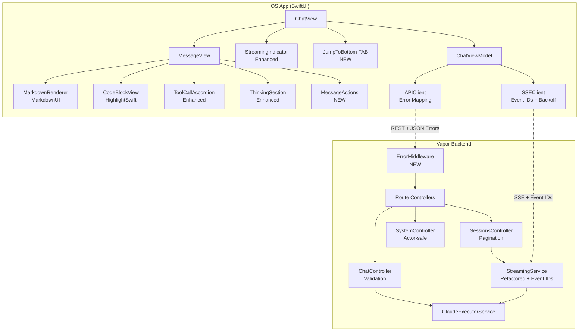
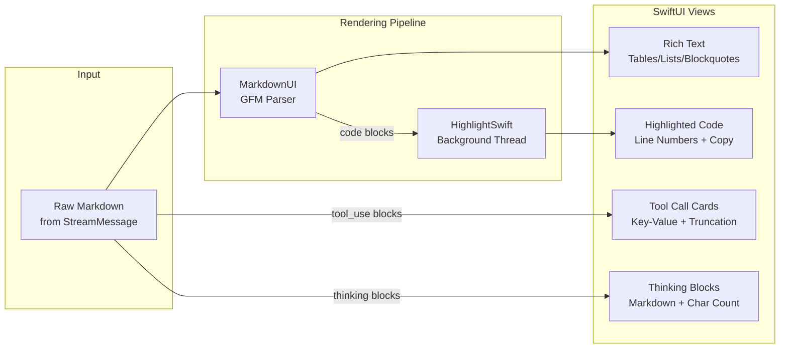
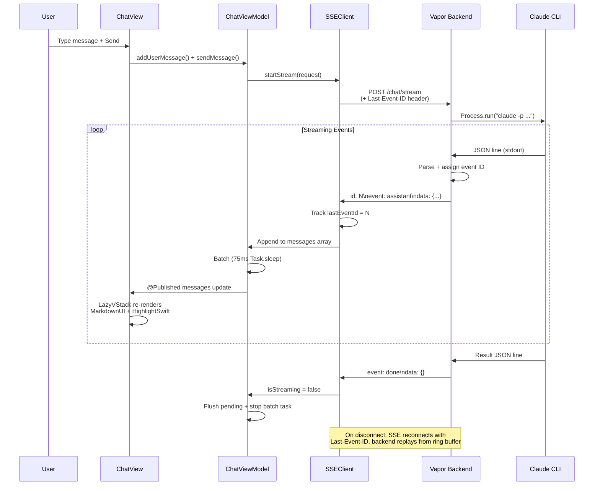
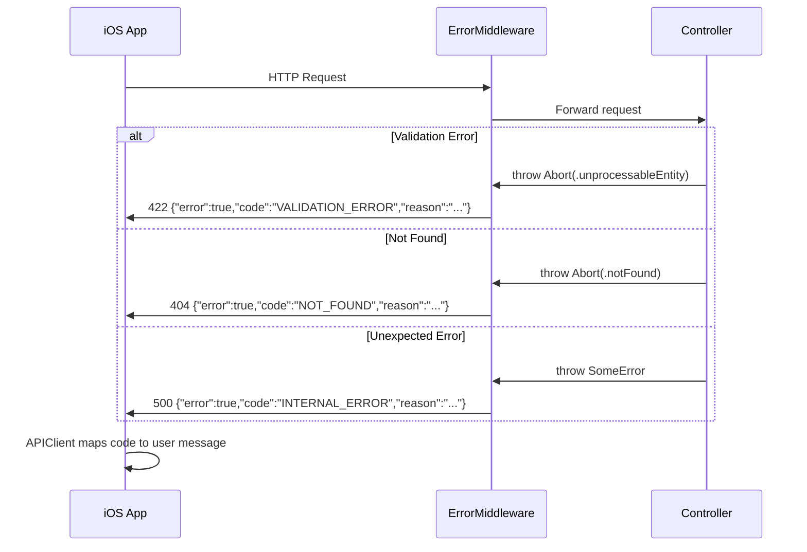

# Design: App Enhancements — Chat Rendering + Backend Overhaul

## Overview

Replace the hand-rolled markdown parser and keyword-only syntax highlighter with MarkdownUI + HighlightSwift, harden SSE streaming with event IDs and exponential backoff, add structured error middleware and pagination to the backend, and absorb 19 remaining audit fixes. All changes extend existing architecture (MVVM, ILSTheme, APIClient actor, StreamingService) with drop-in replacements.

## Design Inputs

| Question | Answer | Impact |
|----------|--------|--------|
| Architecture style | Extend existing — ILSTheme, APIClient actor, ViewModels, navigation | No new patterns needed |
| Technology constraints | None — adopt MarkdownUI + HighlightSwift | Two new SPM deps |
| Integration approach | Drop-in replacements, same ViewModels, same APIClient | Minimal API surface changes |
| Primary users | End users via App Store | Polish + accessibility are P0 |
| Priority tradeoffs | Feature completeness | Cover all 49 FRs before shipping |
| Success criteria | Full overhaul + absorb 43 audit issues | Single mega-spec |

## Architecture

### System Architecture



### Chat Rendering Pipeline



## Components

### Phase 1: Foundation

#### 1.1 Package Dependencies

**File:** `Package.swift` (Modify)

Add to ILSApp Xcode project's `Package.resolved` / SPM dependencies:
- `gonzalezreal/swift-markdown-ui` from `"2.4.0"` (iOS 16+ compatible)
- `appstefan/HighlightSwift` from `"1.0.0"`

These are iOS-only deps, added to the Xcode project SPM config (not the root Package.swift which is backend-only).

#### 1.2 ChatMessage Model Extraction

**File:** `ILSApp/ILSApp/Models/ChatMessage.swift` (Create)

```swift
struct ChatMessage: Identifiable, Equatable {
    let id: UUID
    let isUser: Bool
    var text: String
    var toolCalls: [ToolCallDisplay] = []
    var toolResults: [ToolResultDisplay] = []
    var thinking: String?
    var cost: Double?
    var timestamp: Date?
    var isFromHistory: Bool = false
    var tokenCount: Int = 0        // NEW: for streaming stats
    var elapsedSeconds: Double = 0  // NEW: for streaming stats
}

/// Display-oriented tool call (decoupled from ILSShared.ToolUseBlock)
struct ToolCallDisplay: Identifiable, Equatable {
    let id: String
    let name: String
    let inputPairs: [(key: String, value: String)]  // NEW: structured k-v
    let inputRaw: String?  // fallback for non-dict inputs
}

/// Display-oriented tool result
struct ToolResultDisplay: Equatable {
    let toolUseId: String
    let content: String
    let isError: Bool
}
```

**Rationale:** Decouples view-layer model from MessageView.swift. Renames `ToolCall` -> `ToolCallDisplay` to add structured key-value pairs (FR-5). Adds streaming stats fields (FR-18).

#### 1.3 FileSystemService DI (Backend)

**Pattern:** Controllers accept services via stored properties initialized in `configure.swift` instead of inline `let fileSystem = FileSystemService()`.

```swift
// Before (anti-pattern):
struct SessionsController: RouteCollection {
    let fileSystem = FileSystemService()  // created inline
}

// After (DI):
struct SessionsController: RouteCollection {
    let fileSystem: FileSystemService

    init(fileSystem: FileSystemService) {
        self.fileSystem = fileSystem
    }
}

// In configure.swift:
let fileSystem = FileSystemService()
try app.register(collection: SessionsController(fileSystem: fileSystem))
```

#### 1.4 SystemController Actor-Safe Cancellation

**File:** `Sources/ILSBackend/Controllers/SystemController.swift` (Modify)

Replace `UnsafeMutablePointer<Bool>` with an actor-isolated flag:

```swift
// Before (unsafe):
let isCancelled = UnsafeMutablePointer<Bool>.allocate(capacity: 1)
isCancelled.initialize(to: false)

// After (actor-safe):
actor WebSocketCancellation {
    private var cancelled = false
    func cancel() { cancelled = true }
    func isCancelled() -> Bool { cancelled }
}

let cancellation = WebSocketCancellation()
// In stream loop: guard await !cancellation.isCancelled() else { break }
// In ws.onClose: Task { await cancellation.cancel(); streamTask.cancel() }
```

---

### Phase 2: Chat Rendering

#### 2.1 MarkdownUI Integration

**File:** `ILSApp/ILSApp/Views/Chat/MarkdownTextView.swift` (Replace)

Replace entire 299-line custom parser with MarkdownUI wrapper:

```swift
import MarkdownUI

struct MarkdownTextView: View {
    let text: String

    var body: some View {
        Markdown(text)
            .markdownTheme(.ilsChat)
            .markdownCodeSyntaxHighlighter(ILSCodeHighlighter())
            .textSelection(.enabled)
    }
}

// Custom theme matching ILSTheme
extension MarkdownUI.Theme {
    static let ilsChat = Theme()
        .text { config in
            config.label
                .foregroundColor(ILSTheme.textPrimary)
                .font(ILSTheme.bodyFont)
        }
        .heading1 { config in
            config.label
                .font(.system(.title, weight: .bold))
                .foregroundColor(ILSTheme.textPrimary)
        }
        .heading2 { config in
            config.label
                .font(.system(.title2, weight: .bold))
                .foregroundColor(ILSTheme.textPrimary)
        }
        .heading3 { config in
            config.label
                .font(.system(.title3, weight: .semibold))
                .foregroundColor(ILSTheme.textPrimary)
        }
        .blockquote { config in
            HStack(spacing: 0) {
                RoundedRectangle(cornerRadius: 2)
                    .fill(ILSTheme.accent.opacity(0.6))
                    .frame(width: 4)
                config.label
                    .padding(.leading, ILSTheme.spacingS)
                    .foregroundColor(ILSTheme.textSecondary)
            }
        }
        .codeBlock { config in
            // Delegates to ILSCodeHighlighter -> CodeBlockView
            config.label
        }
        .table { config in
            config.label
                .padding(ILSTheme.spacingXS)
        }
        .taskListMarker { config in
            Image(systemName: config.isCompleted ? "checkmark.square.fill" : "square")
                .foregroundColor(config.isCompleted ? ILSTheme.success : ILSTheme.textTertiary)
        }
        .strikethrough { config in
            config.label.strikethrough()
        }
        .thematicBreak {
            Divider()
                .background(ILSTheme.separator)
                .padding(.vertical, ILSTheme.spacingS)
        }
}
```

**Key decision:** MarkdownUI handles GFM natively (tables, blockquotes, HR, strikethrough, task lists, nested lists). Eliminates 10+ parsing gaps. The `.markdownCodeSyntaxHighlighter` protocol delegates code blocks to our HighlightSwift wrapper.

#### 2.2 CodeBlockView with HighlightSwift

**File:** `ILSApp/ILSApp/Theme/Components/CodeBlockView.swift` (Replace)

```swift
import SwiftUI
import HighlightSwift

struct CodeBlockView: View {
    let language: String?
    let code: String

    @State private var highlightedCode: AttributedString?
    @State private var showCopied = false
    @State private var showLineNumbers = true
    @State private var detectedLanguage: String?

    private let highlight = Highlight()

    var body: some View {
        VStack(alignment: .leading, spacing: 0) {
            headerBar
            ScrollView(.horizontal, showsIndicators: false) {
                codeContent
                    .padding(ILSTheme.spacingS)
            }
            .background(ILSTheme.bg1)
        }
        .clipShape(RoundedRectangle(cornerRadius: ILSTheme.radiusS))
        .overlay(RoundedRectangle(cornerRadius: ILSTheme.radiusS)
            .strokeBorder(Color.white.opacity(0.08), lineWidth: 1))
        .task { await highlightCode() }
    }

    private func highlightCode() async {
        // Background thread highlighting (FR-12)
        let result = try? await highlight.request(code, language: language)
        highlightedCode = result?.attributedString
        detectedLanguage = result?.language
    }
}
```

**Removes:** Entire 100-keyword set, `colorizeLine`, `colorizeTokens`, `findLineComment` — replaced by grammar-aware HighlightSwift with 50+ languages.

**Adds:** Line numbers (toggleable via tap on gutter), language auto-detection label, background thread highlighting.

#### 2.3 ILSCodeHighlighter (MarkdownUI Bridge)

**File:** `ILSApp/ILSApp/Theme/Components/ILSCodeHighlighter.swift` (Create)

```swift
import MarkdownUI
import HighlightSwift

/// Bridges MarkdownUI code block rendering to our CodeBlockView + HighlightSwift
struct ILSCodeHighlighter: CodeSyntaxHighlighter {
    func highlightCode(_ code: String, language: String?) -> Text {
        // For MarkdownUI's inline code rendering path
        // Full code blocks route through CodeBlockView via theme
        Text(code)
            .font(.system(.body, design: .monospaced))
            .foregroundColor(ILSTheme.accent)
    }
}
```

#### 2.4 Enhanced ToolCallAccordion

**File:** `ILSApp/ILSApp/Theme/Components/ToolCallAccordion.swift` (Modify)

Changes:
- Accept `inputPairs: [(key: String, value: String)]` for structured display (FR-5)
- Add output truncation to 5 lines + "Show more" (FR-6)
- Accept `expandAll` binding for batch expand/collapse (FR-7)
- Error tool calls get red left border accent (AC-3.6)

```swift
struct ToolCallAccordion: View {
    let toolName: String
    let inputPairs: [(key: String, value: String)]  // structured k-v
    let inputRaw: String?  // fallback
    let output: String?
    let isError: Bool
    @Binding var expandAll: Bool?  // nil = independent, true/false = batch

    @State private var isExpanded = false
    @State private var showFullOutput = false

    private var truncatedOutput: String? {
        guard let output, !showFullOutput else { return output }
        let lines = output.components(separatedBy: "\n")
        guard lines.count > 5 else { return output }
        return lines.prefix(5).joined(separator: "\n")
    }

    // ... body renders key-value pairs instead of raw string
    // ... "Show more" / "Show less" toggle for output
}
```

#### 2.5 Enhanced ThinkingSection

**File:** `ILSApp/ILSApp/Theme/Components/ThinkingSection.swift` (Modify)

Changes:
- Render thinking text as markdown via `Markdown(thinking)` (FR-8)
- Show character count in header: "Thinking (2,431 chars)" (FR-9)
- Scroll indicator for >50 lines (AC-4.4)

```swift
// Header text becomes:
Text(isActive ? "Thinking..." : "Thinking (\(thinking.count.formatted()) chars)")
    .font(.system(.subheadline, weight: .medium))
    .foregroundColor(ILSTheme.textPrimary)

// Expanded content becomes:
if isExpanded {
    ScrollView {
        Markdown(thinking)
            .markdownTheme(.ilsChat)
            .font(.system(.caption))
    }
    .frame(maxHeight: 400)  // scroll indicator for long blocks
}
```

#### 2.6 Message Actions (Context Menu)

**File:** `ILSApp/ILSApp/Views/Chat/MessageView.swift` (Modify)

Replace simple copy button with full context menu:

```swift
.contextMenu {
    Button(action: copyMarkdown) {
        Label("Copy Markdown", systemImage: "doc.on.doc")
    }

    if !message.isUser {
        Button(action: { onRetry?(message) }) {
            Label("Retry", systemImage: "arrow.counterclockwise")
        }
    }

    Button(role: .destructive, action: { onDelete?(message) }) {
        Label("Delete", systemImage: "trash")
    }
}

private func copyMarkdown() {
    UIPasteboard.general.string = message.text  // raw markdown, not rendered
    HapticManager.notification(.success)
}
```

Actions surfaced via callbacks to ChatView/ChatViewModel.

#### 2.7 Expand All / Collapse All

**File:** `ILSApp/ILSApp/Views/Chat/MessageView.swift` (Modify)

When message has 2+ tool calls, show batch control button:

```swift
if message.toolCalls.count >= 2 {
    Button(action: { expandAllToolCalls.toggle() }) {
        Text(expandAllToolCalls ? "Collapse All" : "Expand All")
            .font(ILSTheme.captionFont)
            .foregroundColor(ILSTheme.accent)
    }
}
```

---

### Phase 3: Streaming Hardening

#### 3.1 SSE Event IDs (Backend)

**File:** `Sources/ILSBackend/Services/StreamingService.swift` (Modify)

```swift
struct StreamingService {
    // NEW: atomic event ID counter per stream
    private actor EventCounter {
        private var nextId: Int = 1
        func next() -> Int {
            let id = nextId
            nextId += 1
            return id
        }
    }

    // NEW: ring buffer for replay
    private actor EventBuffer {
        private var buffer: [(id: Int, data: String)] = []
        private let maxSize = 1000

        func store(id: Int, data: String) {
            buffer.append((id, data))
            if buffer.count > maxSize {
                buffer.removeFirst(buffer.count - maxSize)
            }
        }

        func eventsSince(_ lastId: Int) -> [(id: Int, data: String)] {
            buffer.filter { $0.id > lastId }
        }
    }

    // Updated format: "id: N\nevent: type\ndata: json\n\n"
    private static func formatSSEEvent(_ message: StreamMessage, eventId: Int) throws -> String {
        let data = try jsonEncoder.encode(message)
        guard let jsonString = String(data: data, encoding: .utf8) else {
            throw Abort(.internalServerError, reason: "Failed to encode message")
        }
        let eventType = eventTypeName(for: message)
        return "id: \(eventId)\nevent: \(eventType)\ndata: \(jsonString)\n\n"
    }
}
```

**Decision:** In-memory ring buffer (1000 events) for replay, not SQLite. Chat sessions are ephemeral; persistence across server restarts is unnecessary.

#### 3.2 SSEClient Event ID + Exponential Backoff (iOS)

**File:** `ILSApp/ILSApp/Services/SSEClient.swift` (Modify)

```swift
class SSEClient: ObservableObject {
    private var lastEventId: String?  // NEW: track last received event ID

    private func performStream(request: ChatStreamRequest) async {
        // ... existing setup ...

        // NEW: send Last-Event-ID on reconnect (FR-15)
        if let lastId = lastEventId {
            urlRequest.addValue(lastId, forHTTPHeaderField: "Last-Event-ID")
        }

        // Parse event ID from stream
        for try await line in asyncBytes.lines {
            if line.hasPrefix("id:") {
                lastEventId = String(line.dropFirst(3)).trimmingCharacters(in: .whitespaces)
            }
            // ... existing event/data parsing ...
        }
    }

    // NEW: true exponential backoff (FR-17, FR-45)
    private func shouldReconnect(error: Error) async -> Bool {
        // ...
        reconnectAttempts += 1
        // Power-of-2: 2s, 4s, 8s, 16s, max 30s
        let delay = min(UInt64(pow(2.0, Double(reconnectAttempts))) * 1_000_000_000,
                        30_000_000_000)
        try? await Task.sleep(nanoseconds: delay)
        // ...
    }
}
```

#### 3.3 Task-Based Batching in ChatViewModel

**File:** `ILSApp/ILSApp/ViewModels/ChatViewModel.swift` (Modify)

Replace `Timer.scheduledTimer` with structured concurrency:

```swift
// Before:
private var batchTimer: Timer?
private func startBatchTimer() {
    batchTimer = Timer.scheduledTimer(withTimeInterval: batchInterval, repeats: true) { ... }
}

// After:
private var batchTask: Task<Void, Never>?
private func startBatchTask() {
    guard batchTask == nil else { return }
    batchTask = Task { @MainActor [weak self] in
        while !Task.isCancelled {
            try? await Task.sleep(nanoseconds: 75_000_000)  // 75ms
            guard !Task.isCancelled else { break }
            self?.flushPendingMessages()
        }
    }
}
private func stopBatchTask() {
    batchTask?.cancel()
    batchTask = nil
}
```

#### 3.4 Auto-Scroll + Jump-to-Bottom FAB

**File:** `ILSApp/ILSApp/Views/Chat/ChatView.swift` (Modify)

```swift
@State private var isUserScrolledUp = false
@State private var showJumpToBottom = false

// Detect manual scroll-up
.onScrollGeometryChange(for: Bool.self) { geometry in
    geometry.contentOffset.y < geometry.contentSize.height - geometry.visibleRect.height - 100
} action: { _, isScrolledUp in
    isUserScrolledUp = isScrolledUp
    showJumpToBottom = isScrolledUp && viewModel.isStreaming
}

// Auto-scroll only when user is at bottom
.onChange(of: viewModel.messages.count) { _, _ in
    if !isUserScrolledUp {
        scrollToBottom(proxy: proxy)
    }
}

// FAB overlay
if showJumpToBottom {
    Button(action: { scrollToBottom(proxy: proxy) }) {
        Image(systemName: "chevron.down.circle.fill")
            .font(.title2)
            .foregroundColor(ILSTheme.accent)
            .padding(ILSTheme.spacingS)
            .background(.ultraThinMaterial)
            .clipShape(Circle())
    }
    .transition(.scale.combined(with: .opacity))
}
```

#### 3.5 Streaming Stats (Token Count + Elapsed Time)

Track in ChatViewModel during streaming, display in StreamingStatusView:

```swift
// ChatViewModel additions:
@Published var streamTokenCount: Int = 0
@Published var streamElapsedSeconds: Double = 0
private var streamStartTime: Date?

// In processStreamMessages:
case .result(let resultMsg):
    if let usage = resultMsg.usage {
        streamTokenCount = usage.outputTokens
    }

// StreamingStatusView enhanced:
if isStreaming {
    Text("\(tokenCount) tokens \u{2022} \(String(format: "%.1f", elapsed))s")
        .font(ILSTheme.captionFont)
        .foregroundColor(ILSTheme.textTertiary)
}
```

---

### Phase 4: Backend Robustness

#### 4.1 Global ErrorMiddleware

**File:** `Sources/ILSBackend/Middleware/ErrorMiddleware.swift` (Create)

```swift
import Vapor

struct ILSErrorMiddleware: AsyncMiddleware {
    func respond(to request: Request, chainingTo next: AsyncResponder) async throws -> Response {
        do {
            return try await next.respond(to: request)
        } catch let abort as Abort {
            return errorResponse(
                status: abort.status,
                code: abort.status.reasonPhrase.replacingOccurrences(of: " ", with: "_").uppercased(),
                reason: abort.reason,
                on: request
            )
        } catch let validationError as ValidationsError {
            return errorResponse(
                status: .unprocessableEntity,
                code: "VALIDATION_ERROR",
                reason: validationError.description,
                on: request
            )
        } catch {
            request.logger.error("Unhandled error: \(error)")
            return errorResponse(
                status: .internalServerError,
                code: "INTERNAL_ERROR",
                reason: "An unexpected error occurred",  // never expose stack traces
                on: request
            )
        }
    }

    private func errorResponse(status: HTTPStatus, code: String, reason: String, on req: Request) -> Response {
        let body = ErrorBody(error: true, code: code, reason: reason)
        let response = Response(status: status)
        try? response.content.encode(body)
        return response
    }
}

struct ErrorBody: Content {
    let error: Bool
    let code: String
    let reason: String
}
```

Register in `configure.swift`: `app.middleware.use(ILSErrorMiddleware())`

#### 4.2 Request Validation

**File:** `Sources/ILSBackend/Controllers/ChatController.swift` (Modify)

```swift
// Validate prompt non-empty before reaching ClaudeExecutorService
guard !request.prompt.trimmingCharacters(in: .whitespacesAndNewlines).isEmpty else {
    throw Abort(.unprocessableEntity, reason: "Prompt cannot be empty")
}

// Validate UUID parameters
guard let id = req.parameters.get("id", as: UUID.self) else {
    throw Abort(.badRequest, reason: "Invalid session ID format")
}
```

#### 4.3 Sessions Pagination

**File:** `Sources/ILSBackend/Controllers/SessionsController.swift` (Modify)

```swift
@Sendable
func list(req: Request) async throws -> APIResponse<PaginatedResponse<ChatSession>> {
    let page = max(req.query[Int.self, at: "page"] ?? 1, 1)
    let limit = min(max(req.query[Int.self, at: "limit"] ?? 50, 1), 100)
    let offset = (page - 1) * limit

    var query = SessionModel.query(on: req.db)
    if let projectId = req.query[UUID.self, at: "projectId"] {
        query = query.filter(\.$project.$id == projectId)
    }

    let total = try await query.count()
    let sessions = try await query
        .with(\.$project)
        .sort(\.$lastActiveAt, .descending)
        .offset(offset)
        .limit(limit)
        .all()

    let items = sessions.map { $0.toShared(projectName: $0.project?.name) }

    return APIResponse(
        success: true,
        data: PaginatedResponse(items: items, total: total, hasMore: offset + limit < total)
    )
}
```

**New shared type:**

```swift
// In ILSShared/DTOs/
struct PaginatedResponse<T: Codable>: Codable {
    let items: [T]
    let total: Int
    let hasMore: Bool
}
```

#### 4.4 StreamingService Refactor

**File:** `Sources/ILSBackend/Services/StreamingService.swift` (Modify)

Extract shared SSE writing logic into a single method:

```swift
/// Core SSE writer — used by both persistence and non-persistence paths
private static func writeSSEStream(
    stream: AsyncThrowingStream<StreamMessage, Error>,
    writer: Response.Body.AsyncStreamWriter,
    request: Request,
    eventCounter: EventCounter,
    eventBuffer: EventBuffer,
    onMessage: ((StreamMessage) async -> Void)? = nil
) async throws {
    var isConnected = true
    let heartbeatTask = startHeartbeat(writer: writer, isConnected: &isConnected)
    defer { heartbeatTask.cancel() }

    for try await message in stream {
        guard isConnected else { break }
        let eventId = await eventCounter.next()
        let eventData = try formatSSEEvent(message, eventId: eventId)
        await eventBuffer.store(id: eventId, data: eventData)
        await onMessage?(message)

        do {
            try await writer.write(.buffer(.init(string: eventData)))
        } catch {
            isConnected = false
            break
        }
    }

    if isConnected {
        try? await writer.write(.buffer(.init(string: "event: done\ndata: {}\n\n")))
    }
    try await writer.write(.end)
}
```

`createSSEResponse` calls `writeSSEStream` with `onMessage: nil`.
`createSSEResponseWithPersistence` calls `writeSSEStream` with `onMessage:` that accumulates content for DB save.

**Impact:** Eliminates ~80% code duplication (from research finding). Single path for heartbeat, event formatting, disconnect detection.

#### 4.5 ProjectsController Direct Lookup

**File:** `Sources/ILSBackend/Controllers/ProjectsController.swift` (Modify)

```swift
// Before: show() calls index() then filters O(n)
// After: direct lookup by ID
@Sendable
func show(req: Request) async throws -> APIResponse<Project> {
    guard let id = req.parameters.get("id", as: UUID.self) else {
        throw Abort(.badRequest, reason: "Invalid project ID")
    }
    guard let project = try await ProjectModel.find(id, on: req.db) else {
        throw Abort(.notFound, reason: "Project not found")
    }
    return APIResponse(success: true, data: project.toShared())
}
```

#### 4.6 print() to AppLogger Migration (Backend)

Backend uses `req.logger` (Vapor's built-in structured logger), not AppLogger (iOS-only). Replace `debugLog()` / `print()` with `req.logger`:

- `StreamingService.swift`: Replace `debugLog()` with `request.logger.debug()`
- `ClaudeExecutorService.swift`: Replace `debugLog()` with structured `Logger` from `Logging` framework
- `WebSocketService.swift`, `GitHubService.swift`: Replace `print()` with `req.logger`

**iOS side:** 30 `print()` statements in SSEClient (16), ILSAppApp (12), ChatViewModel (1), CommandPaletteView (1) -> `AppLogger.shared.debug/info/error()`

---

### Phase 5: Audit Fixes + Polish

#### 5.1 Concurrency Safety

| Fix | File(s) | Change |
|-----|---------|--------|
| FR-31: Dedicated URLSession per VM | ChatViewModel | Already has dedicated SSEClient; verify no `.shared` usage |
| FR-32: [weak self] in Task captures | ChatViewModel, SSEClient | Audit all `Task { }` blocks for strong self capture |
| FR-33: Decoder isolation | ChatViewModel | `jsonDecoder` is already locally scoped; mark `nonisolated(unsafe)` or scope tighter |
| FR-34: print() -> AppLogger | SSEClient, ILSAppApp, ChatViewModel, CommandPaletteView | 30 replacements |

#### 5.2 Memory Management

| Fix | File(s) | Change |
|-----|---------|--------|
| FR-35: Timer -> Task | ChatViewModel | Done in Phase 3 (3.3) |
| FR-36: DispatchQueue.asyncAfter -> Task.sleep | MessageView, CodeBlockView, ChatView, SkillsListView, ProjectDetailView, SessionInfoView, TunnelSettingsView, ILSTheme | 8 files, replace with `Task { try? await Task.sleep(for: .seconds(N)); ... }` |
| FR-37: cancellables cleanup | ChatViewModel | Add `cancellables.removeAll()` in deinit |

#### 5.3 Architecture Cleanup

| Fix | File(s) | Change |
|-----|---------|--------|
| FR-38: Published+didSet | Identify any remaining; refactor to explicit `updateFoo()` methods |
| FR-39: DateFormatter extraction | Create `ILSApp/ILSApp/Utils/DateFormatters.swift` with static formatters |
| FR-40: Complex computed properties | Extract >15-line computed props to ViewModel methods |

#### 5.4 Theming Consistency

| Fix | File(s) | Change |
|-----|---------|--------|
| FR-41: Hardcoded fonts | 6 occurrences across 4 files -> ILSTheme.captionFont / bodyFont / etc. |
| FR-42: Redundant objectWillChange | ILSAppApp.swift: 1 occurrence -> remove |

#### 5.5 Network Reliability

| Fix | File(s) | Change |
|-----|---------|--------|
| FR-43: Cache scope | APIClient | Invalidate exact path, not prefix: `cache.removeValue(forKey: path)` |
| FR-44: Skip sleep on final retry | APIClient.performWithRetry | Add `guard attempt < maxAttempts else { throw }` before sleep |
| FR-45: Exponential backoff | SSEClient | Done in Phase 3 (3.2) |
| FR-46: WebSocket fallback reset | SSEClient | Reset `reconnectAttempts = 0` on successful SSE reconnect |

#### 5.6 Accessibility

| Fix | File(s) | Change |
|-----|---------|--------|
| FR-47: Missing labels | Scan for unlabeled Toggles, TextFields, Buttons; add `.accessibilityLabel()` |
| FR-48: Dynamic Type | Replace 6 `.font(.system(size:))` with ILSTheme equivalents that scale |
| FR-49: Color-only indicators | StatusBadge already has text+circle; verify streaming status has non-color cue |

---

## Data Flow

### Message Streaming Sequence



### Error Flow



---

## Technical Decisions

| Decision | Options Considered | Choice | Rationale |
|----------|-------------------|--------|-----------|
| Markdown library | A) MarkdownUI, B) MarkdownView (fatbobman), C) Extend custom parser | A) MarkdownUI | Broadest GFM support, iOS 16+ compat, `.markdownCodeSyntaxHighlighter` protocol for HighlightSwift bridge. Risk: "moving to Textual" but 2.x stable. |
| Syntax highlighting | A) HighlightSwift, B) Splash, C) Custom | A) HighlightSwift | 50+ languages, native AttributedString, background thread via `highlight.request()`. Splash is Swift-only. |
| SSE event ID storage | A) In-memory ring buffer, B) SQLite table | A) Ring buffer | Chat sessions are ephemeral. 1000-event buffer covers any realistic reconnection window. No schema migration. |
| Pagination style | A) Offset-based (?page, ?limit), B) Cursor-based | A) Offset | ILS scale (<10K sessions) doesn't need cursor complexity. Offset is simpler for iOS infinite scroll. |
| Timer replacement | A) Task.sleep loop, B) AsyncTimerSequence | A) Task.sleep | Simpler, no additional imports. Matches existing `connectingTimer` pattern in ChatViewModel. |
| Error middleware | A) Custom ILSErrorMiddleware, B) Vapor default ErrorMiddleware | A) Custom | Vapor default exposes stack traces in debug mode. Custom ensures consistent `{error, code, reason}` structure. |
| StreamingService refactor | A) Extract shared `writeSSEStream()`, B) Protocol-based, C) Subclass | A) Extract method | Minimal change. Composition via closure (`onMessage`) keeps persistence logic separate. |
| Batch flush interval | A) 75ms (current), B) 16ms (60fps), C) 100ms | A) 75ms | Proven stable. 16ms too aggressive for parser + re-render. 100ms feels sluggish. |
| Code block line numbers | A) Built into CodeBlockView, B) Separate LineNumberView | A) Built in | Simpler. Toggle via tap on gutter area. Copy button excludes line numbers. |
| MarkdownUI theme | A) Custom `.ilsChat` theme, B) Default + overrides | A) Custom | Full control over colors matching ILSTheme dark palette. Default theme uses system colors. |

---

## File Structure

| File | Action | Purpose |
|------|--------|---------|
| **Phase 1: Foundation** | | |
| `ILSApp.xcodeproj` (SPM deps) | Modify | Add MarkdownUI + HighlightSwift packages |
| `ILSApp/Models/ChatMessage.swift` | Create | Extracted ChatMessage, ToolCallDisplay, ToolResultDisplay |
| `Sources/ILSBackend/App/configure.swift` | Modify | DI for FileSystemService in controllers; register ErrorMiddleware |
| `Sources/ILSBackend/Controllers/SystemController.swift` | Modify | Replace UnsafeMutablePointer with actor |
| **Phase 2: Chat Rendering** | | |
| `ILSApp/Views/Chat/MarkdownTextView.swift` | Replace | MarkdownUI wrapper with `.ilsChat` theme |
| `ILSApp/Theme/Components/CodeBlockView.swift` | Replace | HighlightSwift + line numbers + language label |
| `ILSApp/Theme/Components/ILSCodeHighlighter.swift` | Create | MarkdownUI CodeSyntaxHighlighter bridge |
| `ILSApp/Theme/Components/ToolCallAccordion.swift` | Modify | Structured inputs, truncation, expand all |
| `ILSApp/Theme/Components/ThinkingSection.swift` | Modify | Markdown rendering, char count |
| `ILSApp/Views/Chat/MessageView.swift` | Modify | Context menu actions, expand-all button, remove ChatMessage model |
| `ILSApp/Views/Chat/ChatView.swift` | Modify | Jump-to-bottom FAB, scroll tracking |
| **Phase 3: Streaming** | | |
| `ILSApp/Services/SSEClient.swift` | Modify | Event ID tracking, Last-Event-ID header, exponential backoff |
| `ILSApp/ViewModels/ChatViewModel.swift` | Modify | Task-based batching, streaming stats, cancellables cleanup |
| `Sources/ILSBackend/Services/StreamingService.swift` | Modify | Event IDs, ring buffer, refactored writeSSEStream |
| `ILSApp/Views/Chat/ChatView.swift` | Modify | StreamingStatusView with token count + elapsed |
| **Phase 4: Backend** | | |
| `Sources/ILSBackend/Middleware/ErrorMiddleware.swift` | Create | Global structured JSON error handler |
| `Sources/ILSBackend/Controllers/ChatController.swift` | Modify | Request validation (empty prompt, invalid UUID) |
| `Sources/ILSBackend/Controllers/SessionsController.swift` | Modify | Pagination (?page, ?limit, total, hasMore) |
| `Sources/ILSBackend/Controllers/ProjectsController.swift` | Modify | Direct lookup in show() |
| `Sources/ILSShared/DTOs/PaginatedResponse.swift` | Create | PaginatedResponse<T> shared type |
| `Sources/ILSBackend/Services/ClaudeExecutorService.swift` | Modify | Replace debugLog with Logging framework |
| `Sources/ILSBackend/Services/WebSocketService.swift` | Modify | Replace print() with logger |
| `Sources/ILSBackend/Services/GitHubService.swift` | Modify | Replace print() with logger |
| **Phase 5: Audit Fixes** | | |
| `ILSApp/Services/SSEClient.swift` | Modify | print() -> AppLogger (16 occurrences) |
| `ILSApp/ILSAppApp.swift` | Modify | print() -> AppLogger (12), remove objectWillChange |
| `ILSApp/Views/Chat/CommandPaletteView.swift` | Modify | print() -> AppLogger (1) |
| `ILSApp/Utils/DateFormatters.swift` | Create | Extracted static date formatters |
| `ILSApp/Views/Chat/MessageView.swift` | Modify | DispatchQueue -> Task.sleep |
| `ILSApp/Theme/Components/CodeBlockView.swift` | Modify | DispatchQueue -> Task.sleep |
| `ILSApp/Views/Sessions/SessionInfoView.swift` | Modify | DispatchQueue -> Task.sleep |
| `ILSApp/Views/Skills/SkillsListView.swift` | Modify | DispatchQueue -> Task.sleep |
| `ILSApp/Views/Projects/ProjectDetailView.swift` | Modify | DispatchQueue -> Task.sleep |
| `ILSApp/Views/Settings/TunnelSettingsView.swift` | Modify | DispatchQueue -> Task.sleep |
| `ILSApp/Theme/ILSTheme.swift` | Modify | DispatchQueue -> Task.sleep in showToast |
| `ILSApp/Views/Onboarding/ServerSetupSheet.swift` | Modify | Replace .font(.system(size:)) with ILSTheme |
| `ILSApp/Views/MCP/MCPServerListView.swift` | Modify | Replace .font(.system(size:)) with ILSTheme |
| `ILSApp/Theme/Components/EmptyEntityState.swift` | Modify | Replace .font(.system(size:)) with ILSTheme |
| `ILSApp/Theme/Components/ConnectionSteps.swift` | Modify | Replace .font(.system(size:)) with ILSTheme |
| `ILSApp/Services/APIClient.swift` | Modify | Scoped cache invalidation, skip sleep on final retry |
| Various views (8+) | Modify | Add missing accessibilityLabels |

**Total: ~40 files touched (8 create, ~32 modify)**

---

## Error Handling

| Error Scenario | Handling Strategy | User Impact |
|----------------|-------------------|-------------|
| MarkdownUI fails to parse | Falls back to plain `Text(content)` | User sees raw text instead of formatted |
| HighlightSwift highlight fails | Display code with default monospace font, no colors | Readable but unstyled code |
| SSE connection drops | Reconnect with Last-Event-ID + exponential backoff (2s/4s/8s/16s/30s max) | Brief "Reconnecting..." banner; missed events replayed |
| SSE reconnect fails 3 times | Stop attempting; show "Disconnected" status | User sees error; can retry manually |
| Backend returns 422 (validation) | APIClient maps to user message via error code | "Please enter a message" or field-specific error |
| Backend returns 500 | ErrorMiddleware returns generic message; no stack trace | "Something went wrong. Please try again." |
| Code block >500 lines | Highlight on background thread; show loading placeholder | Brief "loading" then highlighted code appears |
| Message delete fails | Show toast error; message remains visible | "Couldn't delete message" toast |
| Ring buffer overflow (>1000 events) | Oldest events evicted; reconnect may miss early events | Extremely rare; user sees partial message (beginning missing) |
| Claude CLI timeout (30s) | Backend terminates process; sends TIMEOUT error event | "Claude timed out -- please try again" |

---

## Edge Cases

- **Empty chat history + streaming start**: Welcome message replaced by streaming indicator, then real response
- **Rapid send-cancel-send**: SSEClient.cancel() kills previous stream before starting new one; batch task reset
- **Very long code block (10K+ lines)**: HighlightSwift runs on background thread; horizontal scroll prevents layout explosion; line numbers handle 5-digit numbers
- **Markdown in tool call output**: Tool output rendered as plain monospace text (not markdown) to avoid accidental formatting
- **Nested code blocks in markdown**: MarkdownUI handles this natively (triple backtick counting)
- **Concurrent ChatView instances**: Each ChatView creates its own ChatViewModel; SSEClient is shared but stream is per-session
- **Server restart during stream**: Ring buffer lost; client reconnects but gets empty replay; stream continues from current point
- **Pagination boundary**: Session created between page fetches may cause duplicate/skip; acceptable at ILS scale
- **RTL text in markdown**: MarkdownUI respects system text direction; no special handling needed
- **Reduce motion enabled**: All animations use `UIAccessibility.isReduceMotionEnabled` checks (existing pattern)

---

## Validation Strategy

Per FUNCTIONAL VALIDATION MANDATE: no unit tests, no mocks. All validation through real UI.

### Phase 1 Validation
- `swift build` succeeds (backend)
- `xcodebuild build` succeeds with new MarkdownUI + HighlightSwift deps
- App launches on simulator (screenshot)

### Phase 2 Validation
- **Screenshot**: Claude response with table + blockquote renders correctly
- **Screenshot**: Python and Swift code blocks with grammar-aware coloring + line numbers
- **Screenshot**: Tool call expanded showing key-value pairs
- **Screenshot**: Thinking section with markdown bold/list + char count
- **Screenshot**: Long-press context menu on message
- **Code review**: grep confirms zero keyword-highlight code remaining

### Phase 3 Validation
- **curl**: `curl -N http://localhost:9090/api/v1/chat/stream` shows `id: N` on each event
- **Screenshot**: Streaming indicator with "142 tokens, 3.2s"
- **Screenshot**: Jump-to-bottom FAB visible during active stream
- **Log review**: SSEClient logs show exponential backoff intervals (2s, 4s, 8s...)
- **Code review**: No `Timer.scheduledTimer` in ChatViewModel

### Phase 4 Validation
- **curl**: `curl http://localhost:9090/api/v1/sessions?page=1&limit=5` returns 5 items + total + hasMore
- **curl**: `curl -X POST http://localhost:9090/api/v1/chat/stream -d '{}'` returns 422 with structured error
- **curl**: `curl http://localhost:9090/api/v1/sessions/invalid-uuid` returns 400
- **Code review**: StreamingService has single `writeSSEStream()` method
- **Code review**: `grep -r "print(" Sources/` returns zero hits

### Phase 5 Validation
- **Build**: Zero new warnings
- **Screenshots**: All 5 tabs render correctly (visual regression check)
- **grep**: Zero `print(` in `ILSApp/ILSApp/`
- **grep**: Zero `.font(.system(size:` in app code
- **VoiceOver**: Navigate Sessions -> Chat -> Tool Call -> Settings without dead ends
- **Accessibility Inspector**: Dynamic Type Large renders without truncation

---

## Performance Considerations

- **MarkdownUI streaming re-render**: MarkdownUI 2.x uses efficient diffing. Verify with 100-token/sec stream that FPS stays at 60. Fallback: batch markdown updates at 75ms interval (current batch timer).
- **HighlightSwift cold start**: First highlight loads grammar (50-100ms). Subsequent highlights are instant. Pre-warm common languages (Swift, Python, JavaScript) on app launch.
- **Background highlighting**: `Highlight.request()` is async and runs off main thread. CodeBlockView shows plain text immediately, then swaps in highlighted version.
- **Ring buffer memory**: 1000 events * ~2KB avg = ~2MB peak. Negligible.
- **Pagination**: Offset-based with LIMIT/OFFSET in SQLite. Performance fine up to 100K rows. Beyond that, add index on `lastActiveAt`.
- **LazyVStack**: Already used for message list. MarkdownUI views are more complex than plain Text; monitor memory with 200+ messages.

---

## Security Considerations

- **ErrorMiddleware**: 500 errors never expose stack traces, SQL queries, or file paths
- **Input validation**: All user-provided UUIDs validated before DB queries (prevents SQL injection via malformed params)
- **Pagination limits**: Max 100 items per page (prevents memory exhaustion via `?limit=999999`)
- **File path validation**: SystemController.files() restricts to home directory (existing)
- **Clipboard**: Copy-markdown only copies text content, not HTML/scripts
- **No new auth requirements**: All endpoints are currently unauthenticated (local-only app)

---

## Existing Patterns to Follow

Based on codebase analysis:

| Pattern | Location | Usage in This Spec |
|---------|----------|--------------------|
| ILSTheme design system | `Theme/ILSTheme.swift` | All new views use ILSTheme colors, spacing, fonts |
| EntityType colors | `Theme/EntityType.swift` | Maintained for tool call type coloring |
| APIClient actor | `Services/APIClient.swift` | Extended with error code mapping |
| `.cardStyle()` modifier | `Theme/ILSTheme.swift` | Used for code blocks, tool calls |
| `HapticManager` | `Theme/ILSTheme.swift` | Used for message actions |
| `EmptyEntityState` | `Theme/Components/` | Used for empty chat state |
| `SkeletonRow/ShimmerModifier` | `Theme/Components/` | Used for code block loading state |
| `AppLogger.shared` | `Services/AppLogger.swift` | Replaces all print() in iOS code |
| `@Sendable func` on routes | All controllers | Maintained for new/modified routes |
| `APIResponse<T>` wrapper | All controller responses | Maintained; extended with PaginatedResponse |
| `req.logger` | Backend controllers | Replaces all print()/debugLog() in backend |
| `reduce motion` checks | ChatView, TypingIndicatorView | Applied to all new animations |
| `.accessibilityIdentifier` | Most interactive elements | Added to all new interactive elements |

---

## Implementation Steps

1. **Phase 1 (Foundation)**: Add MarkdownUI + HighlightSwift to Xcode SPM. Extract ChatMessage model. Add FileSystemService DI. Replace UnsafeMutablePointer. Verify builds.

2. **Phase 2 (Chat Rendering)**: Replace MarkdownTextView with MarkdownUI wrapper. Replace CodeBlockView with HighlightSwift. Create ILSCodeHighlighter bridge. Enhance ToolCallAccordion (structured inputs, truncation, expand-all). Enhance ThinkingSection (markdown, char count). Add message context menu. Verify with screenshots.

3. **Phase 3 (Streaming)**: Add event IDs to StreamingService. Add Last-Event-ID to SSEClient. Implement exponential backoff. Replace Timer with Task in ChatViewModel. Add auto-scroll tracking + jump-to-bottom FAB. Add streaming stats display. Verify with curl + screenshots.

4. **Phase 4 (Backend)**: Create ErrorMiddleware. Add request validation. Add sessions pagination. Create PaginatedResponse DTO. Refactor StreamingService (extract writeSSEStream). Fix ProjectsController.show(). Replace print()/debugLog() with logger. Verify with curl.

5. **Phase 5 (Audit Fixes)**: Replace 30 print() with AppLogger (iOS). Replace 8 DispatchQueue.asyncAfter with Task.sleep. Replace 6 hardcoded fonts with ILSTheme. Remove redundant objectWillChange. Scope cache invalidation. Skip retry sleep on final attempt. Add missing accessibility labels. Verify with grep + VoiceOver + screenshots.
