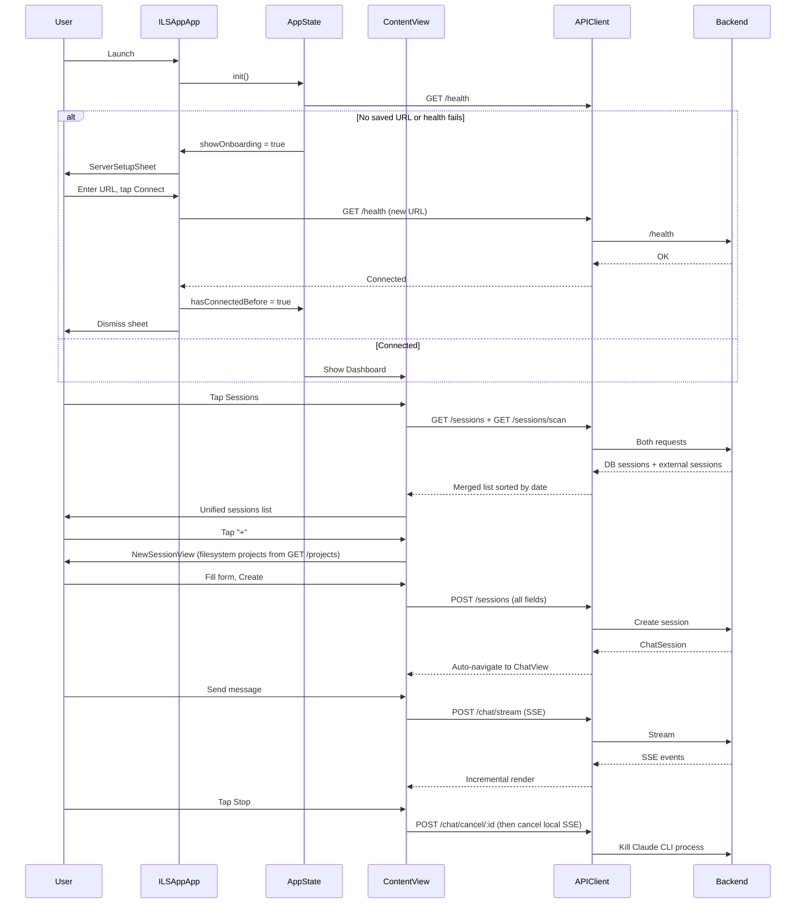

# Design: ILS iOS App — Functional Polish

## Overview

Fix all broken E2E flows by wiring unused backend endpoints to iOS views, removing dead-weight features (SSH, Fleet, mock config views), adding first-run onboarding, and making sessions/projects/plugins/skills fully functional. 1 backend fix (plugin install), 1 backend change (deterministic project IDs), ~15 iOS view/VM changes, 6 file deletions.

## Architecture

```mermaid
graph TB
    subgraph iOS["iOS App (SwiftUI)"]
        App[ILSAppApp] --> CV[ContentView]
        App -->|first run| SSS[ServerSetupSheet NEW]
        CV --> DV[DashboardView]
        CV --> SLV[SessionsListView]
        CV --> PLV[ProjectsListView]
        CV --> SKV[SkillsListView]
        CV --> MCV[MCPServerListView]
        CV --> PGV[PluginsListView]
        CV --> SV[SettingsView TRIMMED]
        SLV -->|tap| ChatV[ChatView]
        SLV -->|+| NSV[NewSessionView]
    end

    subgraph State["State Layer"]
        AS[AppState] -->|@AppStorage serverURL| UD[UserDefaults]
        AS --> API[APIClient actor]
        AS --> SSE[SSEClient]
    end

    subgraph Backend["Vapor Backend :9090"]
        HC[/health]
        SC[SessionsController]
        PC[ProjectsController MODIFIED]
        SKC[SkillsController]
        MCC[MCPController]
        PLC[PluginsController MODIFIED]
        STC[StatsController]
        CC[ConfigController]
        ChatC[ChatController]
    end

    API --> HC
    API --> SC
    API --> PC
    API --> SKC
    API --> MCC
    API --> PLC
    API --> STC
    API --> CC
    SSE --> ChatC
```

## Components

### 1. ServerSetupSheet (NEW)

**Purpose**: First-run onboarding when no server URL saved or connection fails on launch.

**Trigger**: `AppState.init()` sets `@Published showOnboarding = true` when `serverURL` is empty or health check fails AND no previous successful connection recorded.

```swift
// In AppState
@AppStorage("hasConnectedBefore") var hasConnectedBefore = false
@Published var showOnboarding = false

// After init health check fails:
if !isConnected && !hasConnectedBefore {
    showOnboarding = true
}
```

**Interface**:
```swift
struct ServerSetupSheet: View {
    @EnvironmentObject var appState: AppState
    @State private var urlText = "http://localhost:9090"
    @State private var isTestingConnection = false
    @State private var connectionResult: ConnectionResult? // .success / .failure(String)
}
```

**Behavior**:
- Single text field, "Connect" button
- Tapping Connect calls `/health`
- Success: green indicator, 1s delay, dismiss, set `hasConnectedBefore = true`
- Failure: inline error below field, sheet stays open
- No cancel/dismiss gesture (`.interactiveDismissDisabled(true)`)

### 2. AppState Changes

**Purpose**: Move `serverURL` to `@AppStorage`, add onboarding state.

**Changes**:
- Replace `UserDefaults.standard.set/get` with `@AppStorage("serverURL")`
- Add `@Published var showOnboarding: Bool`
- Add `@AppStorage("hasConnectedBefore") var hasConnectedBefore`
- Present `ServerSetupSheet` from `ILSAppApp.body` via `.sheet(isPresented: $appState.showOnboarding)`

### 3. SessionsViewModel Changes

**Already done**: `loadSessions()` already merges DB + external sessions via `/sessions/scan`. The code is in place (lines 46-76 of current file). No change needed here.

**What IS needed**: Session creation auto-navigate.

### 4. SessionsListView + NewSessionView Changes

**Auto-navigate after creation**:

```swift
// SessionsListView — change sheet callback:
.sheet(isPresented: $showingNewSession) {
    NewSessionView { session in
        viewModel.sessions.insert(session, at: 0)
        // Auto-navigate to new session
        navigateToSession = session
    }
}

// Add state + navigationDestination:
@State private var navigateToSession: ChatSession?

.navigationDestination(item: $navigateToSession) { session in
    ChatView(session: session)
}
```

**NewSessionView — pass all form fields**:

```swift
// Change createSession() to store ChatOptions on the created session:
private func createSession() {
    isCreating = true
    Task {
        let request = CreateSessionRequest(
            projectId: selectedProject?.id,
            name: sessionName.isEmpty ? nil : sessionName,
            model: selectedModel,
            systemPrompt: systemPrompt.isEmpty ? nil : systemPrompt,
            maxBudget: Double(maxBudget),
            maxTurns: Int(maxTurns),
            permissionMode: permissionMode,
            fallbackModel: fallbackModel.isEmpty ? nil : fallbackModel
        )
        // ... rest unchanged
    }
}
```

This requires updating `CreateSessionRequest` in ILSShared to include the additional fields. Backend `SessionsController.create()` should store them in the session DB row.

### 5. ChatViewModel — Wire Cancel to Backend

**Current**: `cancel()` calls `sseClient?.cancel()` only.

**Change**:
```swift
func cancel() {
    // Notify backend FIRST, then cancel local stream
    if let sessionId, let apiClient {
        Task {
            do {
                let _: APIResponse<DeletedResponse> = try await apiClient.post(
                    "/chat/cancel/\(sessionId.uuidString)",
                    body: EmptyBody()
                )
            } catch {
                print("Cancel request failed: \(error)")
            }
        }
    }
    sseClient?.cancel()
}
```

### 6. ChatView — Fork Auto-Navigate

**Current**: Fork shows alert but doesn't navigate to forked session.

**Change**: After fork, set a navigation binding:
```swift
// Add to ChatView:
@State private var navigateToForked: ChatSession?

// In fork action:
Button(action: {
    Task {
        if let forked = await viewModel.forkSession() {
            forkedSession = forked
            showForkAlert = true
        }
    }
})

// Change fork alert to navigate on dismiss:
.alert("Session Forked", isPresented: $showForkAlert) {
    Button("Open Fork") {
        navigateToForked = forkedSession
    }
    Button("Stay Here", role: .cancel) {}
}

// Add navigation destination:
.navigationDestination(item: $navigateToForked) { session in
    ChatView(session: session)
}
```

### 7. ProjectsController — Deterministic IDs

**Current**: `id: UUID()` — random UUID per request.

**Change**: Hash the encoded directory path to produce a deterministic UUID.

```swift
// In ProjectsController.index():
let projectId = UUID(
    deterministicFrom: encodedDir  // extension below
)

// UUID extension:
extension UUID {
    init(deterministicFrom string: String) {
        let hash = string.utf8.reduce(into: Data()) { $0.append(contentsOf: [$1]) }
        var digest = SHA256.hash(data: hash)
        // Take first 16 bytes, set UUID version 5 bits
        var bytes = Array(digest.prefix(16))
        bytes[6] = (bytes[6] & 0x0F) | 0x50 // version 5
        bytes[8] = (bytes[8] & 0x3F) | 0x80 // variant
        self = UUID(uuid: (bytes[0], bytes[1], bytes[2], bytes[3],
                           bytes[4], bytes[5], bytes[6], bytes[7],
                           bytes[8], bytes[9], bytes[10], bytes[11],
                           bytes[12], bytes[13], bytes[14], bytes[15]))
    }
}
```

**Impact**: Project IDs now stable across requests. Sessions can link to filesystem projects via `projectId`. `GET /projects/:id` and `GET /projects/:id/sessions` become functional.

### 8. ProjectsController — Remove DB Write Operations

Remove `create()`, `update()`, `delete()` route registrations. Keep `index()` (filesystem read), `show()` (needs rewrite to use filesystem), `getSessions()` (filter by deterministic project ID).

**`show()` rewrite**: Instead of DB lookup, scan filesystem for matching deterministic UUID, return that project.

**`getSessions()` rewrite**: Query sessions DB where `projectId` matches the deterministic UUID.

### 9. ProjectsListView — Remove Create/Delete

- Remove "+" toolbar button
- Remove `showingNewProject` state and sheet
- Remove swipe-to-delete and context menu delete
- Remove `NewProjectView` reference
- Change empty state: "No projects found. Projects are created via `claude` CLI."
- Tap project -> `NavigationLink` to `ProjectDetailView` (inline, not sheet)

### 10. PluginsController — Real git clone Install

**Current**: Returns fake `Plugin` object.

**Change** (copy pattern from `SkillsController.install()`):

```swift
@Sendable
func install(req: Request) async throws -> APIResponse<Plugin> {
    let input = try req.content.decode(InstallPluginRequest.self)

    let fm = FileManager.default
    let pluginsDir = "\(fileSystem.claudeDirectory)/plugins"
    let installDir = "\(pluginsDir)/\(input.pluginName)"

    // Clone from marketplace source
    let source = "https://github.com/\(input.marketplace).git"
    let process = Process()
    process.executableURL = URL(fileURLWithPath: "/usr/bin/git")
    process.arguments = ["clone", "--depth", "1", source, installDir]

    let pipe = Pipe()
    process.standardOutput = pipe
    process.standardError = pipe

    try process.run()
    process.waitUntilExit()

    guard process.terminationStatus == 0 else {
        throw Abort(.internalServerError, reason: "git clone failed")
    }

    // Register in installed_plugins.json
    // ... update installed_plugins.json with new entry

    // Return real plugin data
    let plugin = Plugin(
        name: input.pluginName,
        marketplace: input.marketplace,
        isInstalled: true,
        isEnabled: true,
        path: installDir
    )

    return APIResponse(success: true, data: plugin)
}
```

### 11. SettingsView — Cleanup

**Remove sections**: `connectionSection` SSH NavigationLink, `configManagementSection`, `remoteManagementSection`.

**Merge**: `quickSettingsSection` INTO `generalSettingsSection`. Keep the always-editable model picker from quickSettings; remove the edit/cancel toggle pattern from general.

**Keep**: connectionSection (minus SSH link), merged generalSection, apiKeySection, permissionsSection, advancedSection (with raw config editors), statisticsSection, diagnosticsSection, cacheSection, aboutSection.

**Result**: 9 sections (down from 12), no dead-end navigation.

### 12. DashboardView — Recent Sessions Navigation

**Current**: `RecentActivityRowView` is not tappable (no NavigationLink).

**Change**: Wrap in NavigationLink to ChatView:
```swift
ForEach(viewModel.recentSessions.prefix(10)) { session in
    NavigationLink(destination: ChatView(session: session)) {
        RecentActivityRowView(session: session)
    }
}
```

## Data Flow



## Technical Decisions

| Decision | Options Considered | Choice | Rationale |
|----------|-------------------|--------|-----------|
| Project IDs | Random UUID, path string, hash-based UUID | Hash-based UUID (v5) | Deterministic, fits existing UUID column type, no migration needed |
| Onboarding trigger | Always on first launch, only when disconnected, never | Disconnected + no prior connection | Doesn't annoy returning users whose server is temporarily down |
| Server URL storage | UserDefaults manual, @AppStorage, Keychain | @AppStorage | Simplest, already works with SwiftUI bindings, not a secret |
| Plugin install | git clone in backend, download zip, npm install | git clone --depth 1 | Matches existing SkillsController pattern, minimal code |
| Settings merge strategy | Keep both sections, merge all into one, remove Quick Settings | Merge Quick Settings into General | Eliminates duplicate model picker, reduces confusion |
| Session creation navigation | Push after dismiss, navigate in callback, use coordinator | navigationDestination(item:) in callback | SwiftUI-native, no coordinator needed, clean |
| Cancel flow | Cancel local first then backend, backend first then local, parallel | Backend first then local | Ensures Claude CLI gets killed even if local cancel is instant |
| SSH removal | Hide behind feature flag, remove entirely, disable | Remove entirely | AD-2 locked decision; removing ~6 files eliminates dead code |

## File Structure

### Files to DELETE (6)

| File | Reason |
|------|--------|
| `ILSApp/Views/Settings/SSHConnectionsView.swift` | AD-2: SSH removed |
| `ILSApp/Views/Settings/SSHConnectionFormView.swift` | AD-2: SSH removed |
| `ILSApp/Models/SSHConnection.swift` | AD-2: SSH removed |
| `ILSApp/Services/SSHConnectionManager.swift` | AD-2: SSH removed |
| `ILSApp/Views/Settings/FleetManagementView.swift` | Mock data, no backend |
| `ILSApp/Views/Settings/ConfigProfilesView.swift` | Mock data only |

Note: `ConfigOverridesView.swift` and `ConfigHistoryView.swift` also show mock data. Remove those too if they exist as separate files (3 files found by glob). That brings total deletions to **8**.

### Files to DELETE (additional 2)

| File | Reason |
|------|--------|
| `ILSApp/Views/Settings/ConfigOverridesView.swift` | Mock data only |
| `ILSApp/Views/Settings/ConfigHistoryView.swift` | Mock data only |

### Files to CREATE (1)

| File | Purpose |
|------|---------|
| `ILSApp/Views/Onboarding/ServerSetupSheet.swift` | First-run server URL entry |

### Files to MODIFY (iOS App — 12)

| File | Changes |
|------|---------|
| `ILSApp/ILSAppApp.swift` | Add `showOnboarding` sheet presentation, `@AppStorage hasConnectedBefore` |
| `ILSApp/ContentView.swift` | Replace disconnected banner "Retry" with "Configure" that opens Settings or onboarding |
| `ILSApp/Views/Sessions/SessionsListView.swift` | Add `@State navigateToSession`, `navigationDestination(item:)` for auto-navigate after create; remove FAB button |
| `ILSApp/Views/Sessions/NewSessionView.swift` | Send all form fields in `CreateSessionRequest`; pass `ChatOptions` to onCreated |
| `ILSApp/Views/Chat/ChatView.swift` | Add fork auto-navigate via `navigationDestination(item:)`; external session read-only badge already exists |
| `ILSApp/ViewModels/ChatViewModel.swift` | Wire `cancel()` to `POST /chat/cancel/:sessionId` before local cancel |
| `ILSApp/Views/Settings/SettingsView.swift` | Remove SSH link, configManagement section, remoteManagement section; merge quickSettings into general; add server URL change confirmation dialog |
| `ILSApp/Views/Projects/ProjectsListView.swift` | Remove "+" button, swipe-to-delete, NewProjectView sheet; change empty state text; use NavigationLink instead of sheet for detail |
| `ILSApp/Views/Dashboard/DashboardView.swift` | Wrap `RecentActivityRowView` in `NavigationLink` to `ChatView` |
| `ILSApp/ViewModels/DashboardViewModel.swift` | No change needed (already calls `/stats/recent`) |
| `ILSApp/Views/Plugins/PluginsListView.swift` | Fix marketplace search to use correct data source (not `/plugins/search`) |
| `ILSApp/ViewModels/PluginsViewModel.swift` | Fix `searchMarketplace()` to filter marketplace entries client-side instead of calling wrong endpoint |

### Files to MODIFY (Backend — 2)

| File | Changes |
|------|---------|
| `Sources/ILSBackend/Controllers/ProjectsController.swift` | Deterministic UUID from path hash; remove `create()`, `update()`, `delete()` routes; rewrite `show()` to use filesystem; rewrite `getSessions()` to query by deterministic project ID |
| `Sources/ILSBackend/Controllers/PluginsController.swift` | Replace stub `install()` with real `git clone --depth 1` |

### Files to MODIFY (Shared — 1)

| File | Changes |
|------|---------|
| `Sources/ILSShared/Models/` (relevant DTOs) | Add optional fields to `CreateSessionRequest` (systemPrompt, maxBudget, maxTurns, permissionMode, fallbackModel) |

## Error Handling

| Error Scenario | Handling Strategy | User Impact |
|----------------|-------------------|-------------|
| Server unreachable on first launch | Show ServerSetupSheet, inline error message | "Could not connect. Check URL and try again." |
| Server goes down mid-session | Red banner in ContentView, auto-retry every 5s | "No connection to backend" + Retry button |
| External session scan fails | Silent fallback, only show DB sessions | No visible error — best-effort feature |
| Plugin git clone fails | Return 500 with reason from git stderr | "Install failed: [git error message]" inline |
| Cancel endpoint fails | Still cancel local SSE stream | User sees stream stopped; backend CLI may keep running (acceptable) |
| Project scan fails (no ~/.claude/projects/) | Return empty list | "No projects found" empty state |
| Chat streaming timeout | Existing 30s/5min timeout logic | "Claude CLI timed out" error message |

## Edge Cases

- **First launch with localhost URL pre-filled**: Works if backend is running; shows error if not. User changes URL.
- **External session with same claudeSessionId as ILS session**: Deduplication in `SessionsViewModel.loadSessions()` already handles this (checks `claudeSessionId`).
- **Project path changes on disk**: Deterministic UUID changes too since it's path-based. Old sessions become orphaned. Acceptable — user moved the project.
- **Two projects with identical last path component**: Different encoded paths produce different UUIDs. Name collision shown in UI but IDs are unique.
- **Plugin install interrupted**: Partial clone directory left on disk. User can retry (clone will fail due to existing dir). Backend should `rm -rf` before cloning if directory exists.
- **Server URL changed while streaming**: SSEClient uses the old URL for in-flight request. New URL takes effect on next request. No crash.
- **Empty serverURL after clearing**: Show onboarding sheet again (hasConnectedBefore resets when serverURL is empty).

## Performance Considerations

- **Session merge sort**: O(n log n) for combined DB + external sessions. With ~100 sessions max, negligible.
- **Project ID hashing**: SHA256 of short path string. Sub-microsecond per project. No concern.
- **Plugin git clone**: Blocking process on backend thread. Vapor runs on NIO event loop so must run `Process` on background thread via `withCheckedThrowingContinuation`. Clone time depends on repo size; `--depth 1` keeps it small.
- **Dashboard loads 2 endpoints in parallel**: `loadStats()` and `loadRecentActivity()` use `async let` — already parallel. Good.

## Security Considerations

- **Server URL validation**: Must be valid URL format. No file:// or javascript:// schemes. Validate `URLComponents` before using.
- **Plugin install from arbitrary GitHub repos**: Risk of malicious code. Mitigated: plugins are Claude Code extensions (markdown/config), not executed server-side. They only affect Claude's behavior.
- **No secrets in @AppStorage**: Server URL is not a secret. API keys stay in backend config, not iOS app.

## Existing Patterns to Follow

Based on codebase analysis:

1. **ViewModel pattern**: `@MainActor class XViewModel: ObservableObject` with `configure(client:)`, published state, async methods. Every view follows this. New views must too.
2. **APIClient generic methods**: `client.get<T>("/path")`, `client.post<T>("/path", body:)`. Returns `APIResponse<T>`. Never construct URLRequests manually in ViewModels.
3. **Sheet presentation**: `.presentationBackground(Color.black)` on all sheets. Present via `@State private var showingX = false`.
4. **Error handling in views**: `if let error = viewModel.error { ErrorStateView(error:) { await retry } }`. Consistent across all list views.
5. **Empty states**: `EmptyStateView(title:systemImage:description:actionTitle:)`. Use this, not `ContentUnavailableView` (except for search).
6. **Dark theme**: `.darkListStyle()` on all Lists. `.scrollContentBackground(.hidden)` + `.background(ILSTheme.background)` on Forms.
7. **Navigation**: `NavigationStack` at root in ContentView. Child views use `.navigationTitle()` + `.toolbarBackground(.visible, for: .navigationBar)` + `.toolbarBackground(Color.black, for: .navigationBar)`.
8. **Haptics**: `HapticManager.impact(.light)` for taps, `HapticManager.notification(.success/.error)` for outcomes.
9. **Accessibility**: Every interactive row gets `.accessibilityIdentifier()`, `.accessibilityLabel()`, `.accessibilityHint()`.

## Implementation Steps

Ordered by dependency and priority (P0 first):

### Phase 1: Backend Fixes (P0, no iOS dependency)

1. **ProjectsController**: Add `UUID.deterministicFrom(string:)` extension. Replace `id: UUID()` with `UUID(deterministicFrom: encodedDir)` in `index()`. Remove `create/update/delete` route registrations. Rewrite `show()` to scan filesystem for matching UUID. Rewrite `getSessions()` to query DB by deterministic projectId.

2. **PluginsController**: Replace stub `install()` with real `git clone --depth 1`. Run Process on background thread. Handle existing directory (rm before clone). Update `installed_plugins.json` after clone.

### Phase 2: Core iOS Fixes (P0)

3. **Create `ServerSetupSheet.swift`** in `ILSApp/Views/Onboarding/`. Single text field + Connect button + inline error.

4. **ILSAppApp.swift**: Add `@AppStorage("hasConnectedBefore")`, `showOnboarding` logic in `AppState`, present `ServerSetupSheet`.

5. **NewSessionView.swift**: Update `CreateSessionRequest` to include all form fields. Update ILSShared DTO.

6. **SessionsListView.swift**: Add `@State navigateToSession`, `navigationDestination(item:)` for auto-navigate after session creation. Remove FAB button (redundant UX per U4).

7. **ChatViewModel.swift**: Wire `cancel()` to call `POST /chat/cancel/:sessionId` before `sseClient?.cancel()`.

### Phase 3: Navigation & UX Fixes (P1)

8. **ChatView.swift**: Add fork auto-navigate. After fork alert, offer "Open Fork" button that navigates.

9. **SettingsView.swift**: Remove SSH NavigationLink from connectionSection. Remove `configManagementSection`, `remoteManagementSection`. Merge `quickSettingsSection` into `generalSettingsSection`. Add confirmation dialog for server URL change.

10. **Delete 8 files**: SSHConnectionsView, SSHConnectionFormView, SSHConnection model, SSHConnectionManager, FleetManagementView, ConfigProfilesView, ConfigOverridesView, ConfigHistoryView.

11. **ProjectsListView.swift**: Remove "+" button, swipe-to-delete, NewProjectView sheet. Change empty state message. Use NavigationLink for detail.

12. **DashboardView.swift**: Wrap recent sessions in NavigationLink to ChatView.

### Phase 4: Plugin/Marketplace Fix (P2)

13. **PluginsViewModel.swift**: Fix `searchMarketplace()` — filter marketplace entries client-side rather than calling `/plugins/search` (which only searches installed plugins).

14. **PluginsListView.swift**: Update MarketplaceView search to use client-side filtering of marketplace plugin lists.

### Phase 5: Polish (P2)

15. **ContentView.swift**: Update disconnected banner to show "Configure" button that presents `ServerSetupSheet` if `!hasConnectedBefore`, or triggers `checkConnection()` if previously connected.

16. **Consistent empty states**: Audit all list views to use `EmptyStateView` (not `ContentUnavailableView`) except for search-no-results.

## Unresolved Questions

1. **ILSShared CreateSessionRequest**: Adding optional fields (systemPrompt, etc.) — should backend store them in session DB row or just pass through to first chat request? Storing in DB is more robust (survives app restart). Recommend: store in session row, pass to ChatController when first message sent.

2. **Plugin install progress**: Backend git clone may take 10-30 seconds. Should the endpoint return immediately with a "pending" status and poll, or block until complete? Recommend: block (simpler), show spinner in UI. Timeout at 60s.

3. **Project sessions linking for EXISTING sessions**: Sessions created before deterministic IDs will have `projectId = nil` or old random UUID. These won't appear under any project. Acceptable — no migration needed, sessions still show in main sessions list.

4. **CloudSync and AutomationScripts views**: These are referenced in `configManagementSection` alongside the mock config views. Should they be deleted too? Recommend: yes, delete them if they show mock data. Check during implementation.

5. **NotificationPreferencesView in diagnosticsSection**: Keep or remove? Appears functional (not mock). Recommend: keep.
