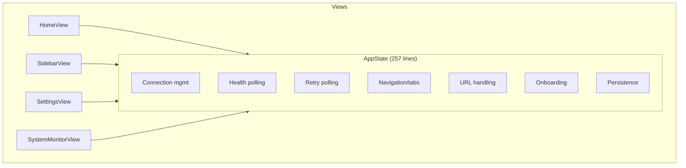
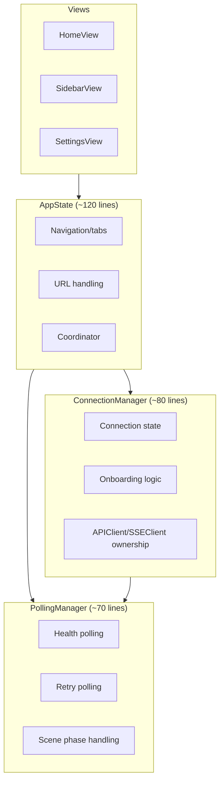

# Design: ILS iOS Front-End Polish & Evidence-Based Validation

## Overview

Systematic 10-phase refactoring of 28 bugs across 75 Swift files: decompose AppState God Object into ConnectionManager + PollingManager, split SettingsView 918-line God File into 4 files, unify 4 duplicate model types with ILSShared, fix theme ID mismatches with UserDefaults migration, and validate all changes plus 10 chat scenarios via real simulator screenshots.

## Architecture

### BEFORE: AppState God Object (257 lines, 7 responsibilities)



### AFTER: Decomposed AppState (~120 lines, 3 responsibilities)



## Components

### 1. ConnectionManager (New)

**Purpose**: Own connection state, APIClient/SSEClient lifecycle, server URL persistence, onboarding triggers.

**Responsibilities**:
- Hold `apiClient`, `sseClient`, `serverURL`, `isConnected`, `showOnboarding`
- `updateServerURL(_:)` — persist + recreate clients
- `connectToServer(url:)` — validate + update atomically
- `showOnboardingIfNeeded()` — first-run check

**Interface**:
```swift
@MainActor
class ConnectionManager: ObservableObject {
    @Published var isConnected: Bool = false
    @Published var serverURL: String = ""
    @Published var showOnboarding: Bool = false

    var apiClient: APIClient
    var sseClient: SSEClient

    init()  // loads from UserDefaults, creates clients
    func updateServerURL(_ url: String)
    func connectToServer(url: String) async throws
    func checkConnection()  // delegates to pollingManager
}
```

### 2. PollingManager (New)

**Purpose**: Health polling and retry polling lifecycle, scene phase handling.

**Responsibilities**:
- `startHealthPolling()` / `stopHealthPolling()`
- `startRetryPolling()` / `stopRetryPolling()`
- `handleScenePhase(_:)` — pause/resume polling
- Uses `ConnectionManager.apiClient` (NOT creating new APIClient instances) — fixes FR-H1

**Interface**:
```swift
@MainActor
class PollingManager: ObservableObject {
    private weak var connectionManager: ConnectionManager?
    private var retryTask: Task<Void, Never>?
    private var healthPollTask: Task<Void, Never>?

    init(connectionManager: ConnectionManager)
    func checkConnection()
    func handleScenePhase(_ phase: ScenePhase)
    func startRetryPolling()
    func stopRetryPolling()
    func startHealthPolling()
    func stopHealthPolling()
}
```

### 3. AppState (Simplified)

**Purpose**: Thin coordinator — navigation intent, tab selection, session persistence. Exposes connection state via ConnectionManager.

**Interface**:
```swift
@MainActor
class AppState: ObservableObject {
    @Published var selectedProject: Project?
    @Published var selectedTab: String = "dashboard"
    @Published var navigationIntent: ActiveScreen?
    @Published var lastSessionId: UUID?
    @Published var isOffline: Bool = false

    let connectionManager: ConnectionManager
    let pollingManager: PollingManager

    // Convenience forwarding (backward compat)
    var isConnected: Bool { connectionManager.isConnected }
    var apiClient: APIClient { connectionManager.apiClient }
    var sseClient: SSEClient { connectionManager.sseClient }
    var serverURL: String { connectionManager.serverURL }
    var showOnboarding: Bool { connectionManager.showOnboarding }

    func handleURL(_ url: URL)
    func updateLastSessionId(_ id: UUID?)
}
```

## SettingsView Split Design

### BEFORE: 1 file, 918 lines, 4 types

| Type | Lines | Location |
|------|-------|----------|
| SettingsView | 1-635 | SettingsView.swift |
| ConfigEditorView | 639-751 | SettingsView.swift |
| SettingsViewModel | 756-856 | SettingsView.swift |
| ConfigEditorViewModel | 858-908 | SettingsView.swift |

### AFTER: 4 files

| File | Type | Est. Lines |
|------|------|-----------|
| `Views/Settings/SettingsView.swift` | SettingsView | ~280 (remove ConfigEditor + VMs) |
| `Views/Settings/ConfigEditorView.swift` | ConfigEditorView | ~115 |
| `ViewModels/SettingsViewModel.swift` | SettingsViewModel | ~105 |
| `ViewModels/ConfigEditorViewModel.swift` | ConfigEditorViewModel | ~55 |

**Extraction order** (minimize intermediate breakage):
1. Extract `ConfigEditorViewModel` (no dependencies on SettingsView)
2. Extract `SettingsViewModel` (no dependencies on ConfigEditorView)
3. Extract `ConfigEditorView` (uses ConfigEditorViewModel, already extracted)
4. SettingsView remains with only its View code + helper functions

## Model Unification Strategy

### MCPServerItem -> MCPServer (ILSShared)

| Field | MCPServerItem (ILSApp) | MCPServer (ILSShared) | Migration |
|-------|----------------------|---------------------|-----------|
| id | `UUID` | `UUID` | Same |
| name | `String` | `String` | Same |
| command | `String` | `String` | Same |
| args | `[String]` | `[String]` | Same |
| env | `[String: String]?` | `[String: String]?` | Same |
| scope | `String` | `MCPScope` (enum) | **BREAKING**: API decoding change |
| status | `String` | `MCPStatus` (enum) | **BREAKING**: API decoding change |
| configPath | `String?` | `String?` | Same |

**Migration path**: MCPServer uses enums for `scope` and `status`. The backend returns string values. Two options:
1. **Option A**: Add `CodingKeys` + custom `init(from:)` to decode strings into enums (in MCPViewModel, not in ILSShared)
2. **Option B**: Keep MCPServerItem as a thin wrapper that decodes strings and converts to MCPServer

**Decision**: Option A — add a local extension with custom decoding. MCPServer already has `MCPScope: String, Codable` and `MCPStatus: String, Codable` with matching raw values. The backend returns `"user"`, `"healthy"` etc. which map directly to enum raw values. Verify with real backend response before deleting MCPServerItem.

**Files to update**: MCPViewModel.swift (change all `MCPServerItem` -> `MCPServer`), BrowserView.swift (if it references MCPServerItem).

### PluginItem -> Plugin (ILSShared)

| Field | PluginItem (ILSApp) | Plugin (ILSShared) | Migration |
|-------|--------------------|--------------------|-----------|
| id | `UUID` | `UUID` | Same |
| name | `String` | `String` | Same |
| description | `String?` | `String?` | Same |
| marketplace | `String?` | `String?` | Same |
| isInstalled | `Bool` | `Bool` | Same |
| isEnabled | `Bool` (var) | `Bool` (var) | Same |
| version | `String?` | `String?` | Same |
| commands | `[String]?` | `[String]?` | Same |
| agents | `[String]?` | `[String]?` | Same |
| path | - | `String?` | New field (nullable, safe) |
| stars | - | `Int?` | New field (nullable, safe) |
| source | - | `PluginSource?` | New field (nullable, safe) |
| category | - | `String?` | New field (nullable, safe) |

**Migration path**: Direct drop-in replacement. Plugin has MORE fields than PluginItem, all optional. JSON decoding will just ignore extra fields, and missing fields default to nil. Also delete `MarketplaceInfo` and `MarketplacePlugin` from PluginModels.swift — ILSShared has `PluginMarketplace` and `PluginInfo`.

**Files to update**: PluginsViewModel.swift (change all `PluginItem` -> `Plugin`), PluginModels.swift (delete entirely).

### APIResponse/APIError Unification

| Type | ILSApp (APIClient.swift) | ILSShared (Requests.swift) | Decision |
|------|-------------------------|---------------------------|----------|
| `APIResponse<T>` | `T: Decodable` | `T: Codable & Sendable` | **Keep ILSApp version** |
| `APIErrorResponse` | `code + message` | N/A | Keep (different purpose) |
| `APIError` (enum) | Error enum with cases | `APIError` (struct, Codable) | **Rename ILSShared's to avoid clash** |

**Decision**: Keep `APIResponse<T: Decodable>` in APIClient.swift as the app-side decoding wrapper. ILSShared's `APIResponse<T: Codable>` is used by the backend for encoding responses. The app only needs `Decodable`. However, the name clash causes ambiguity.

**Resolution**: Since ILSShared is READ-ONLY, we cannot rename ILSShared's types. Instead:
- ILSApp's `APIResponse` stays as-is (it works, views import it implicitly)
- ILSApp's `APIError` (enum) stays as-is (completely different from ILSShared's `APIError` struct)
- ILSApp's `APIErrorResponse` renamed to `APIErrorDetail` to reduce confusion
- Add a comment in APIClient.swift noting the intentional separation from ILSShared types
- FR-H5/FR-DM3 acceptance: document that dual definitions are **intentional** (app-side decoding vs shared encoding) — single source of truth per context

### TunnelSettingsView DTOs -> ILSShared Types

| Private DTO | ILSShared Replacement | Fields Match? |
|------------|----------------------|---------------|
| `TunnelStatusDTO` | `TunnelStatusResponse` | Yes: running, url, uptime |
| `TunnelStartDTO` | `TunnelStartResponse` | Yes: url |
| `TunnelStopDTO` | `TunnelStopResponse` | Yes: stopped |
| `EmptyTunnelRequest` | `TunnelStartRequest` | Replace with `TunnelStartRequest()` (all nil defaults) |

**Migration path**: Direct replacement. Delete all 4 private types, import ILSShared (already imported), use shared types in decoding calls.

## Theme Fix Design

### ThemePickerView ID Fix (FR-C3)

**Problem**: ThemePreview.all uses `id: "ghost"` and `id: "electric"` but actual theme structs use `id: "ghost-protocol"` and `id: "electric-grid"`. When user taps Ghost Protocol card, `themeManager.setTheme("ghost")` is called, but `availableThemes.first(where: { $0.id == "ghost" })` returns nil.

**Fix**: Change ThemePickerView.swift lines 20 and 22:
```swift
// Line 20: "ghost" -> "ghost-protocol"
ThemePreview(id: "ghost-protocol", name: "Ghost Protocol", ...)
// Line 22: "electric" -> "electric-grid"
ThemePreview(id: "electric-grid", name: "Electric Grid", ...)
```

### UserDefaults Migration (Theme ID)

**Problem**: Users who previously (somehow) saved `"ghost"` or `"electric"` in UserDefaults via an older build will get fallback to Obsidian after the fix.

**Fix**: Add migration in ThemeManager.init():
```swift
init() {
    var savedID = UserDefaults.standard.string(forKey: Self.themeIDKey) ?? "obsidian"
    // Migrate legacy theme IDs
    let migrations = ["ghost": "ghost-protocol", "electric": "electric-grid"]
    if let newID = migrations[savedID] {
        savedID = newID
        UserDefaults.standard.set(savedID, forKey: Self.themeIDKey)
    }
    // ... rest of init
}
```

### CodeBlockView Light Theme Fix (FR-H8)

**Problem**: Line 126 always uses `.dark(.xcode)` for syntax highlighting regardless of theme.

**Fix**: Read `theme.isLight` and select appropriate color scheme:
```swift
let colorScheme: CodeHighlightColorMode = theme.isLight ? .light(.xcode) : .dark(.xcode)
let result = try await highlight.request(code, mode: mode, colors: colorScheme)
```

**Challenge**: `theme` is `@Environment` but `performHighlight()` is `async`. Need to capture `isLight` before the async call:
```swift
.task {
    await performHighlight(isLight: theme.isLight)
}
```

### EntityType Color Unification (FR-H4)

**Problem**: `EntityType.color` returns hardcoded hex values (#007AFF, #34C759, #AF52DE, #FF9500, #FFD60A, #30B0C7) that differ from AppTheme protocol defaults (#3B82F6, #8B5CF6, #F59E0B, #10B981, #EC4899, #06B6D4).

**Current usage**: Grep shows `EntityType.color` has ZERO callers. All views use `themeColor(from:)`. The `color` property and `gradient` property are dead code.

**Fix**:
1. Delete `EntityType.color` computed property
2. Delete `EntityType.gradient` computed property
3. Keep `themeColor(from:)` as the only color accessor
4. Build to verify no compilation errors

### textOnAccent Contrast Fix (FR-L2)

**Problem**: All 12 themes hardcode `textOnAccent = Color.white`, but light-accent themes (Ghost Protocol accent `#7DF9FF`, Electric Grid accent `#00FF88`) have poor contrast with white text.

**Fix**: Add computed `textOnAccent` to AppTheme protocol extension using luminance:
```swift
extension AppTheme {
    var computedTextOnAccent: Color {
        // Calculate relative luminance of accent
        // If accent is light (luminance > 0.5), use dark text
        // Otherwise use white
    }
}
```

**Decision**: Rather than a computed property (requires extracting RGB from Color, which is complex in SwiftUI), override `textOnAccent` in specific themes:
- Ghost Protocol: `textOnAccent = Color(hex: "08080C")` (its bgPrimary — dark)
- Electric Grid: `textOnAccent = Color(hex: "050510")` (its bgPrimary — dark)
- Paper: keep white (accent `#EA580C` is dark enough)
- Snow: `textOnAccent = Color.white` (accent `#2563EB` is dark enough)

### Crimson Accent/Error Differentiation (FR-L3)

**Problem**: Both `accent` and `error` are `#EF4444` — identical.

**Fix**: Change Crimson accent to `#DC2626` (deeper red) or change error to `#F87171` (lighter red). Decision: shift accent to `#DC2626` (Tailwind red-700 vs red-500) — accent buttons become slightly darker, error states stay standard red.

### Ember Warning/Accent Differentiation (FR-L4)

**Problem**: Accent `#F59E0B` and warning `#EAB308` are very close (both amber family).

**Fix**: Change Ember warning to `#FBBF24` (lighter amber, Tailwind amber-400) — increases brightness gap from ~3% to ~18%.

## StreamingIndicatorView Timer Leak Fix (FR-H6)

**Problem**: `Timer.scheduledTimer` on line 65 is never invalidated. When the view disappears and reappears, a new timer is created each time without stopping the old one.

**Fix**: Replace Timer with SwiftUI-native animation. Use `.onAppear`/`.onDisappear` with a boolean flag and a recursive Task:

```swift
@State private var isAnimating = false
@State private var animationTask: Task<Void, Never>?

.onAppear {
    isAnimating = true
    animationTask = Task {
        while !Task.isCancelled {
            try? await Task.sleep(for: .milliseconds(400))
            guard !Task.isCancelled else { break }
            withAnimation(.easeInOut(duration: 0.4)) {
                animatingDot = (animatingDot + 1) % 3
            }
        }
    }
}
.onDisappear {
    isAnimating = false
    animationTask?.cancel()
    animationTask = nil
}
```

## SystemMonitorView WebSocket Fix (FR-H7)

**Problem**: Line 125 creates a new `MetricsWebSocketClient` on every `onAppear`. When navigating away and back, old connections may leak.

**Fix**: Check if client already exists and is for the same URL before recreating:

```swift
.onAppear {
    if viewModel.metricsClient.baseURL != appState.serverURL {
        viewModel.metricsClient = MetricsWebSocketClient(baseURL: appState.serverURL)
    }
    viewModel.connect()  // connect() should no-op if already connected
    // ...
}
```

Or better: move `MetricsWebSocketClient` creation into `SystemMetricsViewModel.init()` and add a `updateBaseURL(_:)` method.

## ConnectionBanner Consolidation (FR-M5)

**Problem**: `ConnectionBanner` struct (lines 5-54) and `ConnectionBannerModifier` (lines 57-129) contain duplicated HStack UI code.

**Fix**: Keep only `ConnectionBannerModifier` (it has the `.onChange` auto-dismiss logic). Refactor the inner HStack into the `ConnectionBanner` struct, then have the modifier use it:

```swift
struct ConnectionBanner: View {
    let isConnected: Bool
    // ... same body (the HStack)
}

struct ConnectionBannerModifier: ViewModifier {
    // ... state management
    func body(content: Content) -> some View {
        content.safeAreaInset(edge: .top) {
            if shouldShowBanner {
                ConnectionBanner(isConnected: isConnected)
                    .transition(...)
            }
        }
        .onChange(of: isConnected) { ... }
    }
}
```

This eliminates the duplicated 30-line HStack while keeping both the standalone component and the modifier.

## Technical Decisions

| Decision | Options Considered | Choice | Rationale |
|----------|-------------------|--------|-----------|
| AppState decomposition strategy | A) Extract all at once, B) One manager at a time | B | Lower risk; can rebuild/test after each extraction |
| ConnectionManager ownership | A) AppState owns, B) Standalone @EnvironmentObject | A (owned by AppState) | Backward compat — views still use `appState.isConnected` via forwarding |
| APIResponse duplication | A) Use ILSShared only, B) Keep both, C) Rename one | B (keep both, document) | ILSShared is read-only; app needs `Decodable` not `Codable`; different constraint requirements |
| MCPServerItem migration | A) Custom decoder extension, B) Keep wrapper | A (custom decoder) | MCPScope/MCPStatus enums already have String raw values matching backend JSON |
| Timer leak fix | A) Store/invalidate Timer, B) SwiftUI Task-based | B (Task-based) | No retain cycle risk; automatic cleanup via structured concurrency |
| EntityType.color removal | A) Delegate to theme, B) Delete entirely | B (delete) | Zero callers found via grep; `themeColor(from:)` already exists |
| SettingsView split order | A) Views first, B) ViewModels first | B (VMs first) | ViewModels have no View dependencies; views depend on VMs |
| textOnAccent fix | A) Computed luminance, B) Manual per-theme | B (manual) | Extracting RGB from SwiftUI Color is complex/unreliable; only 2 themes need change |
| Crimson accent differentiation | A) Change accent, B) Change error | A (darken accent to #DC2626) | Error color is standardized across all themes; accent is theme-specific |
| ShareSheet extraction | A) Shared file, B) Protocol | A (shared ShareSheet.swift) | Simple UIViewControllerRepresentable; no abstraction needed |

## File Structure

| File | Action | Purpose | Phase |
|------|--------|---------|-------|
| `ILSApp/ILSAppApp.swift` | **Modify** | Remove dead props (C1/C2), slim AppState to coordinator | 1, 3 |
| `Views/Settings/ThemePickerView.swift` | **Modify** | Fix "ghost" -> "ghost-protocol", "electric" -> "electric-grid" | 1 |
| `Theme/AppTheme.swift` | **Modify** | Add UserDefaults migration in ThemeManager.init() | 1 |
| `Services/ConnectionManager.swift` | **Create** | Extracted connection logic from AppState | 3 |
| `Services/PollingManager.swift` | **Create** | Extracted polling logic from AppState | 3 |
| `Views/Settings/ConfigEditorView.swift` | **Create** | Extracted from SettingsView.swift | 4 |
| `ViewModels/SettingsViewModel.swift` | **Create** | Extracted from SettingsView.swift | 4 |
| `ViewModels/ConfigEditorViewModel.swift` | **Create** | Extracted from SettingsView.swift | 4 |
| `Views/Settings/SettingsView.swift` | **Modify** | Remove extracted types | 4 |
| `Theme/EntityType.swift` | **Modify** | Remove dead `.color` and `.gradient` properties | 2 |
| `Theme/Components/CodeBlockView.swift` | **Modify** | Check `theme.isLight` for highlight colors | 2 |
| `Views/Chat/StreamingIndicatorView.swift` | **Modify** | Replace Timer with Task-based animation | 2 |
| `Views/System/SystemMonitorView.swift` | **Modify** | Guard against WebSocket recreation | 2 |
| `Theme/Components/ConnectionBanner.swift` | **Modify** | Consolidate struct + modifier (remove dup UI) | 5 |
| `Views/Shared/ShareSheet.swift` | **Create** | Extract from ChatView + SessionInfoView | 5 |
| `Views/Chat/ChatView.swift` | **Modify** | Remove inline ShareSheet, import shared | 5 |
| `Views/Sessions/SessionInfoView.swift` | **Modify** | Remove inline ShareSheet, import shared | 5 |
| `ViewModels/BaseListViewModel.swift` | **Delete** | Dead code — never inherited | 5 |
| `Theme/ThemeManager.swift` | **Delete** | 3-line empty redirect; real ThemeManager in AppTheme.swift | 5 |
| `Views/Root/SidebarView.swift` | **Modify** | Wire rename/export context menu, remove Phase comments | 5 |
| `Views/Home/HomeView.swift` | **Modify** | Receive injected VMs instead of creating new ones | 5 |
| `Views/Onboarding/ServerSetupSheet.swift` | **Modify** | Use AppState's APIClient via @EnvironmentObject | 5 |
| `Views/Settings/NotificationPreferencesView.swift` | **Modify** | Replace @State with @AppStorage for persistence | 5 |
| `Views/Settings/TunnelSettingsView.swift` | **Modify** | Replace private DTOs with ILSShared types | 6 |
| `Models/MCPServerItem.swift` | **Delete** | Replace with MCPServer from ILSShared | 6 |
| `Models/PluginModels.swift` | **Delete** | Replace with Plugin from ILSShared | 6 |
| `ViewModels/MCPViewModel.swift` | **Modify** | Change MCPServerItem -> MCPServer | 6 |
| `ViewModels/PluginsViewModel.swift` | **Modify** | Change PluginItem -> Plugin | 6 |
| `Views/System/FileBrowserView.swift` | **Modify** | Replace URLSession.shared with APIClient | 5 |
| `Theme/Themes/CrimsonTheme.swift` | **Modify** | Change accent to #DC2626 | 7 |
| `Theme/Themes/EmberTheme.swift` | **Modify** | Change warning to #FBBF24 | 7 |
| `Theme/Themes/GhostProtocolTheme.swift` | **Modify** | Change textOnAccent to dark color | 7 |
| `Theme/Themes/ElectricGridTheme.swift` | **Modify** | Change textOnAccent to dark color | 7 |
| `Services/APIClient.swift` | **Modify** | Rename APIErrorResponse -> APIErrorDetail, add doc comment | 2 |

## Error Handling

| Error Scenario | Handling Strategy | User Impact |
|----------------|-------------------|-------------|
| Theme ID migration fails | Fallback to "obsidian" (existing behavior) | User sees default theme; can reselect |
| AppState decomposition breaks navigation | Forwarding properties maintain API compatibility | None if forwarding works; rebuild catches compile errors |
| MCPServer enum decoding fails | Backend strings should match enum raw values; fallback to `.unknown` | MCP list may show "unknown" status temporarily |
| Plugin decoding fails (extra fields) | Optional fields auto-nil; decoder ignores unknown keys | None |
| WebSocket reconnect fails | Existing disconnect/error handling in MetricsWebSocketClient | "Offline" indicator shown |
| Timer leak fix changes animation | Task-based approach matches same timing (400ms interval) | Identical visual behavior |

## Edge Cases

- **Theme migration on fresh install**: No stored theme ID -> defaults to "obsidian" -> no migration needed
- **Theme migration with valid ID**: "slate" stored -> not in migration map -> no change -> correct
- **AppState backward compat**: Views using `appState.isConnected` continue working via computed property forwarding
- **MCPServer scope/status enum**: If backend returns unexpected string (e.g., "global"), `MCPScope(rawValue:)` returns nil -> decoding error. Mitigate with custom decoder that falls back to `.unknown`
- **ConnectionBanner during AppState decomposition**: The modifier reads `appState.isConnected` which forwards to `connectionManager.isConnected` — chain must trigger SwiftUI updates via `@Published`
- **FileBrowserView migration**: Currently uses raw URLSession without `/api/v1` prefix — calls `/api/v1/system/files` directly. APIClient.get() auto-prepends `/api/v1`, so path becomes `/system/files?path=...`

## Chat Test Scenario Execution Plan

### Prerequisites
```bash
# Boot simulator
xcrun simctl boot 50523130-57AA-48B0-ABD0-4D59CE455F14
# Start backend
cd <project-root> && PORT=9090 swift run ILSBackend &
# Build and install
xcodebuild -project ILSApp/ILSApp.xcodeproj -scheme ILSApp -sdk iphonesimulator \
  -destination 'id=50523130-57AA-48B0-ABD0-4D59CE455F14' -quiet build
# Install from DerivedData
xcrun simctl install 50523130-57AA-48B0-ABD0-4D59CE455F14 \
  ~/Library/Developer/Xcode/DerivedData/ILSApp-*/Build/Products/Debug-iphonesimulator/ILSApp.app
# Launch
xcrun simctl launch 50523130-57AA-48B0-ABD0-4D59CE455F14 com.ils.app
```

### Scenario Execution

| # | Scenario | Key Steps | Evidence Files |
|---|----------|-----------|----------------|
| CS1 | Basic Send-Receive | Navigate to session, type "What is 2+2?", send, wait for response | `cs1-chat-response.png` |
| CS2 | Cancel Mid-Stream | Send long prompt, tap Stop within 5s, verify partial response, send follow-up | `cs2-partial.png`, `cs2-followup.png` |
| CS3 | Tool Call Render | Send "Read Package.swift", verify accordion with tool inputs/outputs | `cs3-tool-accordion.png` |
| CS4 | Error Recovery | Kill backend, verify banner, restart backend, verify reconnect + send | `cs4-disconnected.png`, `cs4-recovered.png` |
| CS5 | Fork & Navigate | Open 3+ msg session, fork, tap Open Fork, verify forked session | `cs5-fork-alert.png`, `cs5-forked.png` |
| CS6 | Rapid Fire | Send "Message 1" then immediately "Message 2", verify guard/queue | `cs6-rapid.png` |
| CS7 | Theme Switch | Chat with Obsidian, switch to Slate, switch to Paper, verify re-render | `cs7-obsidian.png`, `cs7-slate.png`, `cs7-paper.png` |
| CS8 | Code + Thinking | Send BST prompt, verify ThinkingSection + CodeBlockView rendering | `cs8-thinking.png`, `cs8-code.png` |
| CS9 | External Session | Find external session (or document if none), verify read-only state | `cs9-external.png` |
| CS10 | Rename + Export + Info | Rename session, check sidebar, open info sheet, tap export | `cs10-renamed.png`, `cs10-info.png`, `cs10-export.png` |

**Screenshot capture**: `xcrun simctl io 50523130-57AA-48B0-ABD0-4D59CE455F14 screenshot specs/polish-again/evidence/<name>.png`

**Timing**: Allow 10-30s between send and screenshot for Claude CLI response. Use `sleep` commands or manual `idb ui describe-all` checks.

## Risk Mitigation

| Risk | Severity | Mitigation | Rollback |
|------|----------|------------|----------|
| AppState decomposition breaks SwiftUI reactivity | Critical | Forwarding computed properties + `@Published` chain; rebuild after each step | Revert ConnectionManager extraction, keep monolithic AppState |
| MCPServer enum decoding mismatch | High | Test with `curl localhost:9090/api/v1/mcp` before deleting MCPServerItem; verify scope/status strings match enum raw values | Keep MCPServerItem.swift alongside MCPServer |
| SettingsView split breaks navigation | Medium | Extract one type at a time; verify Settings screen after each | Paste types back into SettingsView.swift |
| Theme migration corrupts UserDefaults | Low | Migration only maps 2 known strings; all other IDs pass through unchanged | Remove migration code; user manually reselects theme |
| ConnectionBanner consolidation breaks auto-dismiss | Medium | Keep modifier's onChange logic intact; only refactor inner HStack | Revert ConnectionBanner.swift to current version |
| FileBrowserView path prefix change | Medium | APIClient.get() prepends `/api/v1` — so change path from full URL to relative `/system/files?path=...` | Revert to URLSession.shared |

## Execution Order

### Phase 1: Critical Bug Fixes (P0) — No architecture changes
1. Remove `isServerConnected` and `serverConnectionInfo` from AppState (FR-C1, FR-C2)
2. Fix ThemePickerView IDs: "ghost" -> "ghost-protocol", "electric" -> "electric-grid" (FR-C3)
3. Add UserDefaults migration in ThemeManager.init()
4. **Build + verify**

### Phase 2: High Bug Fixes (P0) — Targeted fixes, no decomposition
5. Replace 4 redundant `APIClient(baseURL:)` in AppState with `self.apiClient` (FR-H1)
6. Delete EntityType.color and EntityType.gradient dead code (FR-H4)
7. Fix StreamingIndicatorView timer leak (FR-H6)
8. Fix SystemMonitorView WebSocket recreation (FR-H7)
9. Fix CodeBlockView light theme highlighting (FR-H8)
10. Rename APIErrorResponse -> APIErrorDetail, add documentation comment (FR-H5)
11. **Build + verify**

### Phase 3: AppState Decomposition (P0)
12. Create ConnectionManager.swift — extract connection state + URL mgmt + onboarding
13. Create PollingManager.swift — extract health/retry polling + scene phase
14. Slim AppState — add forwarding properties, remove extracted code
15. Update ILSAppApp.swift @main to wire managers
16. **Build + verify all screens still navigate correctly**

### Phase 4: SettingsView Split (P0)
17. Extract ConfigEditorViewModel to `ViewModels/ConfigEditorViewModel.swift`
18. Extract SettingsViewModel to `ViewModels/SettingsViewModel.swift`
19. Extract ConfigEditorView to `Views/Settings/ConfigEditorView.swift`
20. Remove extracted code from SettingsView.swift
21. **Build + verify Settings navigation**

### Phase 5: Medium Bug Fixes (P1)
22. Wire or remove SidebarView "Phase X" comments (FR-M1)
23. Extract ShareSheet to `Views/Shared/ShareSheet.swift` (FR-M2)
24. Delete BaseListViewModel.swift (FR-M3)
25. Delete ThemeManager.swift (FR-M4)
26. Consolidate ConnectionBanner struct + modifier (FR-M5)
27. Share ViewModels between HomeView and SidebarView (FR-M6)
28. Fix ServerSetupSheet to use AppState's APIClient (FR-M7)
29. Persist NotificationPreferencesView toggles with @AppStorage (FR-M8)
30. Fix FileBrowserView to use APIClient (FR-M10)
31. **Build + verify**

### Phase 6: Model Unification (P1)
32. Replace MCPServerItem -> MCPServer in MCPViewModel + views (FR-DM1)
33. Delete MCPServerItem.swift
34. Replace PluginItem -> Plugin in PluginsViewModel + views (FR-DM2)
35. Delete PluginModels.swift
36. Replace TunnelSettingsView private DTOs with ILSShared types (FR-DM4/FR-M9)
37. **Build + verify MCP/Plugins/Tunnel screens**

### Phase 7: Low Polish (P2)
38. Fix GhostProtocol/ElectricGrid textOnAccent (FR-L2)
39. Fix Crimson accent -> #DC2626 (FR-L3)
40. Fix Ember warning -> #FBBF24 (FR-L4)
41. Review ChatInputBar onSubmit behavior (FR-L5)
42. Label token count as approximate (FR-L6)
43. Document ILSCodeHighlighter as intentional passthrough or add basic keywords (FR-L7)
44. Add "Sample Data" label to DashboardViewModel sparklines (FR-L1)
45. **Build + verify**

### Phase 8: Chat Scenarios 1-4 (P0)
46. Execute CS1: Basic Send-Receive-Render
47. Execute CS2: Streaming Cancellation Mid-Response
48. Execute CS3: Tool Call Rendering Chain
49. Execute CS4: Error Recovery After Backend Restart
50. **Capture all evidence screenshots**

### Phase 9: Chat Scenarios 5-10 (P1)
51. Execute CS5: Session Fork and Navigate
52. Execute CS6: Rapid-Fire Message Sending
53. Execute CS7: Theme Switching During Active Chat
54. Execute CS8: Long Message with Code Blocks + Thinking
55. Execute CS9: External Session (Read-Only) Browsing
56. Execute CS10: Session Rename + Export + Info Sheet
57. **Capture all evidence screenshots**

### Phase 10: Final Verification (P0)
58. Clean build: zero warnings, zero errors
59. Grep audit: no dead code, no duplicate types, no raw URLSession in views
60. Evidence index: all screenshots cataloged with descriptions
61. **Final build log captured as evidence**

## Validation

- [ ] Build and run actual application on simulator UDID 50523130-57AA-48B0-ABD0-4D59CE455F14
- [ ] Test through user interface (all 10 chat scenarios)
- [ ] Capture screenshots/output as evidence for every bug fix and scenario
- [ ] Verify evidence shows expected behavior
