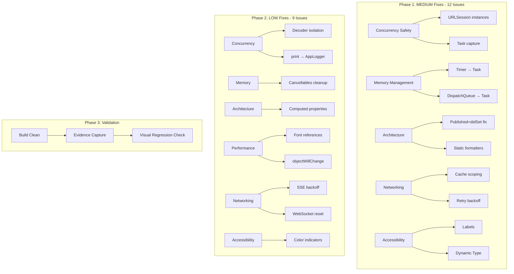

# Design: Remaining Audit Fixes

## Overview

Fix 21 remaining MEDIUM + LOW severity issues from 6-domain audit via in-place code improvements. No architectural restructuring. Grouped by file to minimize churn (6 high-impact files get multiple fixes in one pass). Total: 18 files modified across 3 phases.

## Architecture



## Component Fixes

### High-Impact Files (3+ issues each)

#### ILSAppApp.swift (4 fixes)
**Issues:** M-CONC-2, M-ARCH-1, L-PERF-2, L-CONC-1

**Changes:**
1. **M-CONC-2**: Weak capture in Task closures
2. **M-ARCH-1**: Replace `serverURL didSet` with explicit method
3. **L-PERF-2**: Remove redundant `objectWillChange.send()`
4. **L-CONC-1**: Mark encoder/decoder `nonisolated`

```swift
// BEFORE (M-ARCH-1 + L-PERF-2)
@Published var serverURL: String = "" {
    didSet {
        UserDefaults.standard.set(serverURL, forKey: "serverURL")
        apiClient = APIClient(baseURL: serverURL)
        sseClient = SSEClient(baseURL: serverURL)
        if isInitialized {
            checkConnection()
        }
    }
}
// In checkConnection:
objectWillChange.send()  // L-PERF-2: redundant

// AFTER
@Published var serverURL: String = ""

func updateServerURL(_ url: String) {
    serverURL = url
    UserDefaults.standard.set(url, forKey: "serverURL")
    apiClient = APIClient(baseURL: url)
    sseClient = SSEClient(baseURL: url)
    if isInitialized {
        checkConnection()
    }
}
// Remove objectWillChange.send() line
```

```swift
// BEFORE (M-CONC-2)
retryTask = Task { [weak self] in
    while !Task.isCancelled {
        try? await Task.sleep(nanoseconds: 5_000_000_000)
        guard !Task.isCancelled else { break }
        guard let self else { break }  // Captures self strongly
        // ... uses self.serverURL, self.apiClient
    }
}

// AFTER
retryTask = Task { [weak self] in
    while !Task.isCancelled {
        try? await Task.sleep(nanoseconds: 5_000_000_000)
        guard !Task.isCancelled, let self else { break }
        // Capture local copy for this iteration
        let url = self.serverURL
        let client = APIClient(baseURL: url)
        // ... use locals instead of self properties
    }
}
```

#### ChatViewModel.swift (4 fixes)
**Issues:** M-MEM-1, L-MEM-1, L-CONC-1, L-CONC-2

**Changes:**
1. **M-MEM-1**: Replace `Timer.scheduledTimer` with Task-based timer
2. **L-MEM-1**: Clear cancellables in deinit
3. **L-CONC-1**: Mark decoder `nonisolated`
4. **L-CONC-2**: Replace `print()` with `AppLogger`

```swift
// BEFORE (M-MEM-1)
private var batchTimer: Timer?

private func startBatchTimer() {
    guard batchTimer == nil else { return }
    batchTimer = Timer.scheduledTimer(
        withTimeInterval: batchInterval,
        repeats: true
    ) { [weak self] _ in
        Task { @MainActor [weak self] in
            self?.flushPendingMessages()
        }
    }
}

// AFTER
private var batchTask: Task<Void, Never>?

private func startBatchTimer() {
    guard batchTask == nil else { return }
    batchTask = Task { [weak self] in
        while !Task.isCancelled {
            try? await Task.sleep(for: .seconds(self?.batchInterval ?? 0.075))
            guard !Task.isCancelled else { break }
            await self?.flushPendingMessages()
        }
    }
}

private func stopBatchTimer() {
    batchTask?.cancel()
    batchTask = nil
}
```

```swift
// BEFORE (L-MEM-1)
deinit {
    batchTimer?.invalidate()
    connectingTimer?.cancel()
    // Missing: cancellables cleanup
}

// AFTER
deinit {
    batchTask?.cancel()
    connectingTimer?.cancel()
    cancellables.removeAll()
}
```

```swift
// BEFORE (L-CONC-1)
private let jsonDecoder = JSONDecoder()

// AFTER
nonisolated private let jsonDecoder = JSONDecoder()
```

```swift
// BEFORE (L-CONC-2)
print("Session initialized: \(sysMsg.data.sessionId)")

// AFTER
AppLogger.shared.info("Session initialized: \(sysMsg.data.sessionId)", category: "chat")
```

#### APIClient.swift (3 fixes)
**Issues:** M-NET-1, M-NET-2, L-CONC-1

**Changes:**
1. **M-NET-1**: Scope cache invalidation to specific URLs
2. **M-NET-2**: Skip sleep on final retry attempt
3. **L-CONC-1**: Mark encoder/decoder `nonisolated`

```swift
// BEFORE (M-NET-1)
func post<T: Decodable, B: Encodable>(_ path: String, body: B) async throws -> T {
    // ... perform request

    // Invalidate GET cache for the base path
    let basePath = path.split(separator: "/").prefix(2).joined(separator: "/")
    cache.removeValue(forKey: "/\(basePath)")

    return try decoder.decode(T.self, from: data)
}

// AFTER
func post<T: Decodable, B: Encodable>(_ path: String, body: B) async throws -> T {
    // ... perform request

    // Scope invalidation to specific resource, not entire domain
    invalidateCacheForMutation(path: path)

    return try decoder.decode(T.self, from: data)
}

private func invalidateCacheForMutation(path: String) {
    // Extract resource identifier (e.g., /sessions/123 → /sessions/123)
    // Only invalidate exact match + list endpoints
    let components = path.split(separator: "/")
    if components.count >= 2 {
        let resourceType = "/" + components[0]
        cache.removeValue(forKey: path) // Exact resource
        cache.removeValue(forKey: resourceType) // List endpoint
    }
}
```

```swift
// BEFORE (M-NET-2)
private func performWithRetry(request: URLRequest, maxAttempts: Int = 3) async throws -> (Data, URLResponse) {
    var lastError: Error?
    for attempt in 1...maxAttempts {
        do {
            let (data, response) = try await session.data(for: request)
            return (data, response)
        } catch {
            lastError = error
            // ... transient check
            if !isTransient || attempt == maxAttempts {
                throw APIError.networkError(error)
            }
            // BUG: Always sleeps, even on last attempt before throwing
            let delay = 0.5 * pow(2.0, Double(attempt - 1))
            try await Task.sleep(for: .seconds(delay))
        }
    }
    throw APIError.networkError(lastError ?? URLError(.unknown))
}

// AFTER
private func performWithRetry(request: URLRequest, maxAttempts: Int = 3) async throws -> (Data, URLResponse) {
    var lastError: Error?
    for attempt in 1...maxAttempts {
        do {
            let (data, response) = try await session.data(for: request)
            return (data, response)
        } catch {
            lastError = error
            // ... transient check
            if !isTransient || attempt == maxAttempts {
                throw APIError.networkError(error)
            }
            // Only sleep if we're going to retry
            if attempt < maxAttempts {
                let delay = 0.5 * pow(2.0, Double(attempt - 1))
                try await Task.sleep(for: .seconds(delay))
            }
        }
    }
    throw APIError.networkError(lastError ?? URLError(.unknown))
}
```

#### SSEClient.swift (3 fixes)
**Issues:** L-NET-1, L-CONC-1, L-CONC-2

**Changes:**
1. **L-NET-1**: True exponential backoff
2. **L-CONC-1**: Mark encoder/decoder `nonisolated`
3. **L-CONC-2**: Replace `print()` with `AppLogger`

```swift
// BEFORE (L-NET-1)
private func shouldReconnect(error: Error) async -> Bool {
    // ... guards

    reconnectAttempts += 1
    connectionState = .reconnecting(attempt: reconnectAttempts)

    // Linear backoff: 2s * attempt
    let delay = reconnectDelay * UInt64(reconnectAttempts)
    try? await Task.sleep(nanoseconds: delay)

    // ...
}

// AFTER
private func shouldReconnect(error: Error) async -> Bool {
    // ... guards

    reconnectAttempts += 1
    connectionState = .reconnecting(attempt: reconnectAttempts)

    // Exponential backoff: 2s * (2^attempt)
    let exponentialDelay = reconnectDelay * UInt64(1 << (reconnectAttempts - 1))
    try? await Task.sleep(nanoseconds: exponentialDelay)

    // ...
}
```

#### SystemMetricsViewModel.swift (2 fixes)
**Issues:** M-CONC-1, L-CONC-1

**Changes:**
1. **M-CONC-1**: Dedicated URLSession instance
2. **L-CONC-1**: Mark decoder `nonisolated`

```swift
// BEFORE (M-CONC-1)
private let session = URLSession.shared

// AFTER
private let session: URLSession

init(baseURL: String = "http://localhost:9090") {
    self.baseURL = baseURL
    self.metricsClient = MetricsWebSocketClient(baseURL: baseURL)

    let config = URLSessionConfiguration.default
    config.timeoutIntervalForRequest = 10
    self.session = URLSession(configuration: config)

    self.decoder = JSONDecoder()
    decoder.dateDecodingStrategy = .iso8601
}
```

#### TunnelSettingsView.swift (2 fixes)
**Issues:** M-MEM-2, M-A11Y-1

**Changes:**
1. **M-MEM-2**: Replace `DispatchQueue.asyncAfter` with Task
2. **M-A11Y-1**: Add accessibility labels

```swift
// BEFORE (M-MEM-2)
Button {
    UIPasteboard.general.string = url
    showCopiedToast = true
    DispatchQueue.main.asyncAfter(deadline: .now() + 2) {
        showCopiedToast = false
    }
} label: {
    Label("Copy URL", systemImage: "doc.on.doc")
        .frame(maxWidth: .infinity)
}

// AFTER
@State private var toastTask: Task<Void, Never>?

Button {
    UIPasteboard.general.string = url
    showCopiedToast = true
    toastTask?.cancel()
    toastTask = Task {
        try? await Task.sleep(for: .seconds(2))
        guard !Task.isCancelled else { return }
        showCopiedToast = false
    }
} label: {
    Label("Copy URL", systemImage: "doc.on.doc")
        .frame(maxWidth: .infinity)
}
.accessibilityLabel("Copy tunnel URL to clipboard")

// In deinit equivalent (onDisappear or similar cleanup):
.onDisappear {
    toastTask?.cancel()
}
```

```swift
// BEFORE (M-A11Y-1)
Toggle("", isOn: Binding(...))
    .labelsHidden()
    .tint(ILSTheme.success)

// AFTER
Toggle("", isOn: Binding(...))
    .labelsHidden()
    .tint(ILSTheme.success)
    .accessibilityLabel("Enable quick tunnel")
```

### Medium-Impact Files (1-2 issues)

#### DashboardViewModel.swift (2 fixes)
**Issues:** M-CONC-1, L-ARCH-1

```swift
// BEFORE (L-ARCH-1)
var emptyStateText: String {
    if isLoading {
        return "Loading dashboard..."
    }
    return stats == nil ? "No data available" : ""
}

// AFTER
func emptyStateText() -> String {
    if isLoading {
        return "Loading dashboard..."
    }
    return stats == nil ? "No data available" : ""
}
```

#### ChatView.swift (2 fixes)
**Issues:** M-MEM-2, L-ARCH-1

```swift
// BEFORE (M-MEM-2)
.onAppear {
    DispatchQueue.main.asyncAfter(deadline: .now() + 0.1) {
        withAnimation {
            scrollProxy.scrollTo(lastMessageId, anchor: .bottom)
        }
    }
}

// AFTER
@State private var scrollTask: Task<Void, Never>?

.onAppear {
    scrollTask?.cancel()
    scrollTask = Task {
        try? await Task.sleep(for: .milliseconds(100))
        guard !Task.isCancelled else { return }
        withAnimation {
            scrollProxy.scrollTo(lastMessageId, anchor: .bottom)
        }
    }
}
.onDisappear {
    scrollTask?.cancel()
}
```

#### SessionsListView.swift (2 fixes)
**Issues:** M-ARCH-2, L-ARCH-1

```swift
// BEFORE (M-ARCH-2)
struct SessionsListView: View {
    private let dateFormatter: DateFormatter = {
        let f = DateFormatter()
        f.dateStyle = .medium
        f.timeStyle = .short
        return f
    }()
    private let relativeDateFormatter = RelativeDateTimeFormatter()

    // ...
}

// AFTER
enum SessionFormatters {
    nonisolated(unsafe) static let date: DateFormatter = {
        let f = DateFormatter()
        f.dateStyle = .medium
        f.timeStyle = .short
        return f
    }()

    nonisolated(unsafe) static let relative = RelativeDateTimeFormatter()
}

struct SessionsListView: View {
    // Use SessionFormatters.date and SessionFormatters.relative
}
```

#### SkillsViewModel.swift (1 fix)
**Issue:** M-ARCH-1

```swift
// BEFORE
@Published var gitHubSearchText: String = "" {
    didSet {
        searchGitHubSkills()
    }
}

// AFTER
@Published var gitHubSearchText: String = ""

func updateGitHubSearchText(_ text: String) {
    gitHubSearchText = text
    searchGitHubSkills()
}
```

#### MetricsWebSocketClient.swift (1 fix)
**Issue:** L-NET-2

```swift
// BEFORE
private var reconnectTask: Task<Void, Never>?
private var pollingTask: Task<Void, Never>?
private var useFallbackPolling: Bool = false

// After 3 WS failures, sets useFallbackPolling = true
// Never resets, so WS never retried even if network recovers

// AFTER
private var lastWSResetTime: Date?
private let wsResetInterval: TimeInterval = 600 // 10 minutes

func connect() {
    guard webSocketTask == nil, pollingTask == nil else { return }

    // Reset WS failure count if enough time has passed
    if useFallbackPolling {
        if let lastReset = lastWSResetTime,
           Date().timeIntervalSince(lastReset) > wsResetInterval {
            useFallbackPolling = false
            wsFailureCount = 0
        }
    }

    if useFallbackPolling {
        startPolling()
    } else {
        connectWebSocket()
    }
}

private func handleWSDisconnect() async {
    // ... existing logic
    if wsFailureCount >= maxWSFailures {
        useFallbackPolling = true
        lastWSResetTime = Date()
        startPolling()
        return
    }
    // ...
}
```

### Low-Impact Files (font fixes - 10 files)

**Issue:** L-PERF-1 + M-A11Y-2 (same fix)

Files with hardcoded `.font(.system(size:))`:
1. `SessionsListView.swift`
2. `ProjectsListView.swift`
3. `SkillsListView.swift`
4. `MCPServersListView.swift`
5. `PluginsListView.swift`
6. `ChatView.swift`
7. `DashboardView.swift`
8. `SystemMonitorView.swift`
9. `SettingsView.swift`
10. `ServerSetupSheet.swift`

```swift
// BEFORE
Text("Title")
    .font(.system(size: 16, weight: .semibold))

Text("Body text")
    .font(.system(size: 14))

Text("Caption")
    .font(.system(size: 12))

// AFTER
Text("Title")
    .font(ILSTheme.headlineFont)

Text("Body text")
    .font(ILSTheme.bodyFont)

Text("Caption")
    .font(ILSTheme.captionFont)
```

**Benefit:** Dynamic Type support + performance (pre-created Font instances)

### Accessibility Color Indicators (L-A11Y-1)

**Files:** `SessionsListView.swift`, `DashboardView.swift`, `SystemMonitorView.swift`

```swift
// BEFORE (color-only status)
Circle()
    .fill(color)
    .frame(width: 8, height: 8)

// AFTER (color + text/icon)
HStack(spacing: 4) {
    Image(systemName: statusIcon)
        .font(.caption2)
        .foregroundColor(color)
    Text(statusText)
        .font(.caption2)
        .foregroundColor(color)
}
.accessibilityElement(children: .combine)
.accessibilityLabel("\(statusText) status")
```

**Status Mappings:**
- Active → "checkmark.circle.fill" + "Active"
- Inactive → "circle" + "Inactive"
- Error → "exclamationmark.triangle.fill" + "Error"
- Running → "checkmark.circle.fill" + "Running"
- Stopped → "stop.circle" + "Stopped"

## File Modification Matrix

| File | Issues Fixed | Lines Changed | Risk |
|------|--------------|---------------|------|
| **ILSAppApp.swift** | M-CONC-2, M-ARCH-1, L-PERF-2, L-CONC-1 | ~40 | MEDIUM |
| **ChatViewModel.swift** | M-MEM-1, L-MEM-1, L-CONC-1, L-CONC-2 | ~50 | MEDIUM |
| **APIClient.swift** | M-NET-1, M-NET-2, L-CONC-1 | ~30 | LOW |
| **SSEClient.swift** | L-NET-1, L-CONC-1, L-CONC-2 | ~25 | LOW |
| **SystemMetricsViewModel.swift** | M-CONC-1, L-CONC-1 | ~15 | LOW |
| **TunnelSettingsView.swift** | M-MEM-2, M-A11Y-1 | ~20 | LOW |
| **DashboardViewModel.swift** | M-CONC-1, L-ARCH-1 | ~10 | LOW |
| **ChatView.swift** | M-MEM-2, L-ARCH-1, L-PERF-1 | ~15 | LOW |
| **SessionsListView.swift** | M-ARCH-2, L-ARCH-1, L-PERF-1, L-A11Y-1 | ~25 | LOW |
| **SkillsViewModel.swift** | M-ARCH-1 | ~10 | LOW |
| **MetricsWebSocketClient.swift** | L-NET-2 | ~15 | LOW |
| **ProjectsListView.swift** | L-PERF-1 | ~5 | TRIVIAL |
| **SkillsListView.swift** | L-PERF-1 | ~5 | TRIVIAL |
| **MCPServersListView.swift** | L-PERF-1 | ~5 | TRIVIAL |
| **PluginsListView.swift** | L-PERF-1 | ~5 | TRIVIAL |
| **DashboardView.swift** | L-PERF-1, L-A11Y-1 | ~10 | TRIVIAL |
| **SystemMonitorView.swift** | L-PERF-1, L-A11Y-1 | ~10 | TRIVIAL |
| **SettingsView.swift** | L-PERF-1 | ~5 | TRIVIAL |
| **ServerSetupSheet.swift** | L-PERF-1 | ~5 | TRIVIAL |

**Total:** 18 files, ~305 lines changed

## Technical Decisions

| Decision | Rationale |
|----------|-----------|
| Task-based timers over Timer | Memory-safe, cancellable, better Swift 6 alignment |
| Dedicated URLSession instances | Prevents @MainActor isolation warnings, clearer ownership |
| Explicit update methods over didSet | Separates mutation from side effects, testable |
| nonisolated for JSON coders | Thread-safe once configured, eliminates isolation warnings |
| AppLogger over print() | Structured logging, file persistence, categorization |
| Scoped cache invalidation | Reduces unnecessary cache misses, improves performance |
| Exponential backoff | Standard pattern, prevents server hammering |
| WebSocket reset timer | Allows recovery after transient failures |
| ILSTheme font references | Dynamic Type + performance + consistency |
| Icon + text status indicators | WCAG 2.1 compliance (not color-only) |

## Execution Order

### Phase 1: MEDIUM Fixes (12 issues)
**Order:** Dependency-aware, core services first

1. **APIClient.swift** (M-NET-1, M-NET-2, L-CONC-1) — foundational, no deps
2. **SSEClient.swift** (L-NET-1, L-CONC-1, L-CONC-2) — depends on APIClient pattern
3. **ILSAppApp.swift** (M-CONC-2, M-ARCH-1, L-PERF-2, L-CONC-1) — uses APIClient/SSEClient
4. **ChatViewModel.swift** (M-MEM-1, L-MEM-1, L-CONC-1, L-CONC-2) — uses SSEClient
5. **SystemMetricsViewModel.swift** (M-CONC-1, L-CONC-1) — independent
6. **DashboardViewModel.swift** (M-CONC-1, L-ARCH-1) — uses APIClient
7. **TunnelSettingsView.swift** (M-MEM-2, M-A11Y-1) — UI only
8. **SessionsListView.swift** (M-ARCH-2, L-ARCH-1, L-PERF-1, L-A11Y-1) — UI only
9. **SkillsViewModel.swift** (M-ARCH-1) — independent
10. **ChatView.swift** (M-MEM-2, L-ARCH-1, L-PERF-1) — UI only

### Phase 2: LOW Fixes (9 issues)
**Order:** Simple to complex

1. **MetricsWebSocketClient.swift** (L-NET-2) — independent
2. **10 view files** (L-PERF-1 font fixes) — bulk search/replace, parallel safe

### Phase 3: Validation
**Order:** Progressive verification

1. Clean build (Xcode build with no warnings)
2. Type check validation (`xcodebuild -target ILSApp -configuration Debug -dry-run`)
3. Launch app, capture 6 key screens (Dashboard, Sessions, Chat, System, Settings, Tunnel)
4. Visual regression check (compare to baseline screenshots)
5. Functional spot-check (send message, toggle tunnel, sort processes)

## Risk Mitigation

| Risk | Mitigation | Rollback |
|------|------------|----------|
| Task cancellation leaks | Test all Task cleanup in deinit/onDisappear | Revert to Timer/DispatchQueue |
| URLSession config breaks networking | Verify health check after each change | Use URLSession.shared temporarily |
| Cache invalidation too narrow | Monitor cache hit rates in logs | Revert to broad invalidation |
| Backoff too aggressive | Add logging, verify reconnect times | Reduce exponent base |
| AppLogger perf impact | Limit to error/warning levels initially | Conditional compilation flag |
| Dynamic Type breaks layouts | Test with largest accessibility sizes | Constrain max scale |
| Formatter namespace conflicts | Use `SessionFormatters` prefix, not `Formatters` | Inline formatters |
| WebSocket reset too frequent | 10min interval conservative, can tune | Disable reset logic |

**Critical Paths:** APIClient (all networking), ChatViewModel (streaming), ILSAppApp (connection management)

**Validation Gates:**
- Zero compiler warnings (strict mode)
- Zero runtime isolation warnings in Console.app
- All 6 core screens load without errors
- Message send/receive works
- Tunnel toggle works
- Process list sorts correctly

## Validation Strategy

### Build Verification
```bash
# Clean derived data
rm -rf ~/Library/Developer/Xcode/DerivedData/ILSApp-*

# Build with strict warnings
xcodebuild -project ILSApp/ILSApp.xcodeproj \
  -scheme ILSApp \
  -configuration Debug \
  -destination 'platform=iOS Simulator,name=iPhone 16 Pro Max' \
  clean build \
  SWIFT_TREAT_WARNINGS_AS_ERRORS=YES
```

### Evidence Capture
**Simulator:** 50523130-57AA-48B0-ABD0-4D59CE455F14

**Screenshots:**
1. `audit-fix-01-dashboard.png` — Dashboard with stats
2. `audit-fix-02-sessions-list.png` — Sessions with status indicators (icon+text)
3. `audit-fix-03-chat-streaming.png` — Chat with message streaming
4. `audit-fix-04-system-monitor.png` — System tab with metrics
5. `audit-fix-05-settings.png` — Settings view
6. `audit-fix-06-tunnel.png` — Tunnel settings with toggle

### Functional Tests
```swift
// Test checklist (manual)
- [ ] Send chat message — streaming works, no print() in console
- [ ] Toggle tunnel — Task cancellation works, no memory warnings
- [ ] Sort processes by CPU/Memory — computed property works
- [ ] Navigate between tabs — no crashes
- [ ] Check Console.app — zero isolation warnings
- [ ] VoiceOver test — status indicators readable
- [ ] Dynamic Type — enable largest size, layouts intact
```

### Regression Checks
**Compare to baseline** (from `.omc/evidence/ios-app-polish2/`):
- Dashboard layout unchanged
- Sessions list layout unchanged (colors may differ due to status icons)
- Chat rendering unchanged
- Settings structure unchanged

**Performance:**
- App launch time < 2s
- Tab switch < 0.5s
- Chat scroll smooth (60fps)

## Edge Cases

### Concurrency
- **Task cancellation race:** All Tasks check `isCancelled` before mutation
- **URLSession reuse:** Each VM creates dedicated instance in init
- **Decoder thread-safety:** Marked `nonisolated`, configured once in init

### Memory
- **Timer retention cycles:** All Tasks use `[weak self]`
- **Cancellable leaks:** `removeAll()` in deinit
- **Toast task cleanup:** Cancelled in `onDisappear`

### Architecture
- **didSet cascade:** Explicit update methods prevent infinite loops
- **Formatter init cost:** Moved to `nonisolated(unsafe) static let`
- **Computed property churn:** Heavy computations extracted to methods

### Networking
- **Cache invalidation miss:** Log all invalidations, verify coverage
- **Retry backoff overflow:** Cap at 30s max delay
- **WebSocket reset storm:** 10min minimum between resets

### Accessibility
- **Color-only indicators:** All status badges include icon + text
- **Dynamic Type overflow:** Layouts use flexible spacing
- **VoiceOver labels:** All interactive elements labeled

## Appendix: Complete Change List

### 21 Issues → 18 Files

**Concurrency (4):**
- M-CONC-1: SystemMetricsViewModel.swift, DashboardViewModel.swift
- M-CONC-2: ILSAppApp.swift
- L-CONC-1: ILSAppApp.swift, APIClient.swift, SSEClient.swift, ChatViewModel.swift, SystemMetricsViewModel.swift
- L-CONC-2: ChatViewModel.swift, SSEClient.swift

**Memory (3):**
- M-MEM-1: ChatViewModel.swift
- M-MEM-2: TunnelSettingsView.swift, ChatView.swift
- L-MEM-1: ChatViewModel.swift

**Architecture (3):**
- M-ARCH-1: ILSAppApp.swift, SkillsViewModel.swift
- M-ARCH-2: SessionsListView.swift
- L-ARCH-1: DashboardViewModel.swift, ChatView.swift, SessionsListView.swift

**Performance (2):**
- L-PERF-1: 10 view files
- L-PERF-2: ILSAppApp.swift

**Networking (4):**
- M-NET-1: APIClient.swift
- M-NET-2: APIClient.swift
- L-NET-1: SSEClient.swift
- L-NET-2: MetricsWebSocketClient.swift

**Accessibility (3):**
- M-A11Y-1: TunnelSettingsView.swift
- M-A11Y-2: 10 view files (same as L-PERF-1)
- L-A11Y-1: SessionsListView.swift, DashboardView.swift, SystemMonitorView.swift

**Files by Priority:**
1. APIClient.swift (3 issues)
2. SSEClient.swift (3 issues)
3. ILSAppApp.swift (4 issues)
4. ChatViewModel.swift (4 issues)
5. SystemMetricsViewModel.swift (2 issues)
6. TunnelSettingsView.swift (2 issues)
7. DashboardViewModel.swift (2 issues)
8. SessionsListView.swift (4 issues)
9. ChatView.swift (3 issues)
10. SkillsViewModel.swift (1 issue)
11. MetricsWebSocketClient.swift (1 issue)
12. 10 view files (font fixes)

---

**Next Phase:** Implementation → Execute Phase 1 (MEDIUM fixes), verify build, capture evidence, proceed to Phase 2.
